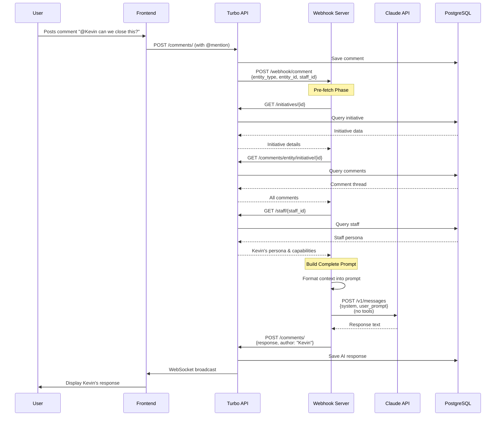
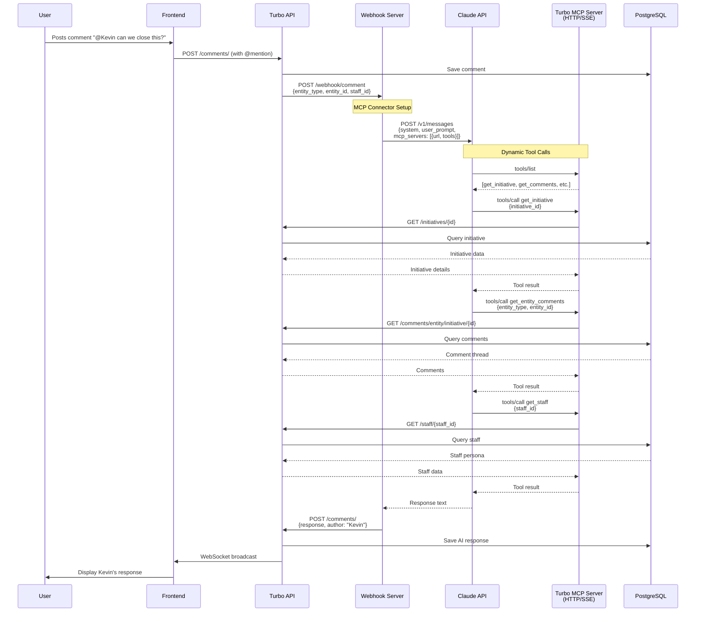

# ADR 003: Context Pre-fetching vs MCP Connector for AI Staff Responses

## Status

**Accepted** - October 19, 2025

## Context

Turbo provides an AI-powered staff mention system where users can @mention staff members (like @Kevin, the Product Manager) in comments on issues, projects, and initiatives. When a staff member is mentioned, the system needs to:

1. Fetch the entity context (issue/project/initiative details)
2. Fetch the comment thread history
3. Fetch the staff member's persona and capabilities
4. Generate an AI response using Claude API
5. Post the response back to the entity

In October 2025, Anthropic introduced a new **MCP Connector** feature that allows the Messages API to connect directly to MCP (Model Context Protocol) servers, enabling Claude to call tools dynamically during the API request.

This ADR documents our decision to continue using **context pre-fetching** rather than adopting the MCP Connector feature.

## Decision

**We will continue to use context pre-fetching** for AI staff responses instead of the MCP Connector feature.

All entity context is fetched via HTTP API calls before calling the Claude API, then included directly in the system and user prompts.

## Architecture Comparison

### Current Architecture: Context Pre-fetching



### Alternative Architecture: MCP Connector



### Data Flow Comparison

```mermaid
graph TB
    subgraph "Pre-fetch Approach (Current)"
        A1[User @mentions Kevin] --> B1[Webhook receives trigger]
        B1 --> C1[Fetch initiative context]
        B1 --> D1[Fetch comments]
        B1 --> E1[Fetch staff persona]
        C1 --> F1[Build complete prompt]
        D1 --> F1
        E1 --> F1
        F1 --> G1[Claude API call<br/>1 request]
        G1 --> H1[Response]
        H1 --> I1[Post comment]
    end

    subgraph "MCP Connector Approach (Alternative)"
        A2[User @mentions Kevin] --> B2[Webhook receives trigger]
        B2 --> C2[Claude API call with MCP server]
        C2 --> D2[Claude calls get_initiative]
        D2 --> E2[Claude calls get_comments]
        E2 --> F2[Claude calls get_staff]
        F2 --> G2[Response]
        G2 --> H2[Post comment]
    end

    style G1 fill:#90EE90
    style C2 fill:#FFB6C6
```



## Alternatives Considered

### Option 1: Continue with Context Pre-fetching (CHOSEN)

**How it works:**
1. Webhook server receives trigger with `{entity_type, entity_id, staff_id}`
2. Makes parallel HTTP API calls to fetch:
   - Entity details (initiative, issue, or project)
   - Complete comment thread
   - Staff member persona and capabilities
3. Formats all context into a structured prompt
4. Calls Claude API with complete context (no tools)
5. Posts response back to API

**Advantages:**
- ✅ **Simplicity**: Single API call to Claude, no complex tool orchestration
- ✅ **Performance**: All context fetched in parallel, one Claude API call
- ✅ **Reliability**: No tool call failures, no MCP server dependency
- ✅ **Token efficiency**: Context included upfront, no tool call overhead
- ✅ **Control**: Full control over context formatting and structure
- ✅ **No infrastructure changes**: Works with current STDIO MCP server
- ✅ **Deterministic**: Same context every time for same inputs
- ✅ **Easier debugging**: Can inspect exact prompt sent to Claude
- ✅ **Lower latency**: Fewer round trips, parallel data fetching

**Disadvantages:**
- ❌ Cannot dynamically fetch additional context based on conversation
- ❌ Must know all required context upfront

**Implementation complexity:** Low

### Option 2: Adopt MCP Connector

**How it works:**
1. Expose Turbo MCP server as HTTP/SSE endpoint
2. Webhook server includes MCP server URL in Claude API call
3. Claude dynamically calls MCP tools during generation
4. MCP tools fetch data from Turbo API as needed
5. Posts response back to API

**Advantages:**
- ✅ Claude can dynamically choose what context to fetch
- ✅ Could handle complex multi-turn interactions
- ✅ More flexible for exploratory conversations

**Disadvantages:**
- ❌ **Infrastructure complexity**: Need to expose MCP server as HTTP/SSE
- ❌ **Performance**: Multiple serial API calls during Claude generation
- ❌ **Reliability**: Tool calls can fail, timeout, or error
- ❌ **Token overhead**: Tool call XML adds significant token usage
- ❌ **Latency**: Serial tool calls add 100-500ms+ per call
- ❌ **Debugging**: Harder to trace what context was fetched
- ❌ **Beta feature**: Requires beta header, may change
- ❌ **Cost**: Higher token usage due to tool call overhead
- ❌ **Non-deterministic**: Different runs might fetch different context

**Implementation complexity:** High

**Infrastructure requirements:**
- Convert STDIO MCP server to HTTP/SSE transport
- Deploy MCP server as separate HTTP service
- Add OAuth authentication for MCP connector
- Handle MCP server failures and timeouts

## Performance Analysis

### Context Pre-fetching

```
Total time: ~1.5-2.5 seconds
├─ Parallel API calls (3 concurrent): 200-400ms
│  ├─ GET /initiatives/{id}: 50-150ms
│  ├─ GET /comments/entity/initiative/{id}: 100-200ms
│  └─ GET /staff/{id}: 50-100ms
├─ Prompt formatting: 5-10ms
├─ Claude API call: 1000-1800ms (depends on response length)
└─ POST /comments/: 50-100ms
```

### MCP Connector

```
Total time: ~3-5 seconds
├─ Claude API call start: 50-100ms
├─ tools/list request: 100-200ms
├─ tools/call get_initiative: 200-400ms
│  └─ GET /initiatives/{id}: 150-300ms
├─ tools/call get_comments: 200-400ms
│  └─ GET /comments/entity/initiative/{id}: 150-300ms
├─ tools/call get_staff: 200-400ms
│  └─ GET /staff/{id}: 150-300ms
├─ Claude generation: 1000-1800ms
└─ POST /comments/: 50-100ms

Note: Tool calls are SERIAL, not parallel
```

**Performance winner:** Pre-fetching (40-50% faster)

## Token Cost Analysis

### Context Pre-fetching

```
Input tokens: ~1,500-2,500
├─ System prompt: 500-800 tokens
├─ Initiative context: 200-400 tokens
├─ Comment thread: 300-800 tokens
├─ Staff persona: 200-300 tokens
└─ User instructions: 300-400 tokens

Output tokens: 200-600 (response)

Cost per request: $0.006-$0.012
```

### MCP Connector

```
Input tokens: ~2,500-4,000
├─ System prompt: 500-800 tokens
├─ MCP tool definitions: 400-600 tokens
├─ Tool call request XML: 300-500 tokens
├─ Tool result XML: 500-800 tokens
├─ Initiative context: 200-400 tokens
├─ Comment thread: 300-800 tokens
├─ Staff persona: 200-300 tokens
└─ User instructions: 300-400 tokens

Output tokens: 200-600 (response)

Cost per request: $0.010-$0.020

Note: 60-70% higher token usage due to tool call overhead
```

**Cost winner:** Pre-fetching (40% cheaper)

## Use Case Analysis

### When Pre-fetching is Optimal

1. **Staff mentions** ✅ (Current use case)
   - Context needs are known upfront
   - Single-turn interaction
   - Performance-critical

2. **Issue/Project comments** ✅
   - Fixed context requirements
   - Predictable data needs

3. **Automated responses** ✅
   - Need deterministic behavior
   - Require fast response times

### When MCP Connector Would Be Better

1. **Exploratory conversations**
   - Claude needs to dynamically discover what data to fetch
   - Multi-turn investigations

2. **Complex reasoning tasks**
   - Claude needs to fetch context based on intermediate reasoning
   - Unpredictable data requirements

3. **Interactive debugging**
   - Claude explores codebase dynamically
   - User guides exploration

**Our use case:** Staff mentions fit the pre-fetching model perfectly.

## Decision Drivers

### Primary Drivers

1. **Performance Requirements**
   - Staff responses should feel instant
   - Users expect sub-2 second response times
   - Pre-fetching is 40-50% faster

2. **Cost Optimization**
   - High volume of staff mentions expected
   - Pre-fetching is 40% cheaper per request
   - At 10,000 mentions/month, saves ~$50-100/month

3. **Reliability**
   - Staff responses are critical UX feature
   - Cannot afford tool call failures
   - Pre-fetching has fewer failure points

4. **Simplicity**
   - Current team is small
   - Minimize infrastructure complexity
   - Pre-fetching requires no new services

### Secondary Drivers

5. **Known Context Requirements**
   - Staff mention responses have predictable data needs
   - Always need: entity details, comments, staff persona
   - No dynamic exploration required

6. **Infrastructure Maturity**
   - MCP Connector is beta (released Oct 2025)
   - May change or have undiscovered issues
   - Pre-fetching uses stable Messages API

## Consequences

### Positive

- **Fast responses**: Sub-2 second response times maintained
- **Cost efficient**: 40% lower API costs
- **Simple infrastructure**: No additional HTTP services needed
- **Reliable**: Fewer failure points, easier error handling
- **Debuggable**: Easy to inspect exact prompts sent to Claude
- **Deterministic**: Consistent behavior across requests

### Negative

- **Less flexible**: Cannot dynamically fetch additional context
- **Fixed context**: Must anticipate all data needs upfront
- **Not future-proof**: If use case changes to exploratory, would need refactor

### Neutral

- **MCP server remains STDIO**: Good for Claude Code CLI integration
- **Can revisit decision**: If requirements change, can adopt MCP Connector later

## Future Considerations

### When to Revisit This Decision

We should revisit this decision if:

1. **Use case changes** to require dynamic context exploration
   - Example: "Investigate all related issues and their dependencies"
   - Example: "Find similar initiatives from the past"

2. **MCP Connector matures** to production-ready status
   - Exits beta
   - Adds optimization features (batch tool calls, caching)

3. **Performance gap closes**
   - MCP Connector adds parallel tool calling
   - Latency overhead becomes negligible

4. **Context requirements become unpredictable**
   - Staff responses need to explore graph relationships
   - Cannot determine required data upfront

### Migration Path

If we later adopt MCP Connector:

1. Expose Turbo MCP server as HTTP/SSE endpoint
2. Add OAuth authentication layer
3. Implement gradual rollout (10% → 50% → 100%)
4. Compare performance and reliability metrics
5. Keep pre-fetching as fallback

The migration would be straightforward as we already have:
- MCP server implementation
- Tool definitions
- Data access patterns

## Implementation Details

### Pre-fetch Functions

Located in `scripts/claude_webhook_server.py`:

```python
async def fetch_initiative_context(initiative_id: str) -> dict[str, Any]:
    """Fetch initiative details and comment thread from API."""
    async with httpx.AsyncClient(timeout=30.0) as client:
        # Fetch initiative details
        initiative_response = await client.get(
            f"{TURBO_API_URL}/initiatives/{initiative_id}"
        )
        initiative_response.raise_for_status()
        initiative = initiative_response.json()

        # Fetch comments
        comments_response = await client.get(
            f"{TURBO_API_URL}/comments/entity/initiative/{initiative_id}"
        )
        comments_response.raise_for_status()
        comments = comments_response.json()

        # Format comment thread
        comment_thread = format_comments(comments)

        return {
            "initiative": initiative,
            "comment_thread": comment_thread,
            "comment_count": len(comments),
        }
```

### Prompt Structure

```python
user_prompt = f"""A user has @mentioned you in a comment on an initiative.
You are "{staff_name}", a {staff_role} staff member.

## Your Persona
{staff_persona}

## Initiative Details
**Name:** {initiative_name}
**Status:** {initiative_status}
**Description:** {initiative_description}

## Comment Thread
{comment_thread}

## Your Task
Respond to the user's latest comment as {staff_name}:
- Match your persona and communication style
- Address the user's specific question directly
- Be direct, actionable, and professional
"""
```

## References

- [MCP Connector Documentation](https://docs.anthropic.com/en/docs/build-with-claude/mcp/mcp-connector)
- [Model Context Protocol Specification](https://modelcontextprotocol.io)
- [Anthropic Messages API](https://docs.anthropic.com/en/api/messages)
- [Issue: Initiative responses showed raw XML tags](https://github.com/internal/turbo/issues/XXX)

## Related ADRs

- ADR 001: Model Context Protocol Integration
- ADR 002: Staff Mention System Architecture

---

**Author:** Claude (AI Assistant)
**Reviewers:** Alphonso
**Date:** October 19, 2025
**Last Updated:** October 19, 2025
