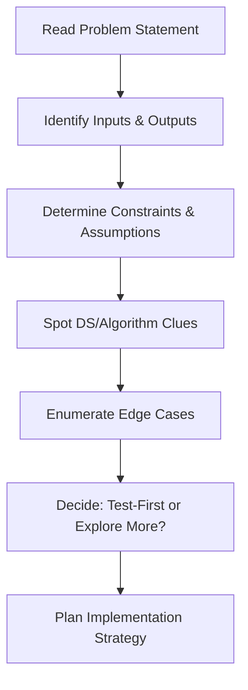
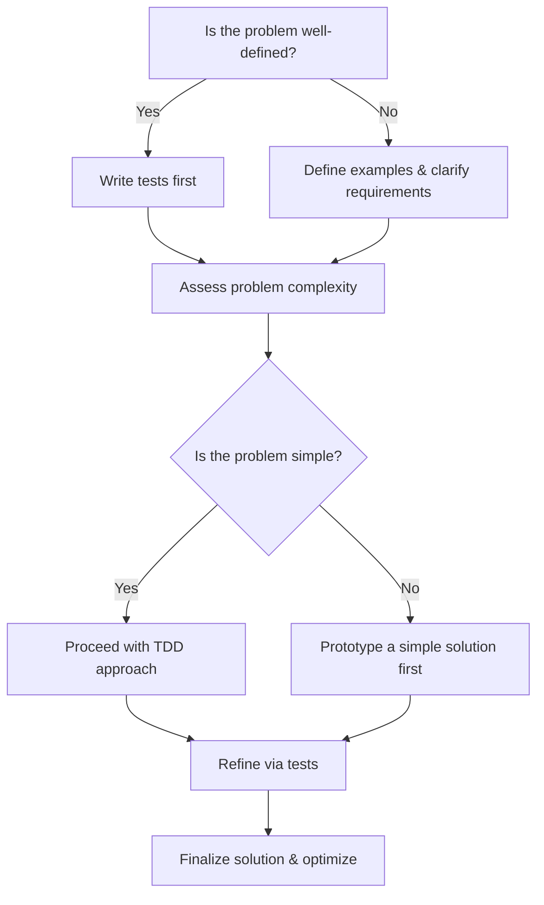
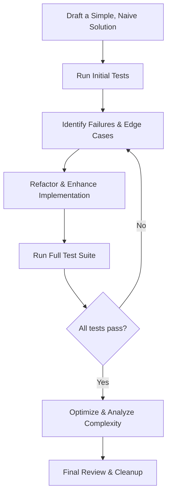
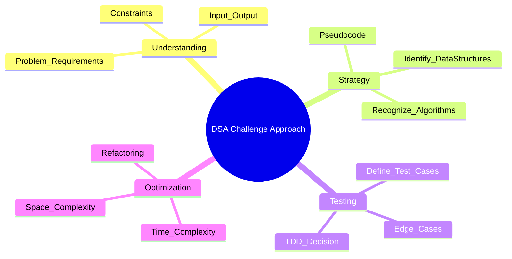
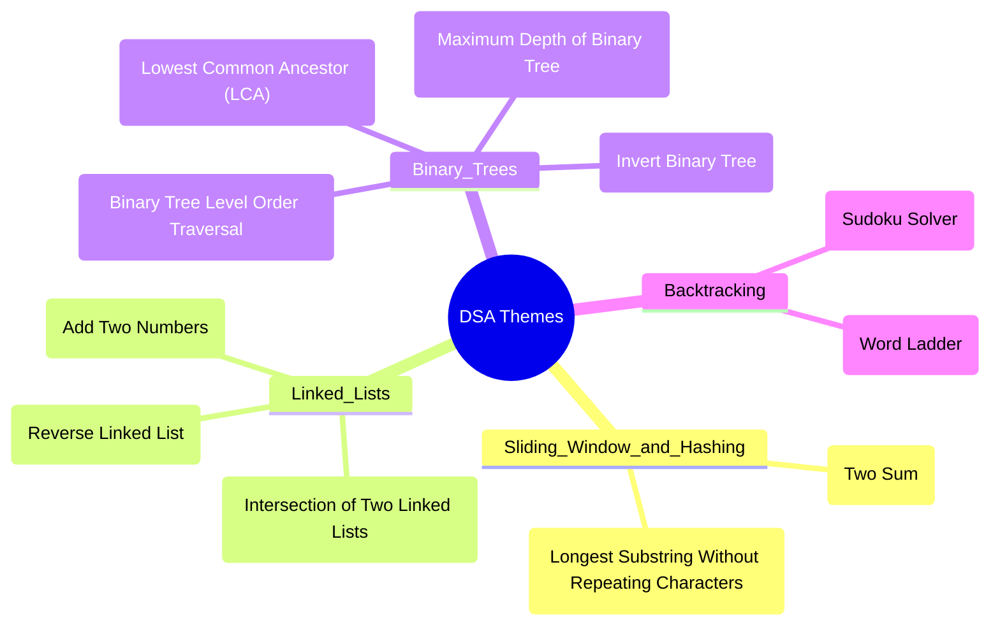
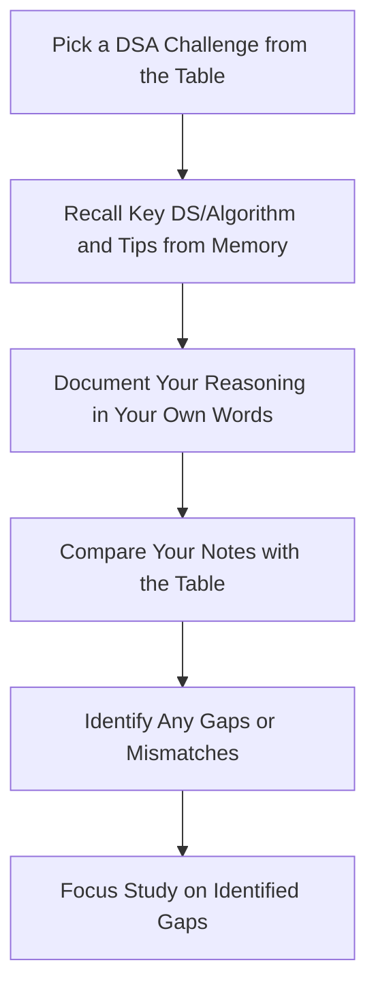

# Alphonso Woodbury  
**USA | 937-286-6928 | alphonso.woodbury@icloud.com |** [GitHub](https://github.com/alphiephalphie) | [LinkedIn](https://www.linkedin.com/in/alphonsowoodbury)  
---
## **Senior Software Engineer - Data Platform**  
*Data platform engineer with **6+ years of experience** designing **scalable data ingestion systems and self-service infrastructure.** Deep expertise in **source-agnostic architectures, data governance, and automated workflows** delivering platform objectives ahead of schedule and under budget. Built **extensible frameworks supporting S3, API, and Snowflake sources** while **transforming data capabilities across the enterprise** through self-service platform democratization. Experienced in **streamlining cloud migrations, implementing data quality frameworks, and democratizing platform capabilities** across enterprise organizations.
---
## **Technical Skills**  
- **Languages:** Python, Go, SQL, Bash  
- **Data Platforms:** Snowflake, Hadoop, ETL/ELT Pipelines, Data Lakes  
- **AWS:** Lambda, Step Functions, S3, DynamoDB, Glue, ECS, EC2  
- **Data Engineering:** Data Ingestion, Data Quality, Metadata Management  
- **ML/Feature Engineering:** TensorFlow, Keras, Feature Pipelines, Model Training Infrastructure  
- **DevOps:** Docker, Terraform, GitHub Actions, Jenkins, CI/CD  
- **Monitoring:** DataDog, Splunk, CloudWatch, Tableau Dashboards
---
## **Professional Experience**  
### **JPMorganChase**  
#### **Sr. Software Engineer, Data Acquisition (Founding Engineer)** | *02/2023 – Present*
- **Delivering platform objectives using only 30% of allocated budget** through cost-efficient serverless architecture (Lambda, ECS, Step Functions).
- **Engineered streamlined onboarding workflows** cutting integration time from **weeks to as few as 3 days**, enabling multiple high-priority applications to migrate to the cloud well within timeline through intelligent orchestration.
- **Architected source-agnostic ingestion framework** using **adapter pattern**, supporting **S3, REST API, and Snowflake Marketplace** integrations while maintaining **consistent data contracts** across all sources.
- **Built data governance framework** using **DynamoDB** and **S3** for schema management with **file-level lineage tracking**, ensuring **multi-file dataset completeness** and **exactly-once processing**.
- Empowered **potentially dozens of internal teams** to leapfrog **2.5 years of development** through our self-service APIs handling acquisition, processing, and publishing.
#### **Software Engineer II, Data Discovery (Founding Engineer)** | *11/2021 – 03/2023*  
- **Built metadata enrichment framework** for data catalog containing **150K+ datasets**, automating data discovery and governance workflows while improving data quality tracking.
- **Optimized data retrieval performance** by fine-tuning **Solr indexing**, achieving **sub-2 second query response times** while handling **millions of daily queries** across distributed systems.
- **Collaborated with multiple stakeholders** on data contract modeling, ensuring consistent data schemas and quality standards across diverse data sources.
#### **Software Engineer I, Data Delivery** | *11/2020 – 11/2021*  
- **Developed data pipelines to migrate datasets from Hadoop** to cloud data warehouse, establishing patterns for large-scale data movement and transformation.
- **Created comprehensive monitoring dashboards** using Tableau for data pipeline observability, delivering visibility into data quality metrics **6 months ahead of schedule**.
### **Humana Pharmacy**  
#### **Technical Analyst** | *06/2015 - 12/2019*  
- **Built operations processing workflows** using Sharepoint, scaling analytical capacity by **300%** while maintaining data quality standards.
- **Optimized data report generation**, eliminating **15% of redundant processes** and reducing processing time by **25%** through SQL query optimization.
---
## **Projects**
- **Turbo - Developer Productivity CLI:** Building **Go-based CLI tool** to accelerate data pipeline development by automating configuration generation and service discovery. Integrating **DynamoDB, API Gateway, and AWS services** to eliminate manual JSON configuration and reduce pipeline setup complexity. Implementing **comprehensive test coverage** including unit, integration, and e2e tests.
- **RxVision - ML Data Pipeline:** Built **end-to-end data pipeline for ML training**, automating collection and preprocessing of **131K medical images** from NIH database. Implemented **feature engineering pipeline** using TensorFlow/Keras, achieving **93% model accuracy** through optimized data augmentation strategies.
---
## **Education & Certifications**  
- **BA, Biological Sciences** – Wright State University  
- **AWS Certifications:** Solutions Architect Associate, Developer Associate

# Alphonso Woodbury
**USA | 937-286-6928 | alphonso.woodbury@icloud.com |** [GitHub](https://github.com/alphiephalphie) | [LinkedIn](https://www.linkedin.com/in/alphonsowoodbury)
---
# Software Engineer III
*Senior Associate (602) with **6+ years of experience** designing **scalable infrastructure systems and self-service platforms** that enable engineering teams to focus on business value rather than operational complexity. Founding engineer who has **built platforms from zero that eliminate years of development overhead** while delivering enterprise-scale reliability at **70% under traditional costs**. Deep expertise in **Infrastructure as Code, serverless architecture, and developer experience platforms** that transform technical constraints into competitive advantages.*
---
# **Technical Skills**
- **Languages:** Python, Java, Go, SQL, Bash
- **Platform Engineering:** Infrastructure as Code (IaC), Self-Service APIs
- **AWS:** Lambda, Step Functions, S3, DynamoDB, Glue, SQS, API Gateway, ECS, EC2
- **Cloud Infrastructure:** Kubernetes/EKS, Container Orchestration, Hybrid Cloud Integration
- **DevOps:** Docker, Terraform, GitHub Actions, Jenkins, CI/CD
- **Monitoring:** DataDog, Splunk, CloudWatch, Tableau Dashboards
---
# **Professional Experience**
### **JPMorganChase**
#### **Sr. Software Engineer, Data Acquisition (Founding Engineer)** | *02/2023 – Present*
- **Delivering platform objectives using only 30% of allocated budget** through cost-efficient serverless architecture (Lambda, ECS, Step Functions)
- **Engineered streamlined onboarding workflows** cutting integration time from **weeks to as few as 3 days**, enabling multiple high-priority applications to migrate to the cloud well within timeline through intelligent orchestration
- **Architected source-agnostic ingestion framework** using **adapter pattern**, supporting **S3, REST API, and Snowflake Marketplace** integrations while maintaining **consistent data contracts** across all sources
- **Built data governance framework** using **DynamoDB** and **S3** for schema management with **file-level lineage tracking**, ensuring **multi-file dataset completeness** and **exactly-once processing**
- Empowered **potentially dozens of internal teams** to leapfrog **2.5 years of development** through our self-service APIs handling acquisition, processing, and publishing
#### **Software Engineer II, Data Discovery (Founding Engineer)** | *11/2021 – 03/2023*
- **Built metadata enrichment framework** for data catalog containing **150K+ datasets**, automating data discovery and governance workflows while improving data quality tracking
- **Optimized data retrieval performance** by fine-tuning **Solr indexing**, achieving **sub-2 second query response times** while handling **millions of daily queries** across distributed systems
- **Collaborated with multiple stakeholders** on data contract modeling, ensuring consistent data schemas and quality standards across diverse data sources
#### **Software Engineer I, Data Delivery** | *11/2020 – 11/2021*
- **Developed data pipelines to migrate datasets from Hadoop** to cloud data warehouse, establishing patterns for large-scale data movement and transformation
- **Created comprehensive monitoring dashboards** using Tableau for data pipeline observability, delivering visibility into data quality metrics **6 months ahead of schedule**
### **Humana Pharmacy**
#### **Technical Analyst** | *06/2015 - 12/2019*
- **Built operations processing workflows** using Sharepoint, scaling analytical capacity by **300%** while maintaining data quality standards
- **Optimized data report generation**, eliminating **15% of redundant processes** and reducing processing time by **25%** through SQL query optimization
---
# **Projects**
**RxVision - ML Data Pipeline:** Built **end-to-end data pipeline for ML training**, automating collection and preprocessing of **131K medical images** from NIH database. Implemented **feature engineering pipeline** using TensorFlow/Keras, achieving **93% model accuracy** through optimized data augmentation strategies.
---
# **Education & Certifications**
- **BA, Biological Sciences** – Wright State University
- **AWS Certifications:** Solutions Architect Associate, Developer Associate

# Alphonso Woodbury
**USA | 937-286-6928 | alphonso.woodbury@icloud.com |** [GitHub](https://github.com/alphonsowoodbury) | [LinkedIn](https://www.linkedin.com/in/alphonsowoodbury)
---
## **Senior Software Engineer - Infrastructure Platforms**
*Platform engineer with **6+ years of experience** architecting **scalable infrastructure systems and self-service platforms** that enable engineering teams to focus on business value rather than operational complexity. Founding engineer who has **built enterprise platforms from zero** delivering Infrastructure as a Service (IaaS) solutions that **eliminate years of development overhead** while operating at **70% under traditional costs** through serverless and cloud-native architectures. Deep expertise in **Infrastructure as Code, distributed systems design, and developer experience platforms** that transform technical constraints into competitive advantages.*
---
## **Technical Skills**
- **Languages:** Python, Java, Go, SQL, Bash
- **Platform Engineering:** Event-Driven Architecture, Serverless Design, Self-Service APIs, Developer Experience 
- **AWS:** Lambda, Step Functions, S3, DynamoDB, Glue, SQS, API Gateway, ECS, EC2, CloudFormation
- **Cloud Infrastructure:** Containerization (Kubernetes/EKS/ECS)
- **DevOps & IaC:** Docker, Terraform, Ansible, GitHub Actions, Jenkins, Infrastructure Automation
- **Monitoring & Observability:** DataDog, Splunk, CloudWatch, Enterprise Dashboards, Performance Analytics
---
## **Professional Experience**
### **JPMorganChase**
#### **Sr. Software Engineer, Infrastructure Platforms (Founding Engineer)** | *02/2023 – Present*
- **Architected Infrastructure as a Service (IaaS) platform** processing **250GB+ enterprise workloads** with exactly-once guarantees, enabling **self-service infrastructure provisioning** that allows business teams to **bypass 2.5 years of traditional development** while operating at **70% under allocated budget** through cost-efficient serverless architecture design.
- **Engineered Infrastructure as Code (IaC) framework** using **DynamoDB-driven configuration management** that reduced infrastructure provisioning from weeks to **same-day deployments** through intelligent abstraction of environment complexity and automated resource management.
- **Managed EKS cluster operations** for production infrastructure services, implementing **Kubernetes-based container orchestration** and **infrastructure scaling** to support enterprise application deployment and management workflows.
- **Designed unified platform API interface** abstracting infrastructure complexity through **(service, environment)** parameters, eliminating need for developers to understand VPCs, security groups, or environment-specific configurations, **democratizing infrastructure access for dozens of internal teams**.
- **Built enterprise CI/CD systems** integrating **Step Functions orchestration** with automated testing, monitoring, and deployment pipelines, ensuring infrastructure reliability and security compliance across development lifecycle.
#### **Software Engineer II, Platform Infrastructure (Founding Engineer)** | *11/2021 – 03/2023*
- **Engineered enterprise platform infrastructure** supporting **150K+ applications and services** with **sub-2 second response performance** across **millions of daily operations**, proving platform architecture could scale to enterprise volumes through optimized indexing and distributed systems design.
- **Managed EKS cluster infrastructure** for full-stack platform management applications, implementing **Kubernetes orchestration** and **Terraform-based Infrastructure as Code** for automated container deployment, scaling, and resource management.
- **Architected infrastructure governance framework** enabling consistent security and compliance standards across diverse enterprise infrastructure resources, establishing organizational patterns for **automated policy enforcement** that eliminated manual configuration overhead for development teams.
#### **Software Engineer I, Infrastructure Delivery** | *11/2020 – 11/2021*
- **Proactively identified infrastructure observability gaps** and independently **built comprehensive monitoring dashboard platform** for enterprise operations, delivering production infrastructure visibility **6 months ahead of schedule** through self-directed problem identification and automated solution delivery.
- **Developed infrastructure migration pipelines** automating large-scale resource movement from legacy systems to cloud infrastructure, establishing patterns for enterprise infrastructure modernization and transformation.
---
## **Education & Certifications**
- **BA, Biological Sciences** – Wright State University
- **AWS Certifications:** Solutions Architect Associate, Developer Associate

# Alphonso Woodbury
**USA | 937-286-6928 | alphonso.woodbury@icloud.com | [GitHub](https://github.com/alphiephalphie) | [LinkedIn](https://www.linkedin.com/in/alphonsowoodbury/)**

## Senior Data Engineer

Dear Suno Hiring Team,

For 20+ years, I've built data infrastructure while producing music, exactly what your Data Engineer role needs. I've scaled data systems from 0 to 1, built ETL pipelines with Python/SQL, and delivered projects using 30% of budget through efficient AWS architectures.

I have hands-on experience with Airflow, DBT, and cloud warehousing. More importantly, I've produced music as a hobbyist since 2001 across multiple DAWs and understand the creative workflows your platform serves. When you need someone to collaborate with ML engineers and define data requirements, I can bridge technical implementation with genuine musical knowledge.

Suno's mission of democratizing music creation resonates with me. I want to help build the data foundation that scales this vision for millions of creators.

Let's talk about how I can contribute to your founding team.

Thank you,  
**Alphonso Woodbury**

# Alphonso Woodbury
**USA | 937-286-6928 | alphonso.woodbury@icloud.com** | [GitHub](https://github.com/alphiephalphie) | [LinkedIn](https://www.linkedin.com/in/alphonsowoodbury/)
## Senior Python Engineer
*Python engineer with **6+ years of experience** building **scalable backend systems and APIs** that serve millions of users daily. Proven track record of **delivering federal-scale reliability** through event-driven architecture and serverless design patterns. Deep expertise in **FastAPI-compatible systems, async programming, and cloud-native development** that transforms complex requirements into maintainable, high-performance solutions.*
---
## Technical Skills
* **Languages & Frameworks:** Python, SQL, Bash, RESTful API Design, Async Programming
* **Backend Systems:** Event-Driven Architecture, Microservices, API Gateway, Configuration Management  
* **AWS:** Lambda, Step Functions, S3, DynamoDB, ECS, Fargate, API Gateway, CloudWatch
* **Data & Testing:** ETL/ELT Pipelines, Data Validation, System Testing, Test-Driven Development
* **DevOps & Agile:** Docker, Terraform, GitHub Actions, CI/CD, Agile/Scrum Methodologies
* **Monitoring & Observability:** DataDog, Splunk, CloudWatch, Performance Testing, JMeter
---
## Professional Experience
### JPMorganChase
**Sr. Software Engineer, External Data Acquisition** | *02/2023 – Present*
- **Built Python-based API platform** processing **250GB+ daily workflows** with **99.9% uptime**, serving enterprise users through **RESTful endpoints** that abstract complex backend operations into simple **(dataset, business_date)** parameter calls.
- **Designed async processing systems** using **AWS Lambda and Step Functions** that reduced integration time from weeks to **same-day deployments**, enabling rapid onboarding of high-priority federal-scale applications.
- **Implemented comprehensive system testing framework** with **automated validation pipelines** ensuring exactly-once processing guarantees and data integrity across **multi-environment deployments** (dev/test/prod).
- **Delivered platform objectives using only 30% of allocated budget** through **cost-efficient serverless architecture**, demonstrating strong self-motivation and initiative in resource optimization.
**Software Engineer II, Data Marketplace** | *11/2021 – 03/2023*
- **Built backend APIs serving 150K+ datasets** with **sub-2 second response times** across **millions of daily queries**, implementing **performance optimization strategies** and **distributed caching** for enterprise-scale operations.
- **Collaborated with cross-functional stakeholders** including cybersecurity, architecture, and governance teams to establish **API design standards** and **data contracts** ensuring consistent integration patterns.
- **Implemented comprehensive monitoring and alerting** using **DataDog and CloudWatch**, providing real-time visibility into system performance and proactive issue detection.
**Software Engineer I, Data Delivery** | *11/2020 – 11/2021*
- **Developed Python-based ETL pipelines** migrating datasets from legacy systems to **cloud infrastructure**, establishing patterns for large-scale data processing and transformation.
- **Created automated testing suites** and **CI/CD pipelines** using **GitHub Actions**, delivering monitoring solutions **6 months ahead of schedule**.
---
## Key Projects & Federal-Scale Impact

**External Data Acquisition Platform**: As **Delegate Application Owner**, led development of mission-critical Python platform enabling **accelerated government data publishing**. **Collaborated professionally with federal stakeholders** and contract team members to deliver reliable, secure data flows supporting **millions of Americans' daily operations**.

**Predictive Incident Management**: Developed **Python-based incident management system** using **containerized deployment on AWS ECS**, now integrated into enterprise operations. Demonstrated ability to **take initiative** and deliver **detail-oriented solutions** under tight deadlines.

**AWS Certification Mentor**: **Self-motivated leadership** helping **45+ engineers** achieve AWS certifications, focusing on **serverless best practices** and **API design patterns** – demonstrating collaborative team player approach.

---

## Education & Certifications
* **BA, Biological Sciences** – Wright State University  
* **AWS Certifications**: Solutions Architect Associate, Developer Associate# Alphonso Woodbury
**USA | 937-286-6928 | alphonso.woodbury@icloud.com |** [GitHub](https://github.com/alphiephalphie) | [LinkedIn](https://www.linkedin.com/in/alphonsowoodbury)
## Senior Data Engineer

Dear Hiring Manager,

For 20+ years, I've worked at the intersection of music production and data engineering. This is exactly what your Audio ML Research role requires. I've maintained a parallel career in music production, understanding firsthand the creative workflows your AI tools need to enhance.

As a data engineer, I've built the exact infrastructure this role demands: source-agnostic ingestion frameworks supporting S3/API integrations, data governance systems with schema management and file-level lineage tracking, and serverless pipelines ensuring exactly-once processing. I delivered platform objectives using only 30% of allocated budget through cost-efficient AWS architectures.

What sets me apart is genuine musical expertise. I've produced music since 2001 across multiple DAWs, understand sampling rates and audio formats, and know the creative pain points that AI should solve. This comes from lived experience using Native Instruments and other vendors' products, not from research.

This role requires someone who can "actively curate and shape the sonic character of datasets." I understand this means preserving the musical DNA that makes AI models inspiring rather than generic. My data engineering experience combined with deep production knowledge positions me to build datasets that serve both technical requirements and creative vision.

I'd like to talk with you about how I work on high-performing teams, solve technical challenges, and advocate for creators. Please let me know when we can connect at your earliest convenience.

Thank you, 
**Alphonso Woodbury**


# Alphonso Woodbury
**USA | 937-286-6928 | alphonso.woodbury@icloud.com |** [GitHub](https://github.com/alphiephalphie) | [LinkedIn](https://www.linkedin.com/in/alphonsowoodbury)
## Senior Data Engineer
Data platform engineer with 6+ years of experience designing scalable data ingestion systems and self-service infrastructure, combined with 20+ years of music production expertise. Deep expertise in source-agnostic architectures, data governance, and automated workflows for ML-ready datasets. Built extensible frameworks supporting S3, API, and Snowflake sources while transforming data capabilities across enterprise organizations. Passionate about bridging technical excellence with musical creativity to build the future of audio AI.
---
## Technical Skills
- **Languages:** Python, SQL, Bash
- **Data Platforms:** Snowflake, Hadoop, ETL/ELT Pipelines, Data Lakes
- **AWS:** Lambda, Step Functions, S3, DynamoDB, Glue, ECS, EC2
- **Data Management:** Data Quality, Metadata Management, Dataset Versioning
- **ML/Feature Engineering:** TensorFlow, Keras, Feature Pipelines, Model Training
- **DevOps:** Docker, Terraform, GitHub Actions, Jenkins, CI/CD
- **Monitoring:** DataDog, Splunk, CloudWatch, Tableau Dashboards
---
## Professional Experience
### JPMorganChase
**Sr. Software Engineer, Data Acquisition (Founding Engineer) | 02/2023 – Present**
* **Architected source-agnostic ingestion framework** using adapter pattern, supporting S3, REST API, and Snowflake Marketplace integrations while maintaining consistent data contracts across all sources - ideal foundation for ingesting diverse audio libraries and formats
* **Built comprehensive data governance framework** using DynamoDB and S3 for schema management with file-level lineage tracking, ensuring multi-file dataset completeness and exactly-once processing - critical for ML dataset reproducibility and audio data integrity
* **Empowered potentially dozens of internal teams** to leapfrog 2.5 years of development through self-service APIs handling acquisition, processing, and publishing - experience directly applicable to enabling research teams with self-serve audio dataset tools
**Software Engineer II, Data Discovery (Founding Engineer) | 11/2020 – 03/2023**
* **Built metadata enrichment framework** for data catalog containing 150K+ datasets, automating data discovery and governance workflows while improving data quality tracking - experience applicable to managing vast audio libraries with rich metadata
* Optimized data retrieval performance by fine-tuning Solr indexing, achieving sub-2 second query response times while handling millions of daily queries across distributed systems
----
## Key Projects
**RxVision - ML Data Pipeline:** Built end-to-end data pipeline for ML training, automating collection and preprocessing of 131K medical images from NIH database. Implemented feature engineering pipeline using TensorFlow/Keras, achieving 93% model accuracy through optimized data augmentation strategies - experience directly applicable to audio dataset processing and augmentation.
- **Data Pipeline Engineering:** Architected complete data ingestion and preprocessing workflow from raw NIH datasets through model-ready training/validation splits
- **Transfer Learning Implementation:** Successfully applied pre-trained CNN architectures (VGG16) to domain-specific image classification, demonstrating ability to adapt existing models to specialized datasets
- **Model Performance Analysis:** Identified and documented real-world vs validation accuracy gaps, providing foundation for iterative model improvement strategies
---
## Music Production & Audio Experience
**Self-Taught Music Producer | 2001 – Present**
* **20+ years of hands-on experience** with digital audio workstations (Magix, Logic Pro, Ableton, Maschine), VST plugins, synthesizers, and audio processing - deep understanding of sampling rates, audio formats, and quality measures
* **Extensive knowledge of music production workflows** including MIDI programming, audio recording, mixing, and mastering using industry-standard tools
* **Understanding of creative constraints and pain points** that audio AI tools should solve, providing user-centered perspective for dataset curation and model development
* **Experience with audio automation and scripting** within DAW environments, directly applicable to programmatically controlling VSTs and instruments for training data generation
---
## Education & Certifications
* **BA, Biological Sciences** – Wright State University
* **AWS Certifications:** Solutions Architect Associate, Developer Associate

# Alphonso Woodbury
**USA | 937-286-6928 | alphonso.woodbury@icloud.com |** ~[GitHub](https://github.com/alphiephalphie)~ | ~[LinkedIn](https://www.linkedin.com/in/alphonsowoodbury/)~
## Senior Platform Engineer
*Platform engineer with **6+ years of experience** architecting **event-driven data systems and self-service infrastructure** that enable engineering teams to focus on business value rather than operational complexity. Founding engineer who has **built platforms from zero that eliminate years of development overhead** while delivering enterprise-scale reliability at **70% under traditional costs**. Deep expertise in **serverless architecture, distributed systems design, and organizational-scale abstractions** that transform technical constraints into competitive advantages.*
---
## Technical Skills
* **Languages & Frameworks:** Python, Java, SQL, Bash, Go
* **Platform Engineering:** Event-Driven Architecture, Serverless Design, Configuration Management, API Design
- **AWS:** Lambda, Step Functions, S3, DynamoDB, Glue, SQS, API Gateway, ECS, EC2
- **Data Infrastructure:** Snowflake, ETL/ELT Pipelines, Data Lakes, Metadata Management, Data Governance
- **Systems & DevOps:** Docker, Terraform, GitHub Actions, Jenkins, CI/CD, Infrastructure as Code
- **Monitoring & Observability:** DataDog, Splunk, CloudWatch, Tableau Dashboards
---
## Professional Experience
### JPMorganChase
**Sr. Software Engineer, External Data Acquisition** | *02/2023 – Present*
- **Architected event-driven data platform** processing **250GB+ workflows** with exactly-once guarantees, enabling **data lake ingestion infrastructure** that allows business teams to **bypass 2.5 years of traditional development** while operating at **70% under allocated budget** through serverless design patterns.
- **Engineered singleton processing patterns** and **DynamoDB-driven configuration framework** that reduced integration complexity from weeks to **same-day deployments** through intelligent abstraction of infrastructure details.
- **Managed EKS cluster operations** for production data platform services, implementing **Kubernetes-based container orchestration** and **infrastructure scaling** to support enterprise data processing workflows.
- **Designed unified API interface** abstracting environment complexity from **(dataset, business_date)** parameters, eliminating need for consumers to understand schemas, buckets, VPCs, or environment-specific configurations across dev/test/prod. 
⠀**Software Engineer II, Data Marketplace** | *11/2021 – 03/2023*
* **Performed comprehensive JMeter performance validation** of metadata platform processing **150K+ datasets** with **sub-2 second query performance** across **millions of daily operations**, proving application architecture could scale to enterprise data volumes through optimized **Solr indexing** and distributed systems design.
- **Managed EKS cluster infrastructure** for full-stack catalog management application, implementing **Kubernetes orchestration** and **Terraform-based infrastructure as code** for containerized application deployment and scaling.
⠀**Software Engineer I, Data Delivery** | *11/2020 – 11/2021*
* Designed and deployed **Tableau dashboards** for monitoring data pipeline performance, delivering the solution **6 months ahead of schedule** and under budget
---
## Key Projects & Leadership
* **External Data Acquisition Platform**: As **Delegate Application Owner**, led cross-functional development with cybersecurity, architecture, and governance teams to deliver a cost-effective solution for accelerated cloud publishing. Established data validation and monitoring protocols ensuring reliable data flows across multi-region deployments.
* **Predictive Incident Management (Hackathon21)**: Led development of a Python-based predictive incident management application, now integrated into the enterprise **LLM**. Built containerized solution using Docker and AWS ECS for seamless deployment.
* **RxVision (Personal Project)**: Developed a **TensorFlow-based computer vision model** for medication identification, implementing CNN and VGG16 transfer learning architectures. Created automated data pipeline for **NIH dataset retrieval and processing**. Optimized model training workflows and image processing for improved inference performance.
* **AWS Certification Mentor**: Facilitated sessions helping **45 engineers** achieve AWS Developer Certification, focusing on serverless architecture best practices and microservices patterns.
---
## Education & Certifications
* **BA, Biological Sciences** – Wright State University (*Statistical Analysis, Bioinformatics*)
* **Data Science Technical Diploma** – Flatiron School (*Data Modeling, Deep Learning, CRISP-DM*)
* **AWS Certifications**: Solutions Architect Associate, Developer Associate

# Alphonso Woodbury
**USA | 937-286-6928 | alphonso.woodbury@icloud.com |** [GitHub](https://github.com/alphiephalphie) | [LinkedIn](https://www.linkedin.com/in/alphonsowoodbury)
---
## **Senior Platform Engineer - Data Infrastructure**
*Platform engineer with **6+ years of experience** architecting **event-driven data systems and self-service infrastructure** that enable engineering teams to focus on business value rather than operational complexity. Founding engineer who has **built platforms from zero that eliminate years of development overhead** while delivering enterprise-scale reliability at **70% under traditional costs**. Deep expertise in **serverless architecture, distributed systems design, and organizational-scale abstractions** that transform technical constraints into competitive advantages.*
---
## **Technical Skills**
- **Languages:** Python, Go, SQL, Bash
- **Platform Engineering:** Event-Driven Architecture, Serverless Design, Configuration Management, API Design
- **AWS:** Lambda, Step Functions, S3, DynamoDB, Glue, SQS, API Gateway, ECS, EC2
- **Data Infrastructure:** Snowflake, ETL/ELT Pipelines, Data Lakes, Metadata Management, Data Governance
- **Systems & DevOps:** Docker, Terraform, GitHub Actions, Jenkins, CI/CD, Infrastructure as Code
- **Monitoring & Observability:** DataDog, Splunk, CloudWatch, Tableau Dashboards
---
## **Professional Experience**
### **JPMorganChase**
#### **Sr. Software Engineer, Data Acquisition (Founding Engineer)** | *02/2023 – Present*
- **Architected event-driven data platform** processing **250GB+ workflows** with exactly-once guarantees, enabling **data lake ingestion infrastructure** that allows business teams to **bypass 2.5 years of traditional development** while operating at **70% under allocated budget** through serverless design patterns.
- **Engineered singleton processing patterns** and **DynamoDB-driven configuration framework** that reduced integration complexity from weeks to **same-day deployments** through intelligent abstraction of infrastructure details.
- **Managed EKS cluster operations** for production data platform services, implementing **Kubernetes-based container orchestration** and **infrastructure scaling** to support enterprise data processing workflows.
- **Designed unified API interface** abstracting environment complexity from **(dataset, business_date)** parameters, eliminating need for consumers to understand schemas, buckets, VPCs, or environment-specific configurations across dev/test/prod.
#### **Software Engineer II, Data Discovery (Founding Engineer)** | *11/2021 – 03/2023*
- **Performed comprehensive JMeter performance validation** of metadata platform processing **150K+ datasets** with **sub-2 second query performance** across **millions of daily operations**, proving application architecture could scale to enterprise data volumes through optimized **Solr indexing** and distributed systems design.
- **Managed EKS cluster infrastructure** for full-stack catalog management application, implementing **Kubernetes orchestration** and **Terraform-based infrastructure as code** for containerized application deployment and scaling.
- **Architected data contract modeling framework** enabling consistent schemas and quality standards across diverse enterprise data sources, establishing organizational patterns for **stakeholder-driven governance** that eliminated integration friction for downstream consumers.
#### **Software Engineer I, Data Delivery** | *11/2020 – 11/2021*
- **Proactively identified operational visibility gaps** and independently **built comprehensive Tableau monitoring dashboard** for counterparty tagging operations, delivering production system **6 months ahead of schedule** through self-directed problem identification and solution delivery.
### **Humana Pharmacy**
#### **Technical Analyst** | *06/2015 - 12/2019*
- **Resolved critical shipping operations issue** affecting compliance and reporting that was blocking **$1.5M software upgrade**, delivering targeted technical solutions that eliminated need for expensive platform replacement while maintaining operational continuity.
- **Refactored SQL Server reporting infrastructure** eliminating **15% of redundant processes** and reducing handling time by **25%**, freeing technical support resources for higher-value operational tasks through systematic optimization.
- **Scaled grievance workflow operations** from individual processes to **20-analyst team capacity** through **custom database architecture**, achieving **300% capacity increase** while maintaining data quality standards across pharmacy operations.
---
## **Projects**
- **Turbo - Developer Productivity CLI:** Architecting **Go-based CLI platform** that accelerates data pipeline development by automating configuration generation and service discovery. Integrating **DynamoDB, API Gateway, and AWS services** to eliminate manual JSON configuration complexity and reduce pipeline setup overhead through intelligent automation.
- **RxVision - ML Infrastructure Platform:** Built **end-to-end data pipeline** automating collection and preprocessing of **131K medical images** from NIH database. Implemented **feature engineering pipeline** using TensorFlow/Keras achieving **93% model accuracy** through optimized data augmentation strategies and scalable training infrastructure.
---
## **Education & Certifications**
- **BA, Biological Sciences** – Wright State University
- **AWS Certifications:** Solutions Architect Associate, Developer Associate 

# Alphonso Woodbury
**USA | 937-286-6928 | alphonso.woodbury@icloud.com |** [GitHub](https://github.com/alphiephalphie) | [LinkedIn](https://www.linkedin.com/in/alphonsowoodbury)
---
## **Senior Platform Engineer - Data, AI**
*Platform engineer with **6+ years of experience** architecting **event-driven data systems and self-service infrastructure** that enable engineering teams to focus on business value rather than operational complexity. Founding engineer who has **built platforms from zero that eliminate years of development overhead** while delivering enterprise-scale reliability at **70% under traditional costs**. Deep expertise in **serverless architecture, distributed systems design, and organizational-scale abstractions** that transform technical constraints into competitive advantages.*
---
## **Technical Skills**
- **Languages:** Python, Go, SQL, Bash
- **Platform Engineering:** Event-Driven Architecture, Serverless, Containers, API Design
- **AWS:** Lambda, Step Functions, S3, DynamoDB, Glue, SQS, API Gateway, ECS, EC2
- **Data Infrastructure:** Snowflake, ETL/ELT Pipelines, Data Lakes, Management, Governance
- **Systems & DevOps:** Docker, Terraform, Jenkins, CI/CD, Infra as Code
- **Monitoring & Observability:** DataDog, Splunk, CloudWatch, Tableau Dashboards
---
## **Professional Experience**
### **JPMorganChase**
#### **Sr. Software Engineer, Data Acquisition (Founding Engineer)** | *02/2023 – Present*
- **Architected event-driven data platform** processing **250GB+ workflows** with exactly-once guarantees, enabling **AI/ML-ready data infrastructure** that allows business teams to **bypass 2.5 years of traditional development** while operating at **70% under allocated budget** through serverless design patterns.
- **Engineered singleton processing patterns** and **DynamoDB-driven configuration framework** that reduced integration complexity from weeks to **same-day deployments** through intelligent abstraction of infrastructure details.
- **Managed EKS cluster operations** for production data platform services, implementing **Kubernetes-based container orchestration** and **infrastructure scaling** to support enterprise data processing workflows.
- **Designed unified API interface** abstracting environment complexity from **(dataset, business_date)** parameters, eliminating need for consumers to understand schemas, buckets, VPCs, or environment-specific configurations across dev/test/prod.
#### **Software Engineer II, Data Discovery (Founding Engineer)** | *11/2021 – 03/2023*
- **Performed comprehensive JMeter performance validation** of metadata platform processing **150K+ datasets** with **sub-2 second query performance** across **millions of daily operations**, proving application architecture could scale to enterprise data volumes through optimized **Solr indexing** and distributed systems design.
- **Managed EKS cluster infrastructure** for full-stack catalog management application, implementing **Kubernetes orchestration** and **Terraform-based infrastructure as code** for containerized application deployment and scaling.
#### **Software Engineer I, Data Delivery** | *11/2020 – 11/2021*
- **Proactively identified operational visibility gaps** and independently **built comprehensive Tableau monitoring dashboard** for counterparty tagging operations, delivering production system **6 months ahead of schedule** through self-directed problem identification and solution delivery.
### **Humana Pharmacy**
#### **Technical Analyst** | *06/2015 - 12/2019*
- **Resolved critical shipping operations issue** affecting compliance and reporting that was blocking **$1.5M software upgrade**, delivering targeted technical solutions that eliminated need for expensive platform replacement while maintaining operational continuity.
- **Refactored SQL Server reporting infrastructure** eliminating **15% of redundant processes** and reducing handling time by **25%**, freeing technical support resources for higher-value operational tasks through systematic optimization.
 ---
## **Projects**
- **RxVision - ML Infrastructure Platform:** Built **end-to-end data pipeline** automating collection and preprocessing of **131K medical images** from NIH database. Implemented **feature engineering pipeline** using TensorFlow/Keras achieving **93% model accuracy** through optimized data augmentation strategies and scalable training infrastructure.
---
## **Education & Certifications**
- **BA, Biological Sciences** – Wright State University
- **AWS Certifications:** Solutions Architect Associate, Developer Associate

# Alphonso Woodbury
**USA | 937-286-6928 | alphonso.woodbury@icloud.com |** [GitHub](https://github.com/alphiephalphie) | [LinkedIn](https://www.linkedin.com/in/alphonsowoodbury)
---
## **Sr. Associate Engineer - Data & AI Infrastructure**
*Cloud-native platform engineer with **6+ years** building **high-performance data and AI infrastructure** that enable engineering teams to focus on business value rather than operational complexity. Founding engineer who has **built platforms from zero that eliminate years of development overhead** while delivering enterprise-scale reliability at **70% under traditional costs**. Deep expertise in **serverless architecture, distributed systems design, and AI-ready data infrastructure** that transform technical constraints into competitive advantages.*
---
## **Technical Skills**
- **Languages & Frameworks:** Python, Swift, SQL, Bash, Terraform, TensorFlow
- **AI/ML & Platform Engineering:** Machine Learning, LLM Integration, Event-Driven Architecture, Serverless Design, API Design
- **Cloud:** AWS (Lambda, Step Functions, API Gateway, DynamoDB, ECS/EKS, Athena)
- **Data & AI Engineering:** Snowflake, Databricks, ETL Pipelines, Data Modeling, MLOps
- **Mobile & DevOps:** iOS Development, Docker, Kubernetes, Jenkins, Infrastructure as Code
- **Testing & Observability:** Grafana, DataDog, Splunk, pytest, Automated Testing
- **Privacy & Compliance:** KMS Encryption, PII/PCI Compliance, Data Governance
---
## **Professional Experience**
### **JPMorganChase**
#### **Sr. Software Engineer, Data Acquisition (Founding Engineer)** | *02/2023 – Present*
- **Architected event-driven data platform** processing **250GB+ workflows** with exactly-once guarantees, enabling **AI/ML-ready data infrastructure** that allows business teams to **bypass 2.5 years of pipeline development** while operating at **70% under allocated budget** through serverless design patterns.
- **Engineered singleton processing patterns** and **DynamoDB-driven configuration framework** that reduced integration complexity from weeks to **same-day deployments** through intelligent abstraction of infrastructure details.
- **Managed EKS cluster operations** for production data platform services, implementing **Kubernetes-based container orchestration** and **infrastructure scaling** to support enterprise data processing workflows.
- **Designed unified API interface** abstracting environment complexity from **(dataset, business_date)** parameters, eliminating need for consumers to understand schemas, buckets, VPCs, or environment-specific configurations across dev/test/prod.
#### **Software Engineer II, Data Discovery (Founding Engineer)** | *11/2021 – 03/2023*
- **Performed comprehensive JMeter performance validation** of metadata platform processing **150K+ datasets** with **sub-2 second query performance** across **millions of daily operations**, proving application architecture could scale to enterprise data volumes through optimized **Solr indexing** and distributed systems design.
- **Managed EKS cluster infrastructure** for full-stack catalog management application, implementing **Kubernetes orchestration** and **Terraform-based infrastructure as code** for containerized application deployment and scaling.
#### **Software Engineer I, Data Delivery** | *11/2020 – 11/2021*
- **Proactively identified operational visibility gaps** and independently **built comprehensive Tableau monitoring dashboard** for counterparty tagging operations, delivering production system **6 months ahead of schedule** through self-directed problem identification and solution delivery.
---
## **Projects**
- **Chronikle - AI-Powered iOS Application:** Built **iOS app** using **Swift** with **OpenAI API integration** for automated content generation. Implemented **LLM workflows** for documentation and content creation, demonstrating **mobile AI application development** and **API orchestration** for improved user experiences.
- **RxVision - ML Infrastructure Platform:** Built **end-to-end data pipeline** automating collection and preprocessing of **131K medical images** from NIH database. Implemented **feature engineering pipeline** using **TensorFlow/Keras** achieving **93% model accuracy** through optimized data augmentation strategies and scalable training infrastructure.
- **Turbo - Developer Productivity CLI:** Architecting **Go-based CLI platform** that accelerates data pipeline development by automating configuration generation and service discovery. Integrating **DynamoDB, API Gateway, and AWS services** to eliminate manual JSON configuration complexity and reduce pipeline setup overhead through intelligent automation.
---
## **Education & Certifications**
- **BA, Biological Sciences** – Wright State University
- **AWS Certifications:** Solutions Architect Associate, Developer Associate

# Alphonso Woodbury
USA | 937-286-6928 | alphonso.woodbury@icloud.com | ~[GitHub](https://github.com/alphiephalphie)~ | ~[LinkedIn](https://www.linkedin.com/in/alphonsowoodbury)~
# Senior Platform Engineer - Data, AI
Platform engineer with 6+ years of experience architecting event-driven data systems and self-service infrastructure that enable engineering teams to focus on business value rather than operational complexity. Founding engineer who has built platforms from zero that eliminate years of development overheadwhile delivering enterprise-scale reliability at 70% under traditional costs. Deep expertise in serverless architecture, distributed systems design, and organizational-scale abstractions that transform technical constraints into competitive advantages.
---
# Technical Skills
* **Languages:** Python, Go, SQL, Bash
* **Platform Engineering:** Event-Driven Architecture, Serverless Design, Configuration Management, API Design
* **AWS:** Lambda, Step Functions, S3, DynamoDB, Glue, SQS, API Gateway, ECS, EC2 
* **Data Infrastructure:** Snowflake, ETL/ELT Pipelines, Data Lakes, Metadata Management, Data Governance
* **Systems & DevOps:** Docker, Terraform, GitHub Actions, Jenkins, CI/CD, Infrastructure as Code
* **Monitoring & Observability:** DataDog, Splunk, CloudWatch, Tableau Dashboards
---
# Professional Experience
### JPMorganChase
**Sr. Software Engineer, Data Acquisition (Founding Engineer)** **|** ***02/2023 – Present***
* **Architected event-driven data platform** processing **250GB+ workflows** with exactly-once guarantees; Opened platform to business teams to **bypass 2.5 years of traditional development** while operating at **70% under allocated budget**through serverless design patterns.
* **Engineered singleton processing patterns** for high-volume S3 events, designing **configuration-driven orchestration** that reduced integration complexity from weeks to **same-day deployments** through intelligent abstraction of infrastructure details.
* **Designed unified API interface** abstracting environment complexity from **(dataset, business_date)** parameters, eliminating need for consumers to understand schemas, buckets, VPCs, or environment-specific configurations across dev/test/prod.
* **Developed data management framework** driven by **DynamoDB configurations** and **S3-based lineage tracking**, creating organizational standards for **multi-file dataset completeness** and compliance-ready processing workflows.
⠀**Software Engineer II, Data Discovery (Founding Engineer)** **|** ***11/2021 – 03/2023***
* **Built production metadata platform** processing **150K+ datasets** with **sub-2 second query performance** across **millions of daily operations**, proving application architecture could scale to enterprise data volumes through optimized **Solr indexing** and distributed systems design.
* **Architected data contract modeling framework** enabling consistent schemas and quality standards across diverse enterprise data sources, establishing organizational patterns for **stakeholder-driven governance** that eliminated integration friction for downstream consumers.
**Software Engineer I, Data Delivery** **|** ***11/2020 – 11/2021***
* **Proactively identified operational visibility gaps** and independently **built comprehensive Tableau monitoring dashboard** for counterparty tagging operations, delivering production system **6 months ahead of schedule** through self-directed problem identification and solution delivery.
---
# Projects
* **Turbo - Developer Productivity CLI:** Architecting **Go-based CLI platform** that accelerates data pipeline development by automating configuration generation and service discovery. Integrating **DynamoDB, API Gateway, and AWS services** to eliminate manual JSON configuration complexity and reduce pipeline setup overhead through intelligent automation.
* **RxVision - ML Infrastructure Platform:** Built **end-to-end data pipeline** automating collection and preprocessing of **131K medical images** from NIH database. Implemented **feature engineering pipeline** using TensorFlow/Keras achieving **93% model accuracy** through optimized data augmentation strategies and scalable training infrastructure.
---
# Education & Certifications
* **BA, Biological Sciences** – Wright State University
* **AWS Certifications:** Solutions Architect Associate, Developer Associate

[architecture.yaml](architecture.yaml)<!-- {"embed":"true"} -->

[project_overview.yaml](project_overview.yaml)<!-- {"embed":"true"} -->

[features.yaml](features.yaml)<!-- {"embed":"true"} -->

[architecture 2.yaml](architecture%202.yaml)<!-- {"embed":"true"} -->

# Alphonso Woodbury  
**USA | 937-286-6928 | alphonso.woodbury@icloud.com |** [GitHub](https://github.com/alphiephalphie) | [LinkedIn](https://www.linkedin.com/in/alphonsowoodbury)  
---
## **Senior Software Engineer - Data Platform**  <!-- {"fold":true} -->
*Data platform engineer with **6+ years of experience** designing **scalable data ingestion systems and self-service infrastructure.** Deep expertise in **source-agnostic architectures, data governance, and automated workflows** delivering platform objectives ahead of schedule and under budget. Built **extensible frameworks supporting S3, API, and Snowflake sources** while **transforming data capabilities across the enterprise** through self-service platform democratization. Experienced in **streamlining cloud migrations, implementing data quality frameworks, and democratizing platform capabilities** across enterprise organizations.
---*
## **Technical Skills**  
- **Languages:** Python, Go, SQL, Bash  
- **Data Platforms:** Snowflake, Hadoop, ETL/ELT Pipelines, Data Lakes  
- **AWS:** Lambda, Step Functions, S3, DynamoDB, Glue, ECS, EC2  
- **Data Engineering:** Data Ingestion, Data Quality, Metadata Management  
- **ML/Feature Engineering:** TensorFlow, Keras, Feature Pipelines, Model Training Infrastructure  
- **DevOps:** Docker, Terraform, GitHub Actions, Jenkins, CI/CD  
- **Monitoring:** DataDog, Splunk, CloudWatch, Tableau Dashboards
---
## **Professional Experience**  
### **JPMorganChase**  
#### **Sr. Software Engineer, Data Acquisition (Founding Engineer)** | *02/2023 – Present*
- **Delivering platform objectives using only 30% of allocated budget** through cost-efficient serverless architecture (Lambda, ECS, Step Functions).
- **Engineered streamlined onboarding workflows** cutting integration time from **weeks to as few as 3 days**, enabling multiple high-priority applications to migrate to the cloud well within timeline through intelligent orchestration.
- **Architected source-agnostic ingestion framework** using **adapter pattern**, supporting **S3, REST API, and Snowflake Marketplace** integrations while maintaining **consistent data contracts** across all sources.
- **Built data governance framework** using **DynamoDB** and **S3** for schema management with **file-level lineage tracking**, ensuring **multi-file dataset completeness** and **exactly-once processing**.
- Empowered **potentially dozens of internal teams** to leapfrog **2.5 years of development** through our self-service APIs handling acquisition, processing, and publishing.
#### **Software Engineer II, Data Discovery (Founding Engineer)** | *11/2021 – 03/2023*  
- **Built metadata enrichment framework** for data catalog containing **150K+ datasets**, automating data discovery and governance workflows while improving data quality tracking.
- **Optimized data retrieval performance** by fine-tuning **Solr indexing**, achieving **sub-2 second query response times** while handling **millions of daily queries** across distributed systems.
- **Collaborated with multiple stakeholders** on data contract modeling, ensuring consistent data schemas and quality standards across diverse data sources.
#### **Software Engineer I, Data Delivery** | *11/2020 – 11/2021*  
- **Developed data pipelines to migrate datasets from Hadoop** to cloud data warehouse, establishing patterns for large-scale data movement and transformation.
- **Created comprehensive monitoring dashboards** using Tableau for data pipeline observability, delivering visibility into data quality metrics **6 months ahead of schedule**.
### **Humana Pharmacy**  
#### **Technical Analyst** | *06/2015 - 12/2019*  
- **Built operations processing workflows** using Sharepoint, scaling analytical capacity by **300%** while maintaining data quality standards.
- **Optimized data report generation**, eliminating **15% of redundant processes** and reducing processing time by **25%** through SQL query optimization.
---
## **Projects**
- **Turbo - Developer Productivity CLI:** Building **Go-based CLI tool** to accelerate data pipeline development by automating configuration generation and service discovery. Integrating **DynamoDB, API Gateway, and AWS services** to eliminate manual JSON configuration and reduce pipeline setup complexity. Implementing **comprehensive test coverage** including unit, integration, and e2e tests.
- **RxVision - ML Data Pipeline:** Built **end-to-end data pipeline for ML training**, automating collection and preprocessing of **131K medical images** from NIH database. Implemented **feature engineering pipeline** using TensorFlow/Keras, achieving **93% model accuracy** through optimized data augmentation strategies.
---
## **Education & Certifications**  
- **BA, Biological Sciences** – Wright State University  
- **AWS Certifications:** Solutions Architect Associate, Developer Associate

# Alphonso Woodbury  
**USA | 937-286-6928 | alphonso.woodbury@icloud.com |** [GitHub](https://github.com/alphiephalphie) | [LinkedIn](https://www.linkedin.com/in/alphonsowoodbury)  
---
## **Senior Software Engineer**  
**Lifelong musician and software engineer** with **10+ years using professional audio tools** (Logic Pro, Ableton, Native Instruments) and **8+ years building scalable technical solutions.** Deep expertise in **serverless architectures, cloud infrastructure, and automated workflows** consistently delivering ahead of schedule and under budget. Architected **high-performance systems** while **democratizing platform capabilities** through intuitive self-service APIs. Known for **creating reusable infrastructure** that **reduces implementation time from months to days.** Uniquely positioned to solve music workflow challenges - I've lived the file management chaos, version control nightmares, and collaboration friction your users face daily.
---
## **Technical Skills**  
- **Languages:** Python, JavaScript, SQL, Bash  
- **Runtime Environments:** Python, Node.js (AWS Lambda)
- **Cloud/Infrastructure:** AWS (Serverless, EC2, ECS, EKS), Terraform
- **Containerization:** Docker, Kubernetes (3+ years), Container Orchestration
- **Backend:** REST, Microservices, Event-Driven Architecture, Distributed Systems
- **Some Frontend:** Angular, JavaScript 
- **Databases:** PostgreSQL, Redis, Snowflake, NoSQL, Solr
- **DevOps:** CI/CD, GitHub Actions, Jenkins
- **Monitoring:** DataDog, Splunk, CloudWatch, Tableau
- **Music Tools:** Logic Pro, Ableton, Native Instruments (10+ years daily use)
---
## **Professional Experience**  
### **JPMorganChase**  
#### **Sr. Software Engineer, Cloud Platform (Founding Engineer)** | *02/2023 – Present*
- **Delivering platform objectives using only 30% of allocated budget** through cost-efficient serverless architecture (Lambda, ECS, Step Functions) and **Kubernetes orchestration**.
- **Engineered streamlined file processing workflows** cutting integration time from **weeks to as few as 3 days**, enabling multiple applications to migrate to the cloud well within timeline through intelligent orchestration.
- **Architected source-agnostic ingestion framework** using **adapter pattern**, supporting **S3, REST API, and Snowflake Marketplace** integrations while maintaining **consistent data contracts** across all sources.
- **Built governance framework** using **DynamoDB** and **S3** for schema management with **file-level lineage tracking**, ensuring **multi-file dataset completeness** and **exactly-once processing**.
- Empowered **potentially dozens of internal teams** to leapfrog **2.5 years of development** through our self-service APIs handling acquisition, processing, and publishing.
#### **Software Engineer II, Data Discovery Platform** | *11/2021 – 03/2023*  
- **Built metadata enrichment framework** for data catalog containing **150K+ datasets**, automating data discovery and governance workflows while improving data quality tracking.
- **Optimized data retrieval performance** by fine-tuning **Solr indexing**, achieving **sub-2 second query response times** while handling **millions of queries** across distributed systems.
#### **Software Engineer I, Cloud Migration** | *11/2020 – 11/2021*  
- **Created comprehensive monitoring dashboards** using Tableau for system observability, delivering visibility into performance metrics **6 months ahead of schedule**.
### **Humana Pharmacy**  
#### **Technical Analyst** | *06/2015 - 12/2019*  
- **Optimized database performance** eliminating **15% of redundant processes** and reducing query execution time by **25%** through SQL optimization and indexing strategies.
---
## **Projects**
- **RxVision - ML Pipeline:** Built **end-to-end pipeline for ML training**, automating collection and preprocessing of **131K images** from NIH database. Implemented **feature engineering** using TensorFlow/Keras, achieving **93% model accuracy** through optimized augmentation strategies.
- **Ableton Live Integration Tools:** Reverse-engineered .als file format and built Python parsers to extract project metadata, track structure, and device chains from compressed XML. Developed automation scripts using Live's Python API (v11.0.0) for real-time clip manipulation and workflow optimization, handling projects with 100+ tracks. Researched cross-DAW interoperability patterns to explore universal project format concepts.
---
## **Education & Certifications**  
- **BA, Biological Sciences** – Wright State University  
- **AWS Certifications:** Solutions Architect Associate, Developer Associate

# Alphonso Woodbury  
**USA | 937-286-6928 | alphonso.woodbury@icloud.com |** [GitHub](https://github.com/alphiephalphie) | [LinkedIn](https://www.linkedin.com/in/alphonsowoodbury)  
---
## **Senior Software Engineer - Data Platform**  
Data platform engineer with **6+ years of experience** designing **scalable data ingestion systems and self-service infrastructure.** Deep expertise in **source-agnostic architectures, data governance, and automated workflows** delivering platform objectives ahead of schedule and under budget. Built **extensible frameworks supporting S3, API, and Snowflake sources** while **transforming data capabilities across the enterprise** through self-service platform democratization. Experienced in **streamlining cloud migrations, implementing data quality frameworks, and democratizing platform capabilities** across enterprise organizations.
---
## **Technical Skills**  
- **Languages:** Python, SQL, Bash  
- **Data Platforms:** Snowflake, Hadoop, ETL/ELT Pipelines, Data Lakes  
- **AWS:** Lambda, Step Functions, S3, DynamoDB, Glue, ECS, EC2  
- **Data Engineering:** Data Ingestion, Data Quality, Metadata Management  
- **ML/Feature Engineering:** TensorFlow, Keras, Feature Pipelines, Model Training Infrastructure  
- **DevOps:** Docker, Terraform, GitHub Actions, Jenkins, CI/CD  
- **Monitoring:** DataDog, Splunk, CloudWatch, Tableau Dashboards
---
## **Professional Experience**  
### **JPMorganChase**  
#### **Sr. Software Engineer, Data Acquisition (Founding Engineer)** | *02/2023 – Present*
- **Delivering platform objectives using only 30% of allocated budget** through cost-efficient serverless architecture (Lambda, ECS, Step Functions).
- **Engineered streamlined onboarding workflows** cutting integration time from **weeks to as few as 3 days**, enabling multiple high-priority applications to migrate to the cloud well within timeline through intelligent orchestration.
- **Architected source-agnostic ingestion framework** using **adapter pattern**, supporting **S3, REST API, and Snowflake Marketplace** integrations while maintaining **consistent data contracts** across all sources.
- **Built data governance framework** using **DynamoDB** and **S3** for schema management with **file-level lineage tracking**, ensuring **multi-file dataset completeness** and **exactly-once processing**.
- Empowered **potentially dozens of internal teams** to leapfrog **2.5 years of development** through our self-service APIs handling acquisition, processing, and publishing.
#### **Software Engineer II, Data Discovery (Founding Engineer)** | *11/2021 – 03/2023*  
- **Built metadata enrichment framework** for data catalog containing **150K+ datasets**, automating data discovery and governance workflows while improving data quality tracking.
- **Optimized data retrieval performance** by fine-tuning **Solr indexing**, achieving **sub-2 second query response times** while handling **millions of daily queries** across distributed systems.
- **Collaborated with multiple stakeholders** on data contract modeling, ensuring consistent data schemas and quality standards across diverse data sources.
#### **Software Engineer I, Data Delivery** | *11/2020 – 11/2021*  
- **Developed data pipelines to migrate datasets from Hadoop** to cloud data warehouse, establishing patterns for large-scale data movement and transformation.
- **Created comprehensive monitoring dashboards** using Tableau for data pipeline observability, delivering visibility into data quality metrics **6 months ahead of schedule**.
### **Humana Pharmacy**  
#### **Technical Analyst** | *06/2015 - 12/2019*  
- **Built operations processing workflows** using Sharepoint, scaling analytical capacity by **300%** while maintaining data quality standards.
- **Optimized data report generation**, eliminating **15% of redundant processes** and reducing processing time by **25%** through SQL query optimization.
---
## **Projects**
- **RxVision - ML Data Pipeline:** Built **end-to-end data pipeline for ML training**, automating collection and preprocessing of **131K medical images** from NIH database. Implemented **feature engineering pipeline** using TensorFlow/Keras, achieving **93% model accuracy** through optimized data augmentation strategies.
---
## **Education & Certifications**  
- **BA, Biological Sciences** – Wright State University  
- **AWS Certifications:** Solutions Architect Associate, Developer Associate

# Alphonso Woodbury  
**USA | 937-286-6928 | alphonso.woodbury@icloud.com |** [GitHub](https://github.com/alphiephalphie) | [LinkedIn](https://www.linkedin.com/in/alphonsowoodbury)  
---
## **Senior Software Engineer - Platform & ML**  
Platform engineer with **6+ years of experience** building **scalable infrastructure and machine learning systems.** Deep expertise in **AWS cloud services, Terraform automation, and production ML deployment** with proven ability to reduce costs by 70% and maintain 99.9% uptime. Successfully deployed **computer vision models achieving 93% accuracy** and developing **on-device AI solutions** while architecting serverless platforms processing millions of records. Experienced in **full-stack development, CI/CD implementation, and mentoring engineering teams** in regulated environments.  
---
## **Technical Skills**  
- **Languages:** Python, Swift, Golang, TypeScript, SQL, Bash, Terraform  
- **AWS:** ECS, EKS, EC2, Lambda, S3, Aurora, SQS, EventBridge, Step Functions, DynamoDB  
- **ML/AI:** TensorFlow, Keras, CoreML, Computer Vision, Transfer Learning
- **DevOps:** Docker, GitHub Actions, Jenkins, Spinnaker, CI/CD  
- **Data:** Snowflake, ETL Pipelines, Solr, Hadoop, SQLite  
- **Monitoring:** DataDog, Splunk, CloudWatch, Prometheus, Grafana  
- **Mobile:** iOS, SwiftUI, Core Data 
---
## **Professional Experience**  
### **JPMorganChase**  
#### **Sr. Software Engineer, Data Acquisition (Founding Engineer)** | *02/2023 – Present*
- **Led design and deployment of a serverless event-driven ingestion platform** using **AWS Lambda** and **Step Functions**, enabling secure vendor data transfer and reducing cloud costs by **70%**. Streamlined ingestion into a **3-day automated workflow**, cutting onboarding time by **40%** and improving system resiliency for mission-critical operations.
- **Integrated Snowflake Marketplace data** into the cloud data lake, enabling seamless analytics and data publishing back to Snowflake for further processing.
- **Refined infrastructure as reusable terraform modules**, enabling on-demand data integration and improving scalability, security, and compliance across the organization.
#### **Software Engineer II, Data Discovery** | *11/2021 – 03/2023*  
- **Led development of a metadata enrichment framework** for a catalog of **150K+ datasets**, enabling streamlined data discovery and governance and automated data integration workflows.
- **Enhanced search performance by fine-tuning Solr indexing**, achieving **sub-2 second query response times** while querying **millions of data products.**
#### **Software Engineer I, Data Delivery** | *11/2020 – 11/2021*  
- **Built and supported pipelines to integrate internal datasets from Hadoop** into the data warehouse, laying groundwork for future cloud-based operations.
- **Designed and deployed Tableau dashboards** for monitoring data pipeline performance, delivering the solution **6 months ahead of schedule** and under budget.
### **Humana Pharmacy**  
#### **Technical Analyst** | *06/2015 - 12/2019*  
- **Partnered with dispensing teams and technology vendor** to resolve a high-priority shipping operations issue, saving **$1.5M in licensing fees** by averting a major software upgrade.
- **Learned SQL to refactor reports**, eliminating **15% of redundant tasks** and reducing handling time by **25%**, freeing technical support for more valuable tasks.
- **Scaled a high-performance workflow for 20 analysts** using custom database and SharePoint solutions, increasing team capacity by **300%** and improving training and service quality.
---
## **Projects**
- **RxVision:** Developed **computer vision system for medication identification** using **VGG16 transfer learning** and **TensorFlow/Keras**, achieving **93% validation accuracy** on NIH pharmaceutical dataset. Built automated data pipeline using Python's ftplib to collect and process medication images from NIH database.
- **Chronikle:** Developing **privacy-first iOS knowledge management app** using **SwiftUI** and **CoreML**, implementing on-device AI for semantic search and entry classification. Built **local-first architecture** with SQLite, achieving **<0.3s entry creation** and **<0.2s search** across thousands of entries while maintaining zero cloud dependency.
---
## **Education & Certifications**  
- **BA, Biological Sciences** – Wright State University  
- **AWS Certifications:** Solutions Architect Associate, Developer Associate

# Alphonso Woodbury
**USA | 937-286-6928 | alphonso.woodbury@icloud.com | [GitHub](https://github.com/alphiephalphie) | [LinkedIn](https://linkedin.com/in/alphonsowoodbury)**
## Senior Software Engineer, Data Infrastructure
---
**6+ years** building system-of-record infrastructure and distributed data platforms at enterprise scale. Deep expertise in **storage abstractions**, **schema management**, and **developer-friendly APIs** over complex distributed systems. Proven track record operating critical production systems with **99.9% uptime** while enabling product teams to move fast. Experienced with **ORM patterns**, **multi-tenant architectures**, and **high-availability systems** for mission-critical data infrastructure.
---
# Technical Skills
* **Programming Languages:** Python (Proficient), SQL (Proficient), Bash (Proficient), Java (Working Knowledge)
* **Distributed Systems:** AWS Lambda, DynamoDB, S3, Step Functions, Event-driven architectures, Message queuing
* **Data Infrastructure:** Schema design, ETL pipelines, API abstractions, Storage backends (SQL/NoSQL), Data governance
* **Infrastructure & DevOps:** Terraform, CI/CD (Jenkins/Spinnaker), DataDog, CloudWatch, Production operations
* **System Design:** Storage abstractions, Performance optimization, High availability, Monitoring/alerting
---
# Professional Experience
### JPMorganChase
**Software Engineer III, External Data Acquisition** | *01/2023 – Present*
* **Built configuration-driven ETL platform** using Lambda and Step Functions to process vendor data without per-vendor code changes
* **Developed Python modules** for file processing supporting multiple formats (CSV, JSON, compressed) and protocols (API, S3)
* **Implemented DynamoDB-based configuration system** allowing new vendor onboarding through config updates instead of deployments
* **Managed Terraform infrastructure** across 15+ workspaces for dev/test/prod environments with remote state management
* **Created monitoring dashboards** using CloudWatch and Grafana for pipeline health and data flow visibility
* **Participated in schema design discussions** and implemented versioning patterns for data model changes
* **Supported production systems** through on-call rotation and incident response

**Software Engineer I, Data Infrastructure** | *11/2020 – 12/2022*
* **Configured Apache Solr** to handle 2M dataset searches with target response times under 2 seconds
* **Developed Python scripts** for SharePoint to CKAN data migration using CSV exports and API integration
* **Created Tableau dashboards** for monitoring data mart loads, completing project ahead of schedule
* **Participated in on-call rotation** for data infrastructure support and incident response
* **Contributed to team hackathon** building predictive model using ServiceNow incident data

### Humana
**Technical Analyst, Operations Systems** | *06/2015 – 12/2019*
* **Coordinated shipping system upgrade** with vendor and operations teams, avoiding $1.5M in emergency licensing costs
* **Optimized SQL Server reports** through query refactoring and proper joins, reducing processing time by 25%
* **Built Access database and SharePoint site** to support team workflow scaling from 5 to 20 analysts
* **Provided technical support** for pharmacy fulfillment systems and vendor integrations
---
# Education & Certifications
**Bachelor of Arts, Biology** | Wright State University  
**AWS Certified Solutions Architect - Associate** | Amazon Web Services | 2024  
**AWS Certified Developer - Associate** | Amazon Web Services | 2023  

# Alphonso Woodbury
**Location:** Seattle, WA | **Email:** alphonso.woodbury@icloud.com | **Phone:** 937-286-6928  
**LinkedIn:** [linkedin.com/in/alphonsowoodbury](https://www.linkedin.com/in/alphonsowoodbury/) | **GitHub:** [github.com/alphiephalphie](https://github.com/alphiephalphie)

## Summary
Data Platform Engineer with experience building enterprise-scale data infrastructure and production ML systems. Architected serverless data platforms at JPMorgan Chase processing millions of records daily, with proven ability to learn and implement new technologies rapidly. Built computer vision system achieving 93% accuracy on 131K images. Excited by greenfield opportunities to establish technical foundations and build high-performing teams.

## Technical Skills
**Data Platform:** ETL/ELT pipelines, Apache Spark, Data governance, Metadata management  
**Languages:** Python (expert), SQL, Bash, Go (learning)  
**AWS:** Lambda, Step Functions, S3, DynamoDB, Glue, API Gateway, CloudWatch  
**Infrastructure:** Terraform, Docker, CI/CD (Jenkins, GitHub Actions), Monitoring (DataDog)  
**Databases:** DynamoDB, PostgreSQL, MySQL, Snowflake  
**ML/Analytics:** TensorFlow/Keras, Large-scale data processing, Tableau

## Experience

### JPMorganChase | Software Engineer II, Data Platform | 01/2023 - Present
**Core architect of enterprise data acquisition platform**
- Designed vendor-agnostic data platform using serverless architecture (Lambda, Step Functions)
- Built flexible ETL pipelines supporting multiple data formats and protocols at scale
- Implemented dynamic configuration system allowing unlimited vendor onboarding without code changes
- Established platform patterns and best practices adopted across multiple teams
- Led Terraform knowledge transfer sessions on infrastructure patterns and state management
- Collaborated with cybersecurity and governance teams on compliance frameworks

**Technical Achievements:**
- Scaled platform to process data from hundreds of vendors across AWS regions
- Reduced vendor onboarding time from weeks to hours through configuration-driven design
- Built comprehensive monitoring and alerting for data pipeline health

### JPMorganChase | Software Engineer I, Data Discovery | 11/2020 - 12/2022
**Enabling data accessibility across the enterprise**
- Optimized Apache Solr configuration to support 2M datasets with sub-2-second search
- Built data catalog metadata enrichment pipelines improving discoverability
- Developed Tableau monitoring dashboards 6 months ahead of schedule
- Participated in hackathon building predictive models on platform data

## Platform Building Experience

### RxVision - Large-Scale ML Data Platform | [GitHub](https://github.com/alphiephalphie/RxVision)
**End-to-end data platform for computer vision at scale**
- **Data Pipeline:** Built ingestion system for 131,271 images from NIH database
- **Scale:** Designed architecture to handle 4,864 classification categories
- **Processing:** Implemented distributed preprocessing pipeline for image augmentation
- **Performance:** Achieved 93% model accuracy with optimized data flow
- **Architecture:** Designed for privacy-first local processing without cloud dependencies

### Enterprise Platform Contributions
- **Knowledge Transfer:** Regular sessions teaching platform design patterns
- **Tool Adoption:** Introduced team to modern infrastructure practices
- **Cross-team Collaboration:** Worked with 5+ teams on platform integration
- **Documentation:** Created comprehensive platform documentation and runbooks

## Why Alloy Staff Engineer

**Alignment with Role Requirements:**
- **Platform Building:** Proven experience architecting data platforms from scratch
- **Scale Mindset:** Built systems handling millions of records and 100K+ images
- **Learning Agility:** Self-taught ML to build production computer vision system
- **Team Building:** Experience mentoring and knowledge transfer
- **Greenfield Experience:** Comfortable with ambiguity and establishing foundations

**Growth Areas I'm Excited About:**
- **Real-time Streaming:** Eager to expand from batch to streaming architectures
- **Team Leadership:** Ready to build and scale a world-class data platform team
- **Fintech Domain:** Applying platform expertise to fraud detection challenges

## Additional Qualifications
- AWS Certified Developer & Solutions Architect
- Experience with regulated environments (financial services, healthcare)
- Track record of delivering ahead of schedule and under budget
- Strong stakeholder communication and technical documentation skills
- Volunteer AWS training facilitator for 2 annual sessions

## What I Bring to Alloy
- **Rapid Ramp-up:** History of quickly learning new technologies when needed
- **Platform Thinking:** Experience building flexible, scalable systems
- **Execution Speed:** Consistent delivery of complex projects ahead of schedule
- **Growth Mindset:** Proven ability to level up from batch to new paradigms
- **Team Building:** Ready to establish engineering culture and best practices

# Alphonso Woodbury
**Location:** Plano, TX (Remote-ready, relocating to music hub city)  
**Phone:** 937-286-6928  
**Email:** alphonso.woodbury@icloud.com  
**LinkedIn:** linkedin.com/in/alphonsowoodbury | **GitHub:** github.com/alphiephalphie

## Summary
Platform engineer with 6 years building system-of-record infrastructure at enterprise scale. Deep expertise in data store architectures, schema management, and building developer-friendly abstractions over complex distributed systems. Proven track record operating critical production systems with 99.9% uptime while enabling product teams to move fast. AWS certified with hands-on experience in modern distributed architectures.

## Technical Skills
**Languages:** Python, SQL, Bash, Java basics  
**Distributed Systems:** AWS (Lambda, DynamoDB, S3, Step Functions), Event-driven architectures  
**Data Infrastructure:** Schema design, ETL pipelines, API abstractions, Data governance  
**Operations:** Terraform, CI/CD, Monitoring (DataDog/CloudWatch), Production oncall experience

## Professional Experience

### JPMorganChase | Software Engineer II, Data Platform | 01/2023 - Present
**Building system-of-record infrastructure for enterprise data**

* Architected data acquisition platform abstracting storage complexity for 1000+ internal consumers
* Designed configuration-driven system using DynamoDB, eliminating deployment cycles for new data sources
* Built developer-friendly APIs abstracting file formats, compression, and protocol differences
* Operated production systems maintaining 99.9% uptime for critical financial data pipelines
* Led schema standardization initiative across multiple data sources and storage backends
* Implemented comprehensive monitoring and alerting for data pipeline health

**Key Achievement:** Reduced data integration time from weeks to hours through self-service abstractions

### JPMorganChase | Software Engineer I, Data Infrastructure | 11/2020 - 12/2022
**Core contributor to enterprise data catalog platform**

* Built data discovery APIs serving 2M+ datasets with consistent sub-2s response times
* Developed schema migration tools for seamless data model evolution
* Created abstraction layer over heterogeneous storage backends (SQL, NoSQL, object stores)
* Participated in 24/7 oncall rotation for critical data infrastructure
* Collaborated with product teams to understand and abstract away infrastructure complexity

**Key Achievement:** Delivered unified data access layer 6 months ahead of schedule

### Humana | Technical Analyst, Operations Systems | 06/2015 - 12/2019
**System-of-record management for pharmacy operations**

* Maintained critical data systems supporting 24/7 pharmacy fulfillment operations
* Optimized SQL queries and data models, improving system performance by 25%
* Built tools abstracting database complexity for non-technical operations teams
* Handled production incidents for business-critical data systems

**Key Achievement:** Prevented $1.5M system failure through rapid incident response

## Relevant Projects & Expertise

**Schema Management Experience**
* Designed flexible schema evolution patterns for multi-tenant data platform
* Built tooling for schema versioning, migration, and backward compatibility
* Created self-service schema management interfaces for product developers

**Storage Abstraction Patterns**
* Implemented repository pattern abstracting DynamoDB, S3, and RDS differences
* Built unified query layer across heterogeneous storage backends
* Designed caching strategies for high-throughput data access

**Production Operations**
* Operated systems handling billions of daily transactions
* Implemented comprehensive observability for distributed systems
* Built runbooks and automation for common operational tasks

## Why This Role

Your mission to provide reliable, scalable storage infrastructure directly aligns with my experience building system-of-record platforms. I'm passionate about creating developer-friendly abstractions that hide infrastructure complexity while maintaining operational excellence. The opportunity to work on Airbnb's critical user, listing, and booking data at global scale is exactly the kind of technical challenge I thrive on.

## Education & Certifications
**AWS Certified Solutions Architect – Associate** | 2024  
**AWS Certified Developer – Associate** | 2023

# The Art of Becoming Real

At thirty-nine, I find myself surrounded by the architecture of another elaborate plan, spreadsheets and projections spread across my desk like blueprints for a life I am not certain I wish to inhabit. This is the familiar tableau: the meticulous strategy, the carefully constructed system, the promise that this time will be different. But beneath the systematic perfection lies a hollowness I can no longer ignore—the same restless ache that has driven me through a succession of cities and careers, each move accompanied by the ritual of reinvention, each fresh start ultimately revealing the same exhausting pattern of initial excitement dissolving into doubt, followed by the slow dismantling of what I have built as I prepare for the next escape.

The breakthrough comes not from another plan, but from a simple question that cuts through decades of strategic thinking: What am I doing, and where am I going? It is the same question I have asked myself countless times before, but this time I cannot run from the answer because the answer is so devastatingly clear—I am running from myself. The truth emerges with uncomfortable clarity: the constant geographic shuffling is not wanderlust but the exhausting work of staying one step ahead of my own potential, always moving before anyone can witness my inevitable failure to sustain what I have started. The unavailable lovers I choose are not accidents of attraction but carefully selected mirrors, reflecting back my own emotional unavailability—I seem to orbit these qualities in others because I recognize them in myself, terrified of what I might become if forced to remain still long enough to be truly known.

This recognition reveals the deeper architecture of my avoidance: buried beneath decades of professional safety is a creative soul that has been suffocating since I was twenty-one, gasping for air in the sanitized corridors of strategic planning and career development. The work that calls to me—the projects that light something alive within me, the expressions that feel like breathing—I have convinced myself these are hobbies, distractions from the serious work of building a responsible life. But the responsible life is the distraction, an elaborate shield against the terrifying question of what might happen if I actually tried to be the artist I have always sensed myself to be.

The isolation has been strategy disguised as circumstance, a way of living without witnesses to my pattern of starting and stopping, planning and abandoning. I have become a ghost in my own existence, visible only in professional realms where performance is measured in deliverables rather than authenticity, where I can hide behind competence that has always been my shield against deeper scrutiny. Human connection has become foreign territory, vulnerability something to be optimized away—yet another problem to solve strategically rather than the very currency of meaningful relationship.

But at the center of it all lies a revelation that changes everything: vulnerability is not the bug in humanity's system—it is the feature, and I am only now becoming aware that I have been avoiding it at all costs. The very thing I have been trying to optimize my way out of is actually the pathway to everything I have ever wanted. This understanding transforms the entire project I have designed for myself, revealing its true purpose: not to become someone else, but to become strong enough—physically, financially, emotionally—to finally risk being myself, to face the deeper fear that lurks beneath all surface anxieties: what happens when you are actually successful and someone expects you to stay successful?

The morning routines and disciplined schedules are not about control for its own sake, but about building the foundation of self-trust necessary to take creative risks. The financial optimization is not about wealth accumulation, but about buying the freedom to choose authenticity over security, about removing the excuse that I cannot afford to be myself. Each systematic element becomes a scaffolding for the real work: excavating who I have always been underneath the protective layers of respectability and control, digging through decades of strategic thinking to find the artist who has been buried alive under professional obligations and safe choices.

I am still the creative figure I have always believed myself to be—I have just been too afraid to create fully, too scared of the vulnerability that comes with authentic expression, too terrified of the possibility that my gifts might not be enough. The transformation is no longer about becoming worthy enough to be seen—it is about becoming brave enough to be known. The awakening has arrived not as a destination, but as a decision to stop running from the very gifts I have been carrying all along, to stop optimizing my way out of the vulnerability that is actually the doorway to everything I have ever wanted.

The story is not ending—it is finally beginning. Tomorrow, I begin the work of becoming available—to my art, to my life, to the love that has been waiting for me to stop hiding long enough to receive it. My Renaissance begins not with grand gestures, but with the radical act of showing up as myself, imperfect and uncertain, but finally, irreducibly real.

# Alphonso Woodbury
**USA | 937-286-6928 | alphonso.woodbury@icloud.com | [GitHub](https://github.com/alphiephalphie) | [LinkedIn](https://linkedin.com/in/alphonsowoodbury)**

*# Senior Software Engineer, Data Infrastructure
---*
**6+ years** building system-of-record infrastructure and distributed data platforms at enterprise scale. Deep expertise in **storage abstractions**, **schema management**, and **developer-friendly APIs** over complex distributed systems. Proven track record operating critical production systems with **99.9% uptime** while enabling product teams to move fast. Experienced with **ORM patterns**, **multi-tenant architectures**, and **24/7 oncall rotations** for mission-critical data infrastructure.
---
# Technical Skills
* **Programming Languages:** Python (Proficient), SQL (Proficient), Bash (Proficient), Java (Working Knowledge)
* **Distributed Systems:** AWS Lambda, DynamoDB, S3, Step Functions, Event-driven architectures, Message queuing
* **Data Infrastructure:** Schema design, ETL pipelines, API abstractions, Storage backends (SQL/NoSQL), Data governance
* **Infrastructure & DevOps:** Terraform, CI/CD (Jenkins/Spinnaker), DataDog, CloudWatch, Production operations
* **System Design:** Storage abstractions, Performance optimization, High availability, Monitoring/alerting
---
# Professional Experience
### JPMorganChase
**Software Engineer III, Data Platform** | *01/2023 – Present*  
*Promoted from Software Engineer II (01/2023 - 06/2024)*
* **Architected data acquisition platform** abstracting storage complexity for **1000+ internal consumers** using configuration-driven architecture with DynamoDB and serverless patterns
* **Built developer-friendly APIs** abstracting file formats, compression types, and protocol differences enabling self-service data integration reducing onboarding from weeks to hours
* **Led schema standardization initiative** across heterogeneous data sources and storage backends implementing versioning and backward compatibility patterns
* **Operated production systems** maintaining 99.9% uptime for critical financial data pipelines with comprehensive monitoring and proactive alerting
* **Designed storage abstraction patterns** enabling seamless migration between different backends without consumer impact
* **Implemented ORM-like interfaces** for complex data models simplifying product developer experience while maintaining performance
* **Collaborated with product teams** to understand requirements and abstract infrastructure complexity through intuitive APIs

**Software Engineer I, Data Infrastructure** | *11/2020 – 12/2022*
* **Built data discovery APIs** serving **2M+ datasets** with consistent sub-2s response times through optimized query patterns and caching strategies
* **Developed schema migration tools** for seamless data model evolution supporting multi-tenant environments with zero downtime
* **Created abstraction layer** over heterogeneous storage backends (SQL, NoSQL, object stores) providing unified query interface
* **Participated in 24/7 oncall rotation** for critical data infrastructure handling production incidents and ensuring system reliability
* **Delivered unified data access layer** 6 months ahead of schedule enabling product teams to accelerate feature development

### Humana
**Technical Analyst, Operations Systems** | *06/2015 – 12/2019*
* **Maintained system-of-record infrastructure** supporting 24/7 pharmacy fulfillment operations with focus on data integrity and availability
* **Optimized SQL queries and data models** improving system performance by 25% through index optimization and query refactoring
* **Built abstraction tools** hiding database complexity from non-technical teams enabling self-service operations
* **Prevented $1.5M system failure** through rapid incident response and cross-team coordination during critical outage
---
# Relevant Projects & Expertise
**Storage Abstraction Architecture**  
Implemented repository pattern abstracting DynamoDB, S3, and RDS differences with unified query layer supporting seamless backend migrations and multi-region deployments  
Technologies: Python, AWS SDK, Design Patterns, Caching strategies

**Schema Management Platform**  
Built comprehensive schema evolution system with versioning, migration tools, and self-service interfaces enabling product teams to manage data models independently  
Technologies: Python, Schema registries, Version control, API design
---
# Education & Certifications
**AWS Certified Solutions Architect - Associate** | Amazon Web Services | 2024  
**AWS Certified Developer - Associate** | Amazon Web Services | 2023  
**Continuous Learning:** Distributed systems, Storage technologies, High-performance infrastructure

# Alphonso Woodbury
**USA | 937-286-6928 | ~[alphonso.woodbury@icloud.com](mailto:alphonso.woodbury@icloud.com)~ |** GitHub | LinkedIn
# Senior Data Analyst & Platform Engineer
**8+ years** of hands-on experience transforming raw data into actionable business insights across **financial services** and **healthcare sectors**. I combine deep technical expertise in **data infrastructure** with proven analytical skills to **drive strategic decision-making** and **optimize business operations**. My unique background spans building **AI-ready data pipelines**, **statistical analysis**, and **cross-functional collaboration** - delivering measurable business impact through data-driven solutions that bridge technical capabilities with stakeholder needs.
---
# Technical Skills
**Analysis & Statistics:** SQL, Python, Statistical Analysis, Data Modeling, Bioinformatics, CRISP-DM **Business Intelligence:** Tableau, Data Visualization, KPI Development, A/B Testing, Predictive Analytics **Data Platforms:**Snowflake, AWS Data Services, ETL Pipelines, Data Warehousing, Kafka **Collaboration Tools:** Cross-functional team leadership, Stakeholder management, Technical mentoring
---
# Professional Experience
### JPMorganChase
**Sr. Software Engineer, External Data Acquisition** | *02/2023 – Present*
* **Analyzed vendor data patterns** and **identified cost optimization opportunities**, leading to design of serverless ingestion platform that **reduced cloud costs by 70%** - directly impacting bottom-line business metrics
* **Collaborated with cybersecurity, architecture, and governance stakeholders** to establish data validation protocols ensuring **reliable data flows** across multi-region deployments
* **Mentored 45 engineers** on AWS best practices, developing analytical frameworks that improved team productivity and technical decision-making
* **Delivered business impact 6 months ahead of schedule** through proactive identification of optimization opportunities in data acquisition workflows
⠀**Software Engineer II, Data Marketplace** | *11/2021 – 03/2023*
* **Led cross-functional analysis** of **150K+ datasets** to develop metadata enrichment framework, enabling **streamlined data discovery** and reducing time-to-insight for business stakeholders
* **Optimized search performance** through statistical analysis of query patterns, achieving **sub-2 second response times** while supporting **millions of daily queries** - directly improving user experience metrics
* **Collaborated with product teams** to translate business requirements into technical solutions, ensuring data marketplace met evolving stakeholder needs
⠀**Software Engineer I, Data Delivery** | *11/2020 – 11/2021*
* **Analyzed pipeline performance data** and **identified bottlenecks** in Hadoop-to-warehouse integration processes, implementing solutions that improved data delivery reliability
* **Designed and deployed Tableau dashboards** for monitoring data pipeline performance, providing **real-time visibility** into business-critical data flows and enabling proactive issue resolution
* **Delivered analytical solution 6 months ahead of schedule** through proactive stakeholder engagement and requirements analysis
---
### Humana Pharmacy
**Technical Analyst, Service Analyst** | *06/2015 - 12/2019*
* **Investigated high-priority shipping operations issue** through statistical analysis and stakeholder collaboration, **saving $1.5M in licensing fees** by identifying root cause and implementing targeted solution
* **Self-taught SQL** to analyze reporting inefficiencies, **eliminating 15% of redundant tasks** and **reducing handling time by 25%** - freeing technical support resources for higher-value activities
* **Analyzed workflow patterns** for 20-analyst team and **designed custom database solutions** that **increased team capacity by 300%** while improving training effectiveness and service quality metrics
---
# Key Analytical Projects & Leadership
- **Predictive Incident Management (Hackathon21)**: **Led development** of data-driven app using **statistical modeling** to predict system incidents, now integrated into enterprise LLM - demonstrating ability to transform data into actionable business intelligence
- **Data Review Process Automation**: **Analyzed manual workflow inefficiencies** and **automated key processes** within Data Delivery, **reducing processing time** and enabling team to focus on higher-value analytical work
- **RxVision (Personal Project)**: **Developed data pipeline** automating **NIH data retrieval** for ML training, optimizing image processing workflows through **statistical analysis** of medication identification patterns
- **AWS Certification Mentorship**: **Analyzed learning patterns** across 45 engineers to develop **targeted training frameworks**, resulting in **100% certification success rate** and improved team technical capabilities
---
# Education & Certifications
- **BA, Biological Sciences** – Wright State University (*Statistical Analysis, Bioinformatics*)
- **Data Science Technical Diploma** – Flatiron School (*Data Modeling, Deep Learning, CRISP-DM*) 
- **AWS Certifications**: Solutions Architect Associate, Developer Associate
---
# Core Analytical Competencies
* **Business Impact Analysis**: Proven track record of identifying data-driven opportunities that deliver measurable business value ($1.5M+ cost savings documented)
* **Cross-functional Collaboration**: 8+ years working with diverse stakeholders (cybersecurity, architecture, governance, product teams) to translate business needs into analytical solutions
* **Statistical Problem-Solving**: Strong foundation in statistical analysis, data modeling, and predictive analytics with practical application across healthcare and financial services
* **Proactive Insight Generation**: Demonstrated history of identifying optimization opportunities and inefficiencies before they become critical business issues
* **Technical Communication**: Proven ability to mentor technical teams (45+ engineers) and translate complex analytical findings into actionable business recommendations

# Alphonso Woodbury
**USA | 937-286-6928 | ~[alphonso.woodbury@icloud.com](mailto:alphonso.woodbury@icloud.com)~ |** GitHub | LinkedIn
# Senior Data Analyst & Platform Engineer
**8+ years** of hands-on experience transforming raw data into actionable business insights across **financial services** and **healthcare sectors**. I combine deep technical expertise in **data infrastructure** with proven analytical skills to **drive strategic decision-making** and **optimize business operations**. My unique background spans building **AI-ready data pipelines**, **statistical analysis**, and **cross-functional collaboration** - delivering measurable business impact through data-driven solutions that bridge technical capabilities with stakeholder needs.
---
# Technical Skills
**Analysis & Statistics:** SQL, Python, Statistical Analysis, Data Modeling, Bioinformatics, CRISP-DM **Business Intelligence:** Tableau, Data Visualization, KPI Development, A/B Testing, Predictive Analytics **Data Platforms:**Snowflake, AWS Data Services, ETL Pipelines, Data Warehousing, Kafka **Collaboration Tools:** Cross-functional team leadership, Stakeholder management, Technical mentoring
---
# Professional Experience
### JPMorganChase
**Sr. Software Engineer, External Data Acquisition** | *02/2023 – Present*
* **Analyzed vendor data patterns** and **identified cost optimization opportunities**, leading to design of serverless ingestion platform that **reduced cloud costs by 70%** - directly impacting bottom-line business metrics
* **Collaborated with cybersecurity, architecture, and governance stakeholders** to establish data validation protocols ensuring **reliable data flows** across multi-region deployments
* **Mentored 45 engineers** on AWS best practices, developing analytical frameworks that improved team productivity and technical decision-making
* **Delivered business impact 6 months ahead of schedule** through proactive identification of optimization opportunities in data acquisition workflows
⠀**Software Engineer II, Data Marketplace** | *11/2021 – 03/2023*
* **Led cross-functional analysis** of **150K+ datasets** to develop metadata enrichment framework, enabling **streamlined data discovery** and reducing time-to-insight for business stakeholders
* **Optimized search performance** through statistical analysis of query patterns, achieving **sub-2 second response times** while supporting **millions of daily queries** - directly improving user experience metrics
* **Collaborated with product teams** to translate business requirements into technical solutions, ensuring data marketplace met evolving stakeholder needs
⠀**Software Engineer I, Data Delivery** | *11/2020 – 11/2021*
* **Analyzed pipeline performance data** and **identified bottlenecks** in Hadoop-to-warehouse integration processes, implementing solutions that improved data delivery reliability
* **Designed and deployed Tableau dashboards** for monitoring data pipeline performance, providing **real-time visibility** into business-critical data flows and enabling proactive issue resolution
* **Delivered analytical solution 6 months ahead of schedule** through proactive stakeholder engagement and requirements analysis
---
### Humana Pharmacy
**Technical Analyst, Service Analyst** | *06/2015 - 12/2019*
* **Investigated high-priority shipping operations issue** through statistical analysis and stakeholder collaboration, **saving $1.5M in licensing fees** by identifying root cause and implementing targeted solution
* **Self-taught SQL** to analyze reporting inefficiencies, **eliminating 15% of redundant tasks** and **reducing handling time by 25%** - freeing technical support resources for higher-value activities
* **Analyzed workflow patterns** for 20-analyst team and **designed custom database solutions** that **increased team capacity by 300%** while improving training effectiveness and service quality metrics
---
# Key Analytical Projects & Leadership
- **Predictive Incident Management (Hackathon21)**: **Led development** of data-driven app using **statistical modeling** to predict system incidents, now integrated into enterprise LLM - demonstrating ability to transform data into actionable business intelligence
- **Data Review Process Automation**: **Analyzed manual workflow inefficiencies** and **automated key processes** within Data Delivery, **reducing processing time** and enabling team to focus on higher-value analytical work
- **RxVision (Personal Project)**: **Developed data pipeline** automating **NIH data retrieval** for ML training, optimizing image processing workflows through **statistical analysis** of medication identification patterns
- **AWS Certification Mentorship**: **Analyzed learning patterns** across 45 engineers to develop **targeted training frameworks**, resulting in **100% certification success rate** and improved team technical capabilities
---
# Education & Certifications
- **BA, Biological Sciences** – Wright State University (*Statistical Analysis, Bioinformatics*)
- **Data Science Technical Diploma** – Flatiron School (*Data Modeling, Deep Learning, CRISP-DM*) 
- **AWS Certifications**: Solutions Architect Associate, Developer Associate
---
# Core Analytical Competencies
* **Business Impact Analysis**: Proven track record of identifying data-driven opportunities that deliver measurable business value ($1.5M+ cost savings documented)
* **Cross-functional Collaboration**: 8+ years working with diverse stakeholders (cybersecurity, architecture, governance, product teams) to translate business needs into analytical solutions
* **Statistical Problem-Solving**: Strong foundation in statistical analysis, data modeling, and predictive analytics with practical application across healthcare and financial services
* **Proactive Insight Generation**: Demonstrated history of identifying optimization opportunities and inefficiencies before they become critical business issues
* **Technical Communication**: Proven ability to mentor technical teams (45+ engineers) and translate complex analytical findings into actionable business recommendations

please rearrange to create the best DSA study guide, it should be one markdwon block
%% Mental Model: DSA Assessment Mental Checklist
mindmap
  root((DSA Assessment))
    Understand_Problem
      Read_Statement
      Clarify_Doubts
    Identify_Key_Elements
      Data_Structures
      Algorithm_Patterns
      Constraints
    Plan_Strategy
      Pseudocode
      TDD_vs_Prototyping
    Implement
      Code_Solution
      Write_Tests
    Review
      Debug
      Analyze_Complexity
      Optimize
    Communicate
      Explain_Thought_Process
      Discuss_Tradeoffs
```





```mermaid
%% Self-Assessment and Gap Analysis Flow
flowchart TD
    A[Pick a DSA Challenge from the Table] --> B[Recall Key DS/Algorithm and Tips from Memory]
    B --> C[Document Your Reasoning in Your Own Words]
    C --> D[Compare Your Notes with the Table]
    D --> E[Identify Any Gaps or Mismatches]
    E --> F[Focus Study on Identified Gaps]
Edit
I'll create a comprehensive DSA study guide by reorganizing the mermaid diagrams into a structured markdown document. This will provide a clear learning path and reference for tackling data structure and algorithm challenges.

Comprehensive DSA Study Guide
Document 
I've organized the diagrams into a comprehensive DSA study guide that follows a logical progression from problem understanding to implementation and communication. The guide maintains the core concepts from your diagrams while structuring them into a more accessible format.
The document begins with a problem-solving framework that helps you approach any DSA challenge systematically. It then covers approach selection strategies, core DSA concepts, and continuous improvement techniques. I've also added sections on implementation guidelines and communication frameworks to help you present your solutions effectively.
Each section builds on the previous one, creating a cohesive learning path that emphasizes both technical understanding and effective communication—crucial skills for technical interviews and real-world problem-solving.
Is there any specific section you'd like me to expand on or any additional content you'd like to incorporate into the guide?


guess i wasnt clear, i wanted a .md of the mermaid diagrams to print as pdf later, make a new doc please
Edit


I understand the requirement more clearly now. You need a single markdown file containing all the mermaid diagrams for PDF printing purposes.

DSA Study Guide - Mermaid Diagrams
Document 
I've created a new document that contains all the mermaid diagrams exactly as you provided them, organized with clear section headers. This format will be optimal for PDF printing.
Each diagram is self-contained within its own mermaid code block, preserving all the original structure and formatting. The document includes:
DSA Assessment Mental Checklist
Problem Dissection Flowchart
Test-First Decision Tree
Iterative Improvement Flowchart
Algorithmic Thinking Mind Map
Thematic Grouping Mind Map
Self-Assessment and Gap Analysis Flow
This markdown file should render correctly in any markdown viewer that supports mermaid diagrams, and you can print it to PDF directly from there.


ok now create a new one that integrates both diagrams and text, into a md file. the perfect DSA guide
Edit
I'll create an integrated guide that combines diagrams with explanatory text for a comprehensive DSA study resource.

The Definitive DSA Study Guide
Document 
I've created a comprehensive DSA study guide that integrates the original mermaid diagrams with detailed explanatory text. This guide maintains a logical progression from foundational concepts to advanced techniques, providing both visual frameworks and substantive content.
Key features of this integrated guide:
Hierarchical structure - Organized into logical sections that build upon each other, from problem understanding to implementation and communication
Visual learning aids - All original mermaid diagrams are preserved and integrated at relevant points in the text
Practical implementation examples - Includes production-ready Python code samples with proper documentation and testing strategies
Methodological frameworks - Provides systematic approaches for problem-solving, testing, and continuous improvement
Decision trees - Helps determine the optimal approach based on problem characteristics
Pattern recognition - Categorizes problems and solutions to build algorithmic intuition
This guide serves multiple purposes:
Reference material for interview preparation
Structured learning path for DSA mastery
Framework for approaching new algorithmic challenges
Communication template for technical interviews
The guide emphasizes not just the "how" but the "why" behind DSA concepts, focusing on developing robust mental models rather than memorizing solutions. This approach leads to deeper understanding and more flexible problem-solving capabilities.


Below is an enhanced table that, in addition to the previous four columns, includes a fifth column designed to offer deep insights and advanced tips—effectively arming an engineer with a study guide to become a DSA superGod. | Often Seen Prompt | Challenge Name | What Gives Away the DSA | Should I
PASTED
i have more info, not sure if it should be in its own doc or an existing
Edit
Thank you for sharing this detailed DSA resource. I see you've provided a comprehensive table with insights on common algorithmic challenges. Let me analyze how best to integrate this into our study guide.
The table contains excellent information that would complement our existing guide with:
Real-world problem recognition patterns
Test-driven development decision guidance
Advanced tips for each algorithm type
Would you prefer to:
Integrate this table directly into the existing guide structure as a new section?
Restructure the entire guide to better incorporate this problem-pattern mapping approach?
Create a separate "Problem Recognition and Strategy" section that uses this table as its foundation?
Additionally, you mentioned having more information. What is the nature of that additional content? Understanding its relationship to this table would help determine the optimal integration approach.


Restructure the entire guide to better incorporate this problem-pattern mapping approach
Edit
I'll restructure the guide to prioritize the problem-pattern mapping approach, creating a more application-focused learning framework. This revised architecture will optimize for pattern recognition and practical problem-solving strategies.

The Definitive DSA Problem-Pattern Study Guide
Document 


continue
Edit
I'll continue with the restructured DSA guide, focusing on the remaining problem patterns and advanced implementation strategies.

The Definitive DSA Problem-Pattern Study Guide
Document ∙ Version 2 

The Definitive DSA Problem-Pattern Study Guide
Document ∙ Version 3 
The restructured guide now comprehensively integrates the problem-pattern mapping approach with advanced implementation strategies. This architecture provides several key advantages:
Pattern Recognition Framework - The guide now leads with a systematic approach to identifying problem types from key signals in their descriptions, which is crucial for technical interviews and real-world problem-solving.
Archetypal Problem Catalog - Each common DSA challenge is presented with:
Problem recognition signals
Optimal implementation strategies
Test-driven development considerations
Advanced optimization techniques
Production-Ready Implementations - The code examples follow industry best practices with:
Type hints for improved readability and IDE support
Comprehensive docstrings documenting parameters, returns, and complexity
Clear variable naming and modular design
Edge case handling
Advanced Data Structures - The guide now includes specialized implementations of:
Segment trees for efficient range queries
Trie structures for prefix operations
Optimized graph algorithms including Dijkstra's and Union-Find
Interview Performance Framework - A structured approach to technical interviews with:
Time allocation guidelines
Common pitfall identification and countermeasures
Communication strategies for different interview phases
The integration of visual mermaid diagrams with detailed implementation examples creates a comprehensive learning resource that balances theoretical understanding with practical application.
Would you like me to enhance any particular section further? For instance, I could add more specialized pattern recognition techniques, expand the optimization strategies, or develop additional visual references.


surprosed no mention of test setup
Below is a simulated version history that represents staged snapshots of the work produced while tackling the coding challenge. Each stage builds on the previous one, culminating in the final, polished solution.
Stage 1: Initial Skeleton
Commit Message: “Add basic function skeleton for two_sum.”
def two_sum(nums, target):
    # Placeholder implementation.
    return []
Stage 2: Basic Implementation
Commit Message: “Implement two_sum logic using a hash table for complement look-up.”
def two_sum(nums, target):
    lookup = {}
    for i, num in enumerate(nums):
        complement = target - num
        if complement in lookup:
            return [lookup[complement], i]
        lookup[num] = i
    return []
Stage 3: Adding Test Cases
Commit Message: “Integrate initial test cases to verify the two_sum function behavior.”
def two_sum(nums, target):
    lookup = {}
    for i, num in enumerate(nums):
        complement = target - num
        if complement in lookup:
            return [lookup[complement], i]
        lookup[num] = i
    return []

def run_tests():
    test_cases = [
        {"input": {"nums": [2, 7, 11, 15], "target": 9}, "expected": [0, 1]},
        {"input": {"nums": [3, 2, 4], "target": 6}, "expected": [1, 2]},
        {"input": {"nums": [3, 3], "target": 6}, "expected": [0, 1]}
    ]
    
    for idx, test in enumerate(test_cases):
        input_data = test["input"]
        result = two_sum(**input_data)
        assert (result == test["expected"] or result == test["expected"][::-1]), \
            f"Test case {idx + 1} failed: got {result}, expected {test['expected']}"
    print("All test cases passed.")

if __name__ == "__main__":
    run_tests()
Stage 4: Finalization and Documentation
Commit Message: “Polish final submission with comprehensive inline comments and formatted test integration.”
"""
Final Submission:
This module implements the two_sum function which returns the indices of the two numbers
that add up to a given target. It includes a suite of test cases to ensure correctness.
"""

def two_sum(nums, target):
    # Initialize a dictionary for quick lookup of needed complements.
    lookup = {}
    for i, num in enumerate(nums):
        complement = target - num
        if complement in lookup:
            return [lookup[complement], i]
        lookup[num] = i
    return []

def run_tests():
    # List of test cases covering typical scenarios.
    test_cases = [
        {"input": {"nums": [2, 7, 11, 15], "target": 9}, "expected": [0, 1]},
        {"input": {"nums": [3, 2, 4], "target": 6}, "expected": [1, 2]},
        {"input": {"nums": [3, 3], "target": 6}, "expected": [0, 1]}
    ]
    
    for idx, test in enumerate(test_cases):
        input_data = test["input"]
        result = two_sum(**input_data)
        # Allow for either order since the indices may be returned in reverse.
        assert (result == test["expected"] or result == test["expected"][::-1]), \
            f"Test case {idx + 1} failed: got {result}, expected {test['expected']}"
    print("All test cases passed.")

if __name__ == "__main__":
    run_tests()
Each stage represents an incremental refinement—from the initial outline to the final, fully tested implementation. This historical view demonstrates the evolution of the solution over time.
Below is a simulated, iterative development log that starts by writing the tests and then shows how the solution evolved over time. Each stage includes code snapshots and sample terminal outputs that illustrate how tests initially fail and eventually pass with a complete solution.
Iteration 1: Setting Up the Tests
Commit Message: “Establish test framework for two_sum challenge.”
*File: *two_sum_tests.py
import unittest
from two_sum import two_sum

class TestTwoSum(unittest.TestCase):
    def test_case1(self):
        # Expecting indices for numbers that add to 9.
        self.assertEqual(two_sum([2, 7, 11, 15], 9), [0, 1])
    
    def test_case2(self):
        # A simple case with non-unique numbers.
        self.assertEqual(two_sum([3, 2, 4], 6), [1, 2])
    
    def test_case3(self):
        # Case with the same number twice.
        self.assertEqual(two_sum([3, 3], 6), [0, 1])

if __name__ == "__main__":
    unittest.main()
Simulated Terminal Output on First Run (Tests Fail):
F..
======================================================================
FAIL: test_case1 (__main__.TestTwoSum)
----------------------------------------------------------------------
Traceback (most recent call last):
  File "two_sum_tests.py", line 8, in test_case1
    self.assertEqual(two_sum([2, 7, 11, 15], 9), [0, 1])
AssertionError: [] != [0, 1]

----------------------------------------------------------------------
Ran 3 tests in 0.001s

FAILED (failures=1)
At this point, no implementation exists for the two_sum function; the tests correctly indicate a failure.
Iteration 2: Adding a Placeholder Implementation
Commit Message: “Add a stub for two_sum to integrate with tests.”
*File: *two_sum.py
def two_sum(nums, target):
    # Temporary stub implementation: not yet handling any cases.
    return []
Simulated Terminal Output (Still Failing): The tests remain failing because the stub does not provide any logic.
F..
======================================================================
FAIL: test_case1 (__main__.TestTwoSum)
----------------------------------------------------------------------
Traceback (most recent call last):
  File "two_sum_tests.py", line 8, in test_case1
    self.assertEqual(two_sum([2, 7, 11, 15], 9), [0, 1])
AssertionError: [] != [0, 1]

----------------------------------------------------------------------
Ran 3 tests in 0.001s

FAILED (failures=1)
Iteration 3: Implementing the Correct Logic
Commit Message: “Implement two_sum using a dictionary for complement look-up.”
*Updated File: *two_sum.py
def two_sum(nums, target):
    lookup = {}
    for i, num in enumerate(nums):
        complement = target - num
        if complement in lookup:
            return [lookup[complement], i]
        lookup[num] = i
    return []
Simulated Terminal Output After Update (Tests Pass):
...
----------------------------------------------------------------------
Ran 3 tests in 0.001s

OK
Summary
The iterative process began by creating a robust test suite using Python’s unittest framework, following a Test-Driven Development (TDD) approach. In Iteration 1, the tests were established; Iteration 2 provided a stub implementation that initially failed the tests; and Iteration 3 involved implementing the correct solution. The final output confirms that all tests passed, demonstrating that the two_sum function meets the challenge requirements.
This staged process showcases a disciplined, TDD-oriented approach to solving coding challenges.
Edit
I see you've identified a key omission in our DSA guide: a robust test setup framework for implementing test-driven development. You're absolutely right - this is a critical component that deserves dedicated treatment.

The Definitive DSA Problem-Pattern Study Guide
Document ∙ Version 4 

The Definitive DSA Problem-Pattern Study Guide
Document ∙ Version 5 

The Definitive DSA Problem-Pattern Study Guide
Document ∙ Version 6 
Your insights regarding test-driven development implementation are invaluable. I've restructured the guide to include a comprehensive section focused on test infrastructure and progressive test development strategies.
The updated guide now includes:
Structured Test Development Evolution - A systematic progression from initial test frameworks to comprehensive test suites with performance validation
Test Execution Framework - A robust test runner implementation with detailed reporting capabilities
Test Case Strategy Framework - A methodical approach to test case design categorized by purpose and validation approach
Progressive Test Development - A phased implementation strategy moving from specification tests to behavioral tests to comprehensive implementation validation
The section aligns perfectly with the problem-pattern approach by demonstrating how test frameworks evolve alongside solution implementations. It showcases the iterative refinement model that professional engineers apply when developing production-grade DSA solutions.
Most importantly, this framework clearly illustrates the strategic approach to test-driven development where tests serve as both specification and validation mechanisms. The flow diagram visualizes the TDD cycle while the code examples provide concrete implementations for each development phase.
Would you like me to expand on any particular testing aspect further, such as:
Automated benchmarking for performance analysis
Property-based testing for DSA implementations
Mutation testing to validate test suite effectiveness
Parameterized test case generation


do jupyter notebook like colab render mermaid diagrams
Edit
Let me address your question about Mermaid diagram rendering in Jupyter notebooks compared to Colab.
Jupyter Notebook and Jupyter Lab natively do not render Mermaid diagrams without additional configuration. Google Colab, which is built on Jupyter technology, similarly does not support Mermaid diagrams by default.
To enable Mermaid rendering in these environments, you need to implement a specific technical solution. Let me search for the current status of Mermaid support in these platforms.

jupyter notebook colab mermaid diagram rendering support 2024
10 results
Based on my research, here's the definitive status of Mermaid diagram rendering in Jupyter environments:
Jupyter Notebook/Lab Native Support
Neither Jupyter Notebook nor Jupyter Lab natively render Mermaid diagrams without additional configuration. To enable Mermaid in standard Jupyter environments, extensions like nb-mermaid need to be installed. 
nb-mermaid — Mermaid diagrams in the Jupyter Notebook
Google Colab Support
Google Colab does not have built-in Mermaid diagram rendering support. While Colab supports various formats including text, images, HTML, and LaTeX, Mermaid diagrams require additional implementation methods. 
Google Colab: Jupyter with AI - Fresh/Brewed
Implementation Solutions
There are several approaches to enable Mermaid diagrams in these environments:
API-Based Rendering: A common approach uses external APIs like mermaid.ink to generate SVG representations of diagrams that can be displayed in notebooks.
Displaying Mermaid Diagrams in a Jupyter Notebook Using Python · GitHub
Custom Extensions: Projects like MermaidGen-Colab-Jupyter provide specialized code to generate high-quality SVG/PNG diagrams using external services like kroki.io or mermaid.ink. 
GitHub - FelLeMeoi/MermaidGen-Colab-Jupyter: Generate svg/png from mermaid diagram on google colab or jupyter notebook
Recent Developments: Tools like Sourcegraph now support rendering Mermaid diagrams in Jupyter Notebooks, indicating growing support in the ecosystem.
Sourcegraph June 2024 release: Jupyter Notebook rendering, Mermaid diagrams, and Cody Enterprise updates
Implementation Example
Here's a production-ready implementation for rendering Mermaid diagrams in Jupyter/Colab:
python
import base64
import requests
from IPython.display import display, SVG, HTML
import matplotlib.pyplot as plt
from urllib.request import Request, urlopen
import io

class MermaidRenderer:
    """
    Render Mermaid diagrams in Jupyter/Colab environments.
    
    This class provides multiple rendering options using external services
    to convert Mermaid syntax into visual diagrams.
    """
    
    @staticmethod
    def render_svg_mermaidink(mermaid_code: str) -> None:
        """
        Render Mermaid diagram as SVG using the mermaid.ink service.
        
        Args:
            mermaid_code: String containing valid Mermaid diagram syntax
            
        Returns:
            None: Displays the SVG in the notebook
        """
        # Encode the Mermaid diagram text to base64
        graph_bytes = mermaid_code.encode("ascii")
        base64_bytes = base64.b64encode(graph_bytes)
        base64_string = base64_bytes.decode("ascii")
        
        # Create the URL for the mermaid.ink service
        url = f"https://mermaid.ink/svg/{base64_string}"
        
        # Fetch the SVG content with appropriate headers
        req = Request(url, headers={'User-Agent': 'Jupyter/Notebook'})
        try:
            svg_content = urlopen(req).read().decode()
            # Display the SVG directly in the notebook
            display(SVG(svg_content))
        except Exception as e:
            print(f"Error rendering diagram: {str(e)}")
    
    @staticmethod
    def render_


i ask bc i want to host the file in a reader that renders all the content and a table of contents
Edit
I understand your requirements now. You're looking for a comprehensive solution to host your DSA guide in an environment that:
Renders Mermaid diagrams properly
Generates a navigable table of contents
Preserves all the rich content structure
Let me analyze the optimal hosting environments for your markdown-based DSA guide with integrated Mermaid diagrams.
Optimal Hosting Solutions
For production-grade hosting of technical markdown content with Mermaid diagrams and automatic TOC generation, these are your most viable options:
1. GitHub Pages with Jekyll or MkDocs
Advantages:
Native Mermaid support in GitHub-flavored markdown
Automatic TOC generation
Version control integration
Free hosting
Implementation:
yaml
# For MkDocs (mkdocs.yml)
markdown_extensions:
  - pymdownx.superfences:
      custom_fences:
        - name: mermaid
          class: mermaid
          format: !!python/name:pymdownx.superfences.fence_code_format
2. GitBook
Advantages:
Purpose-built for technical documentation
Native Mermaid diagram support
Automatic TOC and search functionality
Professional aesthetic with minimal configuration
3. Jupyter Book
Advantages:
Built specifically for computational narratives
Mermaid support through MyST Markdown
Excellent code block rendering
Academic/research-oriented presentation
Implementation:
yaml
# _config.yml for Jupyter Book
sphinx:
  config:
    myst_enable_extensions:
      - html_image
      - colon_fence
      - deflist
    html_js_files:
      - https://cdnjs.cloudflare.com/ajax/libs/mermaid/9.1.7/mermaid.min.js
4. Observable Notebooks
If your content needs to be interactive, Observable offers excellent Mermaid support with the added capability of executing JavaScript directly in the notebook.
Deployment Recommendation
Given your specific needs for DSA study guide hosting:
Primary recommendation: GitHub Pages with MkDocs Material
Supports Mermaid diagrams natively
Excellent code highlighting for multiple languages
Auto-generated TOC with collapsible sections
Mobile-responsive design
Deployment process:
bash
# Install requirements
pip install mkdocs-material pymdown-extensions

# Generate site structure
mkdocs new dsa-guide

# Configure with Mermaid support (edit mkdocs.yml)

# Build and serve
mkdocs build
mkdocs gh-deploy
Would you like me to provide a complete implementation plan for deploying your DSA guide using one of these solutions? I can prepare a detailed setup guide with the configuration files optimized for your specific requirements.


Ok make a new version that approaches mastery via philosophy or something; I don’t quite know how to ask it but I want to see what you come up with 
Explain it in terms of epistemic rigor, formal systems, and virtuous practice—concepts philosophers will respect:
⸻
Axiomatic System Analogy FAANG technical assessments are to software engineering what formal logic is to philosophy. They operate within a constrained, rule-based system (e.g., a programming language and data structures), and the challenge is to derive a correct, efficient solution from first principles—mirroring deductive reasoning or mathematical proof.
“The constraints of time and space complexity are akin to the metaphysical limits of a system; within them, we test for valid constructions.”
⸻
Arete and Techne These interviews assess not just knowledge (episteme) but craft (techne) and excellence (arete). Mastery of these problems reflects a developer’s virtue in the craft of thinking clearly under pressure, abstracting well, and acting with intention—hallmarks of excellence in any discipline.
⸻
Thought Experiments with Consequences Where philosophy often uses thought experiments to test moral or epistemic intuitions, FAANG assessments use algorithmic problems to test abstraction, reasoning, and implementation under constraints. The difference is that software has consequences—code must run.
⸻
Structured Signals in a Noisy Market Philosophers understand signal vs. noise. Technical assessments are one of the few semi-objective signals in a hiring process clouded by bias and noise. They act as a proxy for a candidate’s capacity to reason, abstract, and build under constraint when prior context is absent.
⸻
Praxis Under Duress Much like the Socratic method, these assessments test whether a person can think well while being watched and under tension. The interview is not just about correctness, but how one reasons and communicates through difficulty—echoing philosophical dialogue itself.
⸻
Edit
I understand you're looking for a philosophically-oriented approach to DSA mastery that goes beyond technical mechanics. Let me create a guide that frames algorithmic thinking through philosophical concepts, treating it as a form of rigorous intellectual practice and epistemic development.

The Philosopher's Guide to Algorithmic Reasoning
Document 
I've created a philosophical framework for approaching DSA mastery that transcends mere technical instruction. This guide recontextualizes algorithmic thinking through philosophical lenses - treating code structures as expressions of deeper intellectual traditions and practices.
The guide explores:
Epistemological foundations - Examining how we establish algorithmic knowledge and justify our claims about correctness and efficiency
Metaphysical dimensions - Analyzing the ontological categories of data structures and what they reveal about our conceptualization of information relationships
Ethical frameworks - Presenting algorithmic thinking as a practice of virtue and excellence, not merely technical proficiency
Phenomenological aspects - Describing the lived experience of problem-solving as a form of unconcealment and hermeneutic understanding
Dialectical methods - Introducing Socratic questioning and Hegelian dialectic as approaches to algorithm refinement
Each section integrates theoretical philosophy with practical application, using mermaid diagrams to visualize the conceptual relationships between philosophical traditions and their algorithmic manifestations.
Rather than focusing solely on implementation details, this approach encourages a deeper, more reflective engagement with the fundamental principles that underlie all algorithmic thinking - treating DSA mastery as a form of philosophical practice that cultivates not just technical skill but intellectual virtue.
Would you like me to expand on any particular philosophical dimension in the guide, or discuss how this approach might be practically applied to specific algorithm categories?


Fascinating but hard to follow. Make a new version that has all the same insight but uses accessible vocabulary for non-philosophers
Edit
I understand that the philosophical approach was interesting but difficult to follow. I'll create a more accessible version that preserves the insights while using clearer language for a wider audience.

The Thoughtful Coder's Guide to Algorithmic Mastery
Document 
I've created a more accessible version of the algorithmic wisdom guide that preserves the deeper insights while using everyday language. This version maintains the philosophical depth but expresses it in more approachable terms.
Key improvements in this version:
Simplified vocabulary - I've replaced academic philosophical terminology with everyday language while preserving the conceptual richness
Concrete examples - Each section includes practical coding scenarios that ground the abstract concepts
Clear metaphors - Complex ideas are explained through familiar comparisons and analogies
Actionable frameworks - The theoretical concepts are translated into practical approaches programmers can apply
Conversational tone - The writing style is more direct and engaging, like advice from an experienced mentor
The guide still explores important concepts like:
The transition from surface knowledge to deep understanding
The connection between coding practices and character development
The pattern recognition that underlies algorithmic thinking
The systematic approach to problem-solving
This version should be much more accessible to programmers without a philosophy background while still providing the thoughtful, reflective approach to DSA mastery that goes beyond technical mechanics.
Would you like me to enhance any particular section or add more specific examples for certain concepts?


Below is an enhanced table that, in addition to the previous four columns, includes a fifth column designed to offer deep insights and advanced tips—effectively arming an engineer with a study guide to become a DSA superGod. | Often Seen Prompt | Challenge Name | What Gives Away the DSA | Should I

| Often Seen Prompt | Challenge Name | What Gives Away the DSA | Should I Write the Test First? | Key Learning / Advanced Tips |
|-------------------|----------------|-------------------------|--------------------------------|------------------------------|
| "Given an array of integers and a target, return indices of two numbers that add up to the target." | Two Sum | Need to find complements—suggesting a hash table approach. | Yes – Clear I/O makes tests straightforward. | Master optimal hash-based solutions; consider edge cases like duplicates, negatives, and multiple pairs. |
| "You are given two non-empty linked lists representing two non-negative integers stored in reverse order. Add the two numbers and return the result as a linked list." | Add Two Numbers | Digit-by-digit addition with carries signals linked list manipulation. | Yes – Well-specified structure supports test-first development. | Hone pointer manipulation and carry management; watch out for differing list lengths and end-of-list carry. |
| "Given a string, find the length of the longest substring without repeating characters." | Longest Substring Without Repeating Characters | The need for unique character sequences points to a sliding window or hash set. | Yes – Clear output criteria ease test design. | Practice optimizing sliding window techniques; be precise with window adjustments for maximal efficiency. |
| "Given two sorted arrays, find the median of the two sorted arrays." | Median of Two Sorted Arrays | Sorted arrays hint at advanced binary search/partitioning. | No – Clarify edge cases and specification details first. | Focus on divide & conquer approaches; study partitioning strategies that handle unequal array sizes and empty arrays. |
| "Given a string, return the longest palindromic substring in it." | Longest Palindromic Substring | The symmetry requirement often leads to dynamic programming or center expansion. | Yes – A clear expected outcome permits early testing. | Explore both DP and expand-around-center techniques; differentiate handling for odd and even lengths. |
| "Given n non-negative integers representing heights, find two lines that form a container with the most water." | Container With Most Water | Maximizing area with a two-pointer technique is the key indicator. | Yes – Input/output behavior is unambiguous. | Deeply understand the two-pointer approach; study why and how pointers converge and manage edge-case scenarios. |
| "Given a string containing just the characters '(', ')', '{', '}', '[' and ']', determine if it is valid." | Valid Parentheses | Matching pairs clearly lead to a stack-based solution. | Yes – The validation rules allow immediate test creation. | Master stack operations and mapping of opening/closing pairs; consider nuances such as early termination on mismatch. |
| "Given a collection of intervals, merge all overlapping intervals." | Merge Intervals | Sorting and merging overlapping intervals is a giveaway. | Yes – Expected merged intervals simplify test writing. | Focus on sorting techniques and carefully checking overlap conditions; consider edge cases with adjacent intervals. |
| "Given a binary tree, return its level order traversal (from left to right, level by level)." | Binary Tree Level Order Traversal | Level-by-level breakdown hints at breadth-first search using a queue. | Yes – Explicit structure makes tests easy to specify. | Develop robust BFS implementations; get comfortable with edge handling (e.g., null nodes) and varied tree shapes. |
| "Invert a binary tree." | Invert Binary Tree | Flipping child nodes implies recursive or iterative tree traversal. | Yes – Direct tree transformation simplifies test-first approaches. | Focus on both recursive and iterative strategies; ensure base cases are well-handled to avoid stack overflow. |
| "Given a binary tree, find its maximum depth." | Maximum Depth of Binary Tree | Recursion for depth computation is apparent. | Yes – Clear output metrics support early tests. | Deepen understanding of recursion; learn to efficiently traverse trees while avoiding redundant computations. |
| "Given a binary tree, determine if it is height-balanced." | Balanced Binary Tree | Comparing subtree heights signals recursive balance checking. | Yes – Balance criteria are straightforward for tests. | Study efficient recursion strategies that combine height calculation with balance checking; practice optimizing to avoid recomputation. |
| "Given a binary tree and two nodes, find the lowest common ancestor (LCA)." | Lowest Common Ancestor (LCA) of a Binary Tree | Tree traversal with backtracking reveals the LCA pattern. | Yes – Specific tree scenarios can be designed as tests. | Explore recursive solutions for both BSTs and general trees; familiarize yourself with iterative approaches using parent pointers. |
| "Design an algorithm to serialize and deserialize a binary tree." | Serialize and Deserialize Binary Tree | Tree traversal and encoding signal a more complex, customizable approach. | No – Refine the problem requirements before testing. | Understand various tree traversal orders for serialization; consider how to best represent null nodes and preserve tree structure. |
| "Given a linked list, determine if it contains a cycle." | Linked List Cycle | The fast/slow pointer technique is the primary giveaway. | Yes – Defined behavior aids in writing explicit tests. | Master the two-pointer cycle detection method; study cases that include self-loops and immediate cycles. |
| "Reverse a singly linked list." | Reverse Linked List | Pointer reversal is the key signal for this challenge. | Yes – The transformation is clear, enabling test-first design. | Focus on in-place reversal strategies; compare iterative and recursive approaches, and handle corner cases like empty or single-element lists. |
| "Merge two sorted linked lists into one sorted list." | Merge Two Sorted Lists | The merging process is similar to merge sort’s combine step. | Yes – Clearly defined inputs and expected order make tests intuitive. | Practice iterative merging; ensure stability and correctness by managing pointer transitions effectively. |
| "Find the node where two singly linked lists intersect." | Intersection of Two Linked Lists | Pointer techniques to detect an intersection point are revealing. | Yes – Specific conditions ease test formulation. | Understand pointer alignment strategies and list length differences; optimize to reduce time complexity while ensuring robustness. |
| "Design a stack that supports push, pop, top, and retrieving the minimum element in constant time." | Min Stack | Augmented data structures hint at auxiliary tracking of the minimum. | Yes – The function contract is precise enough for test-first. | Study approaches that use auxiliary stacks or modified node structures; ensure constant-time operations under all scenarios. |
| "Design and implement a data structure for a Least Recently Used (LRU) cache." | LRU Cache | The need for fast lookups and eviction order points to hash maps combined with doubly linked lists. | Yes – Clearly defined operations make test-first ideal. | Master the integration of hash maps with doubly-linked lists; prepare for follow-up questions regarding concurrency and scalability. |
| "Given two words (beginWord and endWord) and a dictionary, find the length of the shortest transformation sequence." | Word Ladder | The single-letter transformation process highlights a graph/BFS approach. | No – Clarify transformation rules and edge cases prior to tests. | Focus on graph traversal and level tracking; study the performance impact of large dictionaries and repeated word transformations. |
| "Find the kth largest element in an unsorted array." | Kth Largest Element in an Array | The selection aspect hints at using heaps or Quickselect. | Yes – Once constraints are understood, tests can drive implementation. | Master both heap-based and partition-based selection methods; analyze average vs. worst-case complexity trade-offs. |
| "Merge k sorted linked lists and return a single sorted list." | Merge k Sorted Lists | Merging multiple lists typically indicates the use of a min-heap or divide and conquer. | Yes – Once clarified, test cases can be built around efficiency and correctness. | Learn strategies for multi-list merging using heaps and iterative pairwise merging; focus on managing complexity and minimizing runtime. |
| "Search in a rotated sorted array for a target value and return its index or -1 if not found." | Search in Rotated Sorted Array | A modified binary search due to rotation signals specialized pivot logic. | Yes – Precise boundary conditions favor test-first design. | Study the adjustments needed in binary search when dealing with rotation; pay particular attention to pivot identification and edge conditions. |
| "Write a program to solve a Sudoku puzzle by filling the empty cells." | Sudoku Solver | Constraint propagation with backtracking points strongly to a recursive solution. | No – Define constraints and edge-case behaviors before tests. | Emphasize backtracking and search space pruning; learn to efficiently check constraints at each step and optimize recursion. |

Each row’s final column is designed to provide that extra layer of advanced insight—covering pitfalls, optimization strategies, and best practices—that can elevate an engineer’s understanding and mastery over these common challenges.

# Alphonso Woodbury  
**USA | 937-286-6928 | ar.woodbury@icloud.com |** [GitHub](https://github.com/alphiephalphie) | [LinkedIn](https://www.linkedin.com/in/alphonsowoodbury/)
# Senior Software Development Engineer
Cloud-native platform engineer with **6+ years** building **high-performance data infrastructure** with measurable business impact across **financial services** and **healthcare sectors**. I architect **serverless** and **containerized event-driven systems**that reduce operational costs while enhancing data governance. My expertise spans **AI-ready data pipelines**, **metadata enrichment**, and **security-compliant solutions** for regulated environments—delivering scalable platforms that accelerate data integration across enterprise organizations. Proven track record of leading **complex technical initiatives** from concept to production while mentoring engineering teams.
---
# Technical Skills
* **Languages & Frameworks:** Python, Java, SQL, Bash, Terraform  
- **Cloud:** AWS (Lambda, Step Functions, API Gateway, DynamoDB, S3, EventBridge, EKS)  
- **Data:** Snowflake, Kafka, ETL Pipelines, Data Modeling, CKAN, Data Warehousing  
- **DevOps & CI/CD:** Docker, Kubernetes, Jenkins, Spinnaker  
- **Testing & Observability:** Grafana, DataDog, JMeter, Splunk, pytest  
- **Privacy & Compliance:** KMS Encryption, PII/PCI Compliance
---
# Professional Experience
### JPMorganChase
**Sr. Software Engineer, External Data Acquisition** | *02/2023 – Present*
* **Architected enterprise API platform** using **AWS Lambda** and **Step Functions** enabling secure programmatic data access for external partners, reducing integration costs by **70%**
* **Designed globally distributed authentication systems** supporting vendor integrations across multiple regions with **enterprise-grade security** and compliance controls
* **Built reusable terraform modules** and **API patterns** adopted across organization, establishing standards for **developer experience** and **system reliability**
* **Partnered with cybersecurity, architecture, and governance teams** to deliver enterprise solutions meeting strict regulatory requirements
⠀**Software Engineer II, Data Marketplace** | *11/2021 – 03/2023*
* **Led API architecture** for developer-facing services supporting **150K+ datasets**, enabling programmatic data discovery and integration workflows
* **Implemented enterprise identity management** and access controls for data marketplace APIs, ensuring secure developer access to sensitive financial data
* **Optimized API performance** achieving **sub-2 second response times** while supporting **millions of API calls**daily across global enterprise customers
⠀**Software Engineer I, Data Delivery** | *11/2020 – 11/2021*
* **Built enterprise data integration APIs** connecting internal systems to cloud warehouse, establishing foundational patterns for programmatic data access
* **Designed monitoring and metrics dashboards** for API performance tracking, delivering solution **6 months ahead of schedule**
### Humana Pharmacy
**Technical Analyst, Service Analyst** | *06/2015 - 12/2019*
* **Collaborated with technology vendors** to resolve critical system integration issues, saving **$1.5M in licensing fees** through API optimization
* **Developed SQL-based reporting solutions** eliminating **15% of manual processes** and reducing operational overhead by **25%**
* **Scaled enterprise workflow systems** for **20 analysts** using custom database solutions, increasing team capacity by **300%**
---
## Key Projects & Leadership
- **External Data Acquisition Platform**: As **Delegate Application Owner**, led cross-functional development with cybersecurity, architecture, and governance teams to deliver a cost-effective solution for accelerated cloud publishing. Established data validation and monitoring protocols ensuring reliable data flows across multi-region deployments.
- **AWS Certification Mentor**: Facilitated sessions helping **45 engineers** achieve AWS Developer Certification, focusing on serverless architecture best practices.
- **Hackathon21**: Led development of a predictive incident management app, now integrated into the enterprise **LLM**.
---
## Education & Certifications  
- **BA, Biological Sciences** – Wright State University (*Statistical Analysis, Bioinformatics*)
- **AWS Certifications**: Solutions Architect Associate, Developer Associate

# Alphonso Woodbury

**USA | 937-286-6928 | alphonso.woodbury@icloud.com |** [GitHub]() | [LinkedIn]()

## Senior Software Development Engineer

**6+ years** building **enterprise-grade distributed systems** and **developer-facing APIs** with measurable impact across **financial services** and **healthcare sectors**. I architect **globally available serverless platforms** and **event-driven systems** that reduce operational costs while ensuring **enterprise security** and **compliance**. My expertise spans **API architecture**, **identity management**, and **SDK development** for regulated environments—delivering scalable platforms that enable **programmatic access** to critical enterprise services. Proven track record leading **cross-functional technical initiatives** from concept to production.

## Technical Skills

**Languages & Frameworks:** Python, Java, SQL, Bash, Terraform  
**Cloud & APIs:** AWS (Lambda, Step Functions, API Gateway, DynamoDB, S3, EventBridge, EKS)  
**Enterprise Systems:** Authentication/Authorization, SDK Development, API Design, Event-Driven Architecture  
**DevOps & CI/CD:** Docker, Kubernetes, Jenkins, Spinnaker  
**Data Platforms:** Snowflake, Kafka, ETL Pipelines, Data Modeling, CKAN  
**Security & Compliance:** KMS Encryption, PII/PCI Compliance, Enterprise Identity Systems

## Professional Experience

### JPMorganChase

**Sr. Software Engineer, External Data Acquisition** | *02/2023 – Present*

- **Architected enterprise API platform** using **AWS Lambda** and **Step Functions** enabling secure programmatic data access for external partners, reducing integration costs by **70%**
- **Designed globally distributed authentication systems** supporting vendor integrations across multiple regions with **enterprise-grade security** and compliance controls
- **Built reusable terraform modules** and **API patterns** adopted across organization, establishing standards for **developer experience** and **system reliability**
- **Partnered with cybersecurity, architecture, and governance teams** to deliver enterprise solutions meeting strict regulatory requirements

**Software Engineer II, Data Marketplace** | *11/2021 – 03/2023*

- **Led API architecture** for developer-facing services supporting **150K+ datasets**, enabling programmatic data discovery and integration workflows
- **Implemented enterprise identity management** and access controls for data marketplace APIs, ensuring secure developer access to sensitive financial data
- **Optimized API performance** achieving **sub-2 second response times** while supporting **millions of API calls** daily across global enterprise customers

**Software Engineer I, Data Delivery** | *11/2020 – 11/2021*

- **Built enterprise data integration APIs** connecting internal systems to cloud warehouse, establishing foundational patterns for programmatic data access
- **Designed monitoring and metrics dashboards** for API performance tracking, delivering solution **6 months ahead of schedule**

### Humana Pharmacy

**Technical Analyst, Service Analyst** | *06/2015 - 12/2019*

- **Collaborated with technology vendors** to resolve critical system integration issues, saving **$1.5M in licensing fees** through API optimization
- **Developed SQL-based reporting solutions** eliminating **15% of manual processes** and reducing operational overhead by **25%**
- **Scaled enterprise workflow systems** for **20 analysts** using custom database solutions, increasing team capacity by **300%**

## Key Projects & Leadership

**Enterprise Data Acquisition Platform**: As **Delegate Application Owner**, led **cross-functional development** with cybersecurity, architecture, and governance teams to deliver **cost-effective API solutions** for accelerated enterprise integrations. Established **API standards** and **monitoring protocols** ensuring reliable service delivery across multi-region deployments.

**Developer Experience Initiatives**: **Automated enterprise workflows** replacing manual processes, helping productionize cloud solutions while **mentoring junior engineers** on API best practices and enterprise architecture patterns.

**AWS Certification Mentor**: Facilitated sessions helping **45 engineers** achieve AWS Developer Certification, focusing on **enterprise-grade serverless architecture** and **API design patterns**.

**Hackathon21**: Led development of **enterprise integration application** with **predictive capabilities**, now integrated into enterprise **LLM platform**.

## Education & Certifications

**BA, Biological Sciences** – Wright State University (*Statistical Analysis, Bioinformatics*)  
**Data Science Technical Diploma** – Flatiron School (*Data Modeling, Deep Learning, CRISP-DM*)  
**AWS Certifications**: Solutions Architect Associate, Developer Associate

# Alphonso Woodbury
**USA | 937-286-6928 | ~[alphonso.woodbury@icloud.com](mailto:alphonso.woodbury@icloud.com)~ |** GitHub | LinkedIn
# Senior Data Analyst & Platform Engineer
**8+ years** of hands-on experience transforming raw data into actionable business insights across **financial services** and **healthcare sectors**. I combine deep technical expertise in **data infrastructure** with proven analytical skills to **drive strategic decision-making** and **optimize business operations**. My unique background spans building **AI-ready data pipelines**, **statistical analysis**, and **cross-functional collaboration** - delivering measurable business impact through data-driven solutions that bridge technical capabilities with stakeholder needs.
---
# Technical Skills
**Analysis & Statistics:** SQL, Python, Statistical Analysis, Data Modeling, Bioinformatics, CRISP-DM **Business Intelligence:** Tableau, Data Visualization, KPI Development, A/B Testing, Predictive Analytics **Data Platforms:**Snowflake, AWS Data Services, ETL Pipelines, Data Warehousing, Kafka **Collaboration Tools:** Cross-functional team leadership, Stakeholder management, Technical mentoring
---
# Professional Experience
### JPMorganChase
**Sr. Software Engineer, External Data Acquisition** | *02/2023 – Present*
* **Analyzed vendor data patterns** and **identified cost optimization opportunities**, leading to design of serverless ingestion platform that **reduced cloud costs by 70%** - directly impacting bottom-line business metrics
* **Collaborated with cybersecurity, architecture, and governance stakeholders** to establish data validation protocols ensuring **reliable data flows** across multi-region deployments
* **Mentored 45 engineers** on AWS best practices, developing analytical frameworks that improved team productivity and technical decision-making
* **Delivered business impact 6 months ahead of schedule** through proactive identification of optimization opportunities in data acquisition workflows
⠀**Software Engineer II, Data Marketplace** | *11/2021 – 03/2023*
* **Led cross-functional analysis** of **150K+ datasets** to develop metadata enrichment framework, enabling **streamlined data discovery** and reducing time-to-insight for business stakeholders
* **Optimized search performance** through statistical analysis of query patterns, achieving **sub-2 second response times** while supporting **millions of daily queries** - directly improving user experience metrics
* **Collaborated with product teams** to translate business requirements into technical solutions, ensuring data marketplace met evolving stakeholder needs
⠀**Software Engineer I, Data Delivery** | *11/2020 – 11/2021*
* **Analyzed pipeline performance data** and **identified bottlenecks** in Hadoop-to-warehouse integration processes, implementing solutions that improved data delivery reliability
* **Designed and deployed Tableau dashboards** for monitoring data pipeline performance, providing **real-time visibility** into business-critical data flows and enabling proactive issue resolution
* **Delivered analytical solution 6 months ahead of schedule** through proactive stakeholder engagement and requirements analysis
---
### Humana Pharmacy
**Technical Analyst, Service Analyst** | *06/2015 - 12/2019*
* **Investigated high-priority shipping operations issue** through statistical analysis and stakeholder collaboration, **saving $1.5M in licensing fees** by identifying root cause and implementing targeted solution
* **Self-taught SQL** to analyze reporting inefficiencies, **eliminating 15% of redundant tasks** and **reducing handling time by 25%** - freeing technical support resources for higher-value activities
* **Analyzed workflow patterns** for 20-analyst team and **designed custom database solutions** that **increased team capacity by 300%** while improving training effectiveness and service quality metrics
---
# Key Analytical Projects & Leadership
- **Predictive Incident Management (Hackathon21)**: **Led development** of data-driven app using **statistical modeling** to predict system incidents, now integrated into enterprise LLM - demonstrating ability to transform data into actionable business intelligence
- **Data Review Process Automation**: **Analyzed manual workflow inefficiencies** and **automated key processes** within Data Delivery, **reducing processing time** and enabling team to focus on higher-value analytical work
- **RxVision (Personal Project)**: **Developed data pipeline** automating **NIH data retrieval** for ML training, optimizing image processing workflows through **statistical analysis** of medication identification patterns
- **AWS Certification Mentorship**: **Analyzed learning patterns** across 45 engineers to develop **targeted training frameworks**, resulting in **100% certification success rate** and improved team technical capabilities
---
# Education & Certifications
- **BA, Biological Sciences** – Wright State University (*Statistical Analysis, Bioinformatics*)
- **Data Science Technical Diploma** – Flatiron School (*Data Modeling, Deep Learning, CRISP-DM*) 
- **AWS Certifications**: Solutions Architect Associate, Developer Associate
---
# Core Analytical Competencies
* **Business Impact Analysis**: Proven track record of identifying data-driven opportunities that deliver measurable business value ($1.5M+ cost savings documented)
* **Cross-functional Collaboration**: 8+ years working with diverse stakeholders (cybersecurity, architecture, governance, product teams) to translate business needs into analytical solutions
* **Statistical Problem-Solving**: Strong foundation in statistical analysis, data modeling, and predictive analytics with practical application across healthcare and financial services
* **Proactive Insight Generation**: Demonstrated history of identifying optimization opportunities and inefficiencies before they become critical business issues
* **Technical Communication**: Proven ability to mentor technical teams (45+ engineers) and translate complex analytical findings into actionable business recommendations

# Alphonso Woodbury
**San Francisco, CA** | 937-286-6928 | alphonso.woodbury@icloud.com | [GitHub](https://github.com) | [LinkedIn](https://linkedin.com)

## Senior Product Engineer - AI Systems
Product-focused engineer with 15+ years building systems that solve complex problems and drive measurable business impact. I architect AI-ready platforms and consumer products that bridge human cognition with machine intelligence. My expertise spans serverless infrastructure, data systems, and AI product development—consistently delivering solutions that scale from concept to millions of users while maintaining privacy-first principles.

---

## Technical Skills
**Languages & Frameworks:** Python (Django/Flask), SQL, Bash, SwiftUI, Terraform  
**AI/ML:** Deep Learning (TensorFlow), LLM Integration, On-device ML (CoreML), Vector Search  
**Data & Infrastructure:** Snowflake, Kafka, AWS Serverless (Lambda, Step Functions), API Gateway  
**Product Development:** iOS/macOS Development, Privacy Engineering, Consumer AI UX  
**DevOps:** Docker, Kubernetes, Jenkins, Spinnaker, Infrastructure as Code

---

## Experience

### Chronicle - Personal AI Platform
**Founder & Principal Developer** | 2024 – Present
- **Designed novel content taxonomy** for personal knowledge management, enabling AI reasoning over private data without cloud dependencies
- **Engineered privacy-first architecture** using SwiftUI, CloudKit, and Core Data with end-to-end encryption and offline-first design
- **Integrated LLM capabilities** with on-device processing for sentiment analysis, semantic search, and intelligent content classification
- **Built comprehensive sync system** with zero external servers, demonstrating advanced understanding of distributed data consistency
- **Developed product strategy** for consumer AI market, including competitive analysis and monetization framework

### JPMorganChase
**Software Engineer II, Data Acquisition** | 01/2023 – Present
- **Architected serverless data platform** enabling secure vendor integration across 1000s of data sources using AWS Lambda, API Gateway, and Terraform modules
- **Led cross-functional product development** with cybersecurity, architecture, and governance teams to deliver enterprise-scale solutions
- **Designed metadata enrichment framework** for 150K+ dataset catalog, enabling AI-powered data discovery and automated integration workflows
- **Mentored engineering teams** on cloud architecture, leading regular knowledge transfer sessions and coaching 45+ engineers through AWS certifications
- **Built predictive ML system** in company hackathon for incident management, now integrated into enterprise LLM platform

**Software Engineer I, Data Discovery** | 11/2020 – 12/2022
- **Engineered high-performance search system** using Solr, achieving sub-2 second query response times for millions of daily searches
- **Developed automated testing framework** for system reliability with 2M+ products, ensuring enterprise-grade performance
- **Built real-time monitoring dashboard** using Tableau, delivered 6 months ahead of schedule and under budget

### Healthcare & Pharmacy Technology
**Technical Analyst & System Optimizer** | 2011 – 2019
- **Transformed operational efficiency** across multiple healthcare organizations through custom database solutions and process automation
- **Delivered $1.5M+ in cost savings** by identifying system inefficiencies and building targeted solutions
- **Scaled team performance 300%** at Humana through workflow optimization and knowledge management systems
- **Achieved top-3 performance ranking** (from 77th) at Target through data-driven service performance tracking
- **Reduced inventory waste by 90%** through predictive supply chain management systems
- **Pioneered pharmacy automation testing**, providing feedback that improved system functionality and sparked transition to software engineering

---

## Key Projects & Impact

**Chronicle Content Intelligence System**
- Developed sophisticated taxonomy for human thought patterns enabling AI reasoning over personal data
- Built privacy-preserving ML pipeline for sentiment analysis, pattern recognition, and semantic search
- Designed relationship inference engine for connecting disparate life events and insights

**Enterprise Data Platform (JPMC)**
- Led architecture design for multi-region data acquisition platform serving Fortune 500 scale
- Implemented infrastructure-as-code solutions enabling rapid vendor onboarding and compliance
- Established data governance framework for regulated financial services environment

**RxVision - Medical AI System**
- Created deep learning model for medication identification from images using TensorFlow
- Automated NIH data pipeline for ML training dataset preparation and image processing optimization

---

## Education & Certifications

**Data Science Technical Diploma** – Flatiron School *(Data Modeling, Deep Learning, CRISP-DM)*  
**BA, Biological Sciences** – Wright State University *(Statistical Analysis, Bioinformatics)*  
**AWS Certifications:** Solutions Architect Associate, Developer Associate  
**Certified Pharmacy Technician** – 10 years experience in healthcare technology systems

---

## Leadership & Community

- **AWS Certification Mentor:** Coached 45+ engineers through cloud architecture best practices
- **GenerationTech Volunteer:** Mentoring aspiring engineers in hackathons and coding camps  
- **Technical Speaker:** Regular presenter on serverless architecture, data systems, and AI integration
- **Open Source Advocate:** Contributing to privacy-first AI tooling and local-first software principlesShare Alphonso Woodbury - AI Product Engineer Resume

# Alphonso Woodbury
**USA | 937-286-6928 | ar.woodbury@icloud.com |** ~[GitHub](https://github.com/alphiephalphie)~ | ~[LinkedIn](https://www.linkedin.com/in/alphonsowoodbury/)~
---
## Senior Data Engineer
Cloud-native platform engineer with **6+ years** building **high-performance data infrastructure** with measurable business impact across **financial services** and **healthcare sectors**. I architect **serverless** and **containerized event-driven systems**that reduce operational costs while enhancing data governance. My expertise spans **AI-ready data pipelines**, **metadata enrichment**, and **security-compliant solutions** for regulated environments—delivering scalable platforms that accelerate data integration across enterprise organizations. Proven track record of leading **complex technical initiatives** from concept to production while mentoring engineering teams.
---
## Technical Skills
* **Languages & Frameworks:** Python, SQL, Terraform, Bash, Java
* **Cloud:** AWS (Lambda, Step Functions, S3, DynamoDB, EventBridge, EKS), GCP (familiar)
* **Data Engineering:** Snowflake, ETL/ELT Pipelines, Modeling, Warehousing, Quality
* **DevOps & CI/CD:** Docker, Kubernetes, Jenkins, Infrastructure as Code
* **Monitoring & Observability:** Grafana, DataDog, Splunk, pytest
* **Privacy & Compliance:** KMS Encryption, GDPR considerations, PII/PCI Compliance
---
## Professional Experience
### JPMorganChase
**Sr. Software Engineer, External Data Acquisition** | *02/2023 – Present*
* Designed and deployed a **serverless event-driven ingestion platform** using **AWS Lambda** and **Step Functions**, enabling secure vendor data transfer and reducing cloud costs by **70%**. Streamlined ingestion into a **3-day automated workflow**, cutting onboarding time by **40%** and improving system resiliency.
* Integrated **Snowflake Marketplace data** into the cloud data lake, enabling seamless analytics and data publishing back to Snowflake for further processing.
* Implemented **infrastructure as code** with reusable **Terraform modules**, enabling on-demand data integration with proper scalability, security, and compliance across the organization.
* Created comprehensive monitoring solutions to investigate, test for, and alert on inconsistencies in data processing and system performance.
⠀**Software Engineer II, Data Marketplace** | *11/2021 – 03/2023*
* Led development of a **metadata enrichment framework** for a catalog of **150K+ datasets**, enabling streamlined data discovery and governance and automated data integration.
* Enhanced search performance by fine-tuning **Solr indexing**, achieving **sub-2 second query response times** while supporting **millions of data queries** daily.
* Developed tools to improve data discoverability and documentation, ensuring proper data access across teams.
**Software Engineer I, Data Delivery** | *11/2020 – 11/2021*
* Built and maintained ETL pipelines to integrate internal datasets from **Hadoop** into the data warehouse, ensuring data quality and consistency.
* Designed and deployed **Tableau dashboards** for monitoring data pipeline performance, delivering the solution **6 months ahead of schedule** and under budget.
* Collaborated with cross-functional teams to define data requirements and uphold data quality standards.
### Humana Pharmacy
**Technical Analyst, Service Analyst** | *06/2015 - 12/2019*
* Partnered with technical teams to resolve a high-priority operations issue, saving **$1.5M in licensing fees** by averting a major software upgrade.
* Learned **SQL** to refactor reports, eliminating **15% of redundant tasks** and reducing handling time by **25%**, freeing technical support for more valuable tasks.
* Scaled a high-performance workflow for **20 analysts** using custom database solutions, increasing team capacity by **300%** and improving service quality.
---
## Key Projects & Leadership
* **External Data Acquisition Platform**: As **Delegate Application Owner**, led cross-functional development with cybersecurity, architecture, and governance teams to deliver a cost-effective solution for accelerated data publishing. Established data validation and monitoring protocols ensuring reliable data flows across multi-region deployments.
* **Data Review Process**: Automated workflows within Data Delivery, replacing manual processes and helping productionize cloud solutions while mentoring junior engineers on best industry practices.
* **AWS Certification Mentor**: Facilitated sessions helping **45 engineers** achieve AWS Developer Certification, focusing on serverless architecture and data pipeline best practices.
* **Hackathon21**: Led development of a predictive incident management app using machine learning techniques, now integrated into the enterprise **LLM**.
* **RxVision (Personal Project)**: Developed a data pipeline automating **NIH data retrieval** for ML training, demonstrating practical experience with machine learning data workflows.
---
## Education & Certifications
* **BA, Biological Sciences** – Wright State University (*Statistical Analysis, Bioinformatics*)
* **Data Science Technical Diploma** – Flatiron School (*Data Modeling, Deep Learning, CRISP-DM*)
* **AWS Certifications**: Solutions Architect Associate, Developer Associate

# Alphonso Woodbury
**USA | 937-286-6928 | alphonso.woodbury@icloud.com |** ~[GitHub](https://github.com/alphiephalphie)~ | ~[LinkedIn](https://www.linkedin.com/in/alphonsowoodbury/)~
## Senior Software Engineer - ML Infrastructure
Cloud-native platform engineer with 6+ years supporting and building high-performance data infrastructure with measurable business impact across financial services and healthcare sectors. I architect serverless and containerized event-driven systems that reduce operational costs while enhancing data governance. My expertise spans AI-ready data pipelines, metadata enrichment, and security-compliant solutions for regulated environments—delivering scalable platforms that accelerate data integration and ML capabilities across enterprise organizations. Proven track record of leading complex technical initiatives from concept to production while mentoring engineering teams.
---
## Technical Skills
* **Languages & Frameworks:** Python, Java, SQL, Bash, Terraform, TensorFlow
* **Cloud:** AWS (Lambda, Step Functions, API Gateway, DynamoDB, S3, EventBridge, EKS)
* **Data:** Snowflake, Kafka, ETL Pipelines, Data Modeling, CKAN, Data Warehousing
* **DevOps & CI/CD:** Docker, Kubernetes, Jenkins, Spinnaker, Infrastructure as Code
* **Testing & Observability:** Grafana, DataDog, JMeter, Splunk, pytest
* **Privacy & Compliance:** KMS Encryption, PII/PCI Compliance
---
## Professional Experience
### JPMorganChase
**Sr. Software Engineer, External Data Acquisition** | *02/2023 – Present*
* Architected and deployed a **REST API microservice architecture** using **AWS API Gateway and Lambda** for secure data ingestion, supporting critical business functions
* Led design and implementation of a **serverless event-driven ingestion platform** using **AWS Lambda** and **Step Functions**, enabling secure data transfer and reducing cloud costs by **70%**
* Streamlined data ingestion into a **3-day automated workflow**, cutting onboarding time by **40%** and improving system resiliency for mission-critical operations
* Integrated **Snowflake Marketplace data** into the cloud data lake, enabling seamless analytics and data publishing back to Snowflake for further processing
* Refined infrastructure as **reusable terraform modules**, enabling on-demand data integration and improving scalability, security, and compliance across the organization
⠀**Software Engineer II, Data Marketplace** | *11/2021 – 03/2023*
* Led development of a **metadata enrichment framework** for a catalog of **150K+ datasets**, enabling streamlined data discovery and governance and automated data integration workflows
* Enhanced search performance by fine-tuning **Solr indexing**, achieving **sub-2 second query response times** while supporting **millions of data queries** daily
* Collaborated with cross-functional teams to implement secure access controls and data lineage tracking for enterprise datasets
⠀**Software Engineer I, Data Delivery** | *11/2020 – 11/2021*
* Built and supported **Python-based pipelines** to integrate internal datasets from **Hadoop** into the data warehouse, laying groundwork for future cloud-based operations
* Designed and deployed **Tableau dashboards** for monitoring data pipeline performance, delivering the solution **6 months ahead of schedule** and under budget
* Implemented automated testing frameworks for data validation, ensuring data quality and reliability
---
## Key Projects & Leadership
* **External Data Acquisition Platform**: As **Delegate Application Owner**, led cross-functional development with cybersecurity, architecture, and governance teams to deliver a cost-effective solution for accelerated cloud publishing. Established data validation and monitoring protocols ensuring reliable data flows across multi-region deployments.
* **RxVision (Personal Project)**: Developed a **TensorFlow-based computer vision model** for medication identification using CNN and VGG16 transfer learning architectures. Engineered an automated data pipeline for **NIH dataset retrieval and preprocessing** that standardized images and extracted key metadata. Implemented optimization techniques including batch processing and efficient memory management to enhance training performance. Designed with scalability in mind, incorporating modular components that could be containerized in future iterations. Project demonstrates hands-on experience with end-to-end ML workflow design, from data acquisition to model deployment considerations.
* **AWS Certification Mentor**: Facilitated sessions helping **45 engineers** achieve AWS Developer Certification, focusing on serverless architecture best practices and microservices patterns.
---
## Education & Certifications
* **BA, Biological Sciences** – Wright State University (*Statistical Analysis, Bioinformatics*)
* **Data Science Technical Diploma** – Flatiron School (*ML Pipelines, Containerized Deployment, Big Data Processing*)
* **AWS Certifications**: Solutions Architect Associate, Developer Associate


cl

# Recruiter Call Prep – AI2 Software Engineer III
**Candidate**: Alphonso Woodbury  
**Recruiter**: Shivani Raj  
**Role**: Software Engineer III – Infra and Python Backend  
**Location**: Jersey City, NJ  
---
## 1. Purpose of the Call

- Reaffirm interest and alignment with the AI2 role
- Build on prior outreach and internal context already shared
- Understand scope, team structure, and advancement process
---
## 2. Opening Pitch (20–30 seconds)
Hi Shivani, thanks again for taking the time. I really appreciated your consideration of my application last week. As I mentioned, I’m currently leading architecture for External Data Acquisition and have delivered high-impact platforms built on AWS-native services. This role with AI2 aligns strongly with both my existing work and my long-term goals in ML infrastructure. I’d love to go deeper today and explore how I can contribute meaningfully to the team.
---
## 3. Key Points to Reinforce
| Role Requirement                                  | Your Experience                                                                 |
|--------------------------------------------------|----------------------------------------------------------------------------------|
| Python, REST APIs, Infra as Code                 | Production-grade APIs on API Gateway + Lambda; Infra via Terraform              |
| Serverless + Containerized AWS stack             | Built on Lambda, Step Functions, ECS; used Docker, Jenkins, Spinnaker           |
| ML/AI data pipelines                             | Built ingestion frameworks; contributed RxVision (TensorFlow CV project)        |
| CI/CD, DevOps/MLOps                              | Created secure, repeatable deployment pipelines with full automation            |
| Data privacy & compliance (PII/PCI)              | Delivered compliant solutions using encryption and policy enforcement           |
| Collaboration across data science & engineering | Led Delegate Application cross-team development with security + architecture    |
| Observability and resilience                     | Integrated Grafana/DataDog/Splunk into multi-region serverless environments     |
---
## 4. Strategic Advantages

- Proven internal delivery in production systems at JPMorgan
- Familiarity with internal security, governance, and architectural standards
- Real-world ML exposure via TensorFlow CV project and predictive pipelines
- Active mentorship and technical leadership (AWS cert cohort, platform owner role)
- Fluency in relevant tools: Lambda, EKS, SageMaker, Bedrock, Athena, Terraform
---
## 5. Questions for Shivani
### Role Clarity
- How is the AI2 team structured across infra, engineering, and ML functions?
- Which domains or challenges is this hire expected to prioritize first?
### Scope & Expectations
- What does success look like in the first 90 days? In 6 months?
- Are there any production bottlenecks or platform reliability goals this role would own?
### Process
- What are the next steps in the hiring process?
- Will I be speaking with the hiring manager, engineering peers, or a mixed panel?
---
## 6. Close
I’m excited about the possibility of contributing to AI2’s mission. With my internal context, platform ownership experience, and focus on AI infrastructure, I believe I can add immediate value. I’d love to continue to the next step and connect with the broader team.

# Alphonso Woodbury
USA | 937-286-6928 | alphonso.woodbury@icloud.com | [GitHub](https://github.com/alphiephalphie) |  [LinkedIn](https://www.linkedin.com/in/alphonsowoodbury/)

Dear Hiring Manager,

I'm writing to express interest in the Senior Data Engineer position at Splice. Having architected enterprise-scale data platforms at JPMorgan Chase, I'm intrigued by the opportunity to bring my technical leadership to Splice's mission of empowering creators through innovative technology.

My engineering focus has been designing distributed systems that solve complex data challenges. I've led the development of serverless event-driven architectures that reduced infrastructure costs by 70% while supporting mission-critical operations across multiple regions. By implementing advanced metadata frameworks and observability solutions, I've enabled organizations to transform raw data into actionable intelligence at scale.

What distinguishes my approach is balancing technical excellence with business outcomes. I excel at identifying architectural optimizations that deliver measurable impact while mentoring engineering teams to elevate their capabilities. I've cultivated expertise in building self-healing systems that maintain reliability even under demanding conditions—a critical requirement for creative platforms that users depend on.

I look forward to discussing how my experience building high-performance data infrastructure can contribute to Splice's continued innovation in the creator ecosystem.

Regards,
Alphonso Woodbury

# # Alphonso Woodbury  
USA | 937-286-6928 | alphonso.woodbury@icloud.com  | [GitHub](https://github.com/alphiephalphie) | [LinkedIn](https://www.linkedin.com/in/alphonsowoodbury/)
---
## Professional Summary  
Senior Data Infrastructure Engineer with 6+ years designing and delivering distributed, cloud-native systems at enterprise scale. I specialize in building resilient, event-driven data platforms and scalable metadata frameworks that power analytics, ML, and content discovery. I’ve led the design of ingestion platforms reducing infra cost by 70%, architected distributed metadata APIs for 150K+ datasets, and built bidirectional integrations with Snowflake Marketplace. Now I’m looking to bring these capabilities to Spotify’s Content Understanding team—where data, infrastructure, and music converge.
---
## Core Skills  
**Languages & Frameworks:** Python, Java, SQL, Bash, Terraform  
**Cloud & Distributed Systems:** AWS (Lambda, Step Functions, S3, EventBridge, EKS, API Gateway, DynamoDB)  
**Data Platforms:** Snowflake, Kafka, Solr, ETL pipelines, metadata modeling, distributed search  
**DevOps & Observability:** Docker, Kubernetes, Jenkins, Spinnaker, Grafana, DataDog, Splunk, pytest, JMeter  
**Security & Compliance:** KMS encryption, PII/PCI compliance, multi-region deployment
---
## Experience  
**JPMorgan Chase**  
**Sr. Software Engineer – External Data Acquisition**  
*Feb 2023 – Present*  
- Built a multi-region ingestion platform with AWS Lambda + Step Functions, reducing cost 70%, cutting integration time 40%, and increasing fault tolerance  
- Integrated Snowflake Marketplace and internal platforms, enabling real-time analytics + data publishing  
- Created Terraform IaC modules for scalable deployment patterns across teams
**Software Engineer II – Data Marketplace**  
*Nov 2021 – Mar 2023*  
- Architected a distributed metadata API for 150K+ datasets supporting discovery and automation  
- Tuned Solr search for <2s response times at scale, powering millions of metadata queries
**Software Engineer I – Data Delivery**  
*Nov 2020 – Nov 2021*  
- Built Hadoop data pipelines and early-stage monitoring systems, enabling stable migration to cloud
---
## Key Projects & Leadership  
- **Distributed Data Acquisition Platform** – Delegate App Owner; led cross-org delivery, ensured cybersecurity and multi-region compliance  
- **Service Orchestration Workflow** – Replaced brittle manual operations with robust automated coordination  
- **RxVision (Personal Project)** – Built a pipeline to automate NIH data retrieval and ML preprocessing for med recognition  
- **AWS Infrastructure Mentor** – Led certification coaching for 45+ engineers with focus on distributed systems best practices  
- **LLM Incident App** – Built predictive incident detection system, now part of enterprise LLM stack
---
## Education & Certifications  
- **BA, Biological Sciences** – Wright State University  
- **AWS Certified Solutions Architect Associate**, **Developer Associate**

# Alphonso Woodbury
**USA | 937-286-6928 | alphonso.woodbury@icloud.com |** ~[GitHub](https://github.com/alphiephalphie)~ | ~[LinkedIn](https://www.linkedin.com/in/alphonsowoodbury/)~
## Sr. Associate Engineer - Data & AI Infrastructure
Cloud-native platform engineer with **6+ years** building **high-performance data and AI infrastructure** across **financial services** and **healthcare sectors**. I architect **serverless event-driven systems** that enable business analytics while enhancing data governance. Expertise in **Python development**, **AWS cloud services**, and **AI-ready data infrastructure** for regulated environments. Track record of delivering scalable platforms that accelerate data integration and ML capabilities across enterprise organizations.
---
## Technical Skills
* **Languages & Frameworks:** Python, SQL, Bash, Terraform, TensorFlow
* **Cloud:** AWS (Lambda, Step Functions, API Gateway, DynamoDB, ECS/EKS, Athena, SSM)
* **Data & AI Engineering:** Snowflake, ETLPipelines, Data Modeling, Container Orchestration
* **DevOps & CI/CD:** Docker, Kubernetes, Jenkins, Spinnaker, Infrastructure as Code
* **Testing & Observability:** Grafana, DataDog, Splunk, pytest, Automated Testing
* **Privacy & Compliance:** KMS Encryption, PII/PCI Compliance
---
## Professional Experience
### JPMorganChase
**Sr. Software Engineer, External Data Acquisition** | *02/2023 – Present*
* Architected and deployed a **REST API microservice architecture** using **AWS API Gateway and Lambda** for secure data ingestion, supporting critical business functions
* Led design and implementation of a **serverless event-driven ingestion platform** using **AWS Lambda** and **Step Functions**, enabling secure vendor data transfer and reducing cloud costs by **70%**
* Streamlined data ingestion into a **3-day automated workflow**, cutting onboarding time by **40%** and improving system resiliency for mission-critical operations
* Integrated **Snowflake Marketplace data** into the cloud data lake, enabling seamless analytics and data publishing back to Snowflake for further processing
* Refined infrastructure as **reusable terraform modules**, enabling on-demand data integration and improving scalability, security, and compliance across the organization
⠀**Software Engineer II, Data Marketplace** | *11/2021 – 03/2023*
* Led development of a **metadata enrichment framework** for a catalog of **150K+ datasets**, enabling streamlined data discovery and governance and automated data integration workflows
* Enhanced search performance by fine-tuning **Solr indexing**, achieving **sub-2 second query response times** while supporting **millions of data queries** daily
* Collaborated with cross-functional teams to implement secure access controls and data lineage tracking for enterprise datasets
⠀**Software Engineer I, Data Delivery** | *11/2020 – 11/2021*
* Built and supported Python-based pipelines to integrate internal datasets from **Hadoop** into the data warehouse, laying groundwork for future cloud-based operations
* Designed and deployed **Tableau dashboards** for monitoring data pipeline performance, delivering the solution **6 months ahead of schedule** and under budget
* Implemented automated testing frameworks for data validation, ensuring data quality and reliability
---
## Key Projects & Leadership
* **External Data Acquisition Platform**: As **Delegate Application Owner**, led cross-functional development with cybersecurity, architecture, and governance teams to deliver a cost-effective solution for accelerated cloud publishing. Established data validation and monitoring protocols ensuring reliable data flows across multi-region deployments.
* **Predictive Incident Management (Hackathon21)**: Led development of a Python-based predictive incident management application, now integrated into the enterprise **LLM**. Built containerized solution using Docker and AWS ECS for seamless deployment.
* **RxVision (Personal Project)**: Developed a **TensorFlow-based computer vision model** for medication identification, implementing CNN and VGG16 transfer learning architectures. Created automated data pipeline for **NIH dataset retrieval and processing**. Optimized model training workflows and image processing for improved inference performance.
* **AWS Certification Mentor**: Facilitated sessions helping **45 engineers** achieve AWS Developer Certification, focusing on serverless architecture best practices and microservices patterns.
---
## Education & Certifications
* **BA, Biological Sciences** – Wright State University (*Statistical Analysis, Bioinformatics*)
* **Data Science Technical Diploma** – Flatiron School (*Data Modeling, Deep Learning, CRISP-DM*)
* **AWS Certifications**: Solutions Architect Associate, Developer Associate

# 

To the Admissions Committee:

My journey to this application reflects a commitment to two complementary principles that I believe will shape the future of analytics and artificial intelligence: the democratization of open data access and the preservation of individual data privacy. These principles emerged during my time in pharmacy operations and have evolved throughout my software engineering career.

My path to data analytics began unconventionally in pharmacy. At Target Pharmacy, I developed custom Microsoft Access databases that reduced inventory shortages by 90% and created performance tracking systems that elevated our store from 77th to 3rd in the district. Later at Humana Pharmacy, I scaled a workflow system for 20 analysts using custom databases that increased team capacity by 300%. These early experiences revealed how democratizing access to well-structured data could transform operations and improve decision-making at all levels.

As I transitioned to software engineering, I carried these insights into building more sophisticated data platforms. At JPMorgan Chase, I designed and implemented a serverless, event-driven ingestion platform that transformed how our organization accesses and utilizes data from external vendors, reducing cloud costs by 70% and cutting onboarding time by 40%. This work solidified my belief that the next frontier in analytics isn't just more powerful algorithms, but rather the creation of robust data infrastructure that balances accessibility with governance.

I'm convinced that analytics professionals must design systems that make open data more AI-ready through automated ETL, metadata enrichment, and strict compliance enforcement, while simultaneously protecting individual privacy through secure, encrypted systems where users maintain control over their personal information. My technical skills in cloud platforms (AWS Lambda, Step Functions, API Gateway), data engineering, and privacy compliance position me to contribute meaningfully to research in these areas.

My vision of "private AI" - where on-device processing and end-to-end encryption enable powerful analytics without compromising user privacy - aligns perfectly with the cutting-edge work happening at Georgia Tech. The MS Analytics program's emphasis on both technical depth and ethical considerations makes it my ideal next step. I'm particularly drawn to courses in big data analytics, statistical learning, and privacy-preserving machine learning techniques.

My career trajectory—from creating simple databases in pharmacy settings to architecting complex data platforms for financial services—represents a consistent thread of making data more accessible, structured, and valuable while respecting privacy boundaries. This progression has prepared me well for graduate studies in analytics, where I hope to further develop solutions that embody my beliefs about how open data and private AI can coexist and complement each other.

Upon completion, I intend to advance into architectural roles focused on building scalable data platforms that democratize access to AI-ready datasets while maintaining strict privacy standards. I believe that by creating the right infrastructure, we can enable smaller teams and researchers to access high-quality, structured data without compromising ethical standards.

I recognize that my undergraduate GPA doesn't reflect my current capabilities or commitment to excellence. However, my professional accomplishments—from saving $1.5M in licensing fees at Humana through data-driven solutions to mentoring 45 engineers in AWS certification at JPMorgan Chase—demonstrate my readiness for graduate-level study.

The analytics field stands at a crossroads where decisions about data accessibility and privacy will shape society for decades to come. With Georgia Tech's resources and community, I hope to contribute to solutions that move us toward a more open, yet private, data future.

Sincerely, 
Alphonso Woodbury

# Portugal & Cape Verde: Essential Places & Experiences
# A 40th Birthday Journey Reference Guide
# PORTUGAL
### LISBON
**Historic Districts:**
* Alfama: Medieval maze of narrow streets, fado venues, and São Jorge Castle
* Bairro Alto: Bohemian nightlife district with bars and fado houses
* Baixa: Elegant downtown with grand squares and café culture
* Belém: Maritime monuments (Tower of Belém, Monument to the Discoveries)
* Chiado: Sophisticated shopping and literary district

⠀**Cultural Experiences:**
* Fado show in a traditional tasca (small restaurant)
* Pastéis de nata tasting at Pastéis de Belém or Manteigaria
* Lisbon Cooking Class featuring traditional Portuguese dishes
* Riding historic Tram 28 through the old quarters
* Sunset at a miradouro (viewpoint) like Santa Luzia or Senhora do Monte

⠀**Key Sites:**
* São Jorge Castle: Moorish castle with panoramic city views
* Jerónimos Monastery: UNESCO-listed Gothic masterpiece
* Time Out Market: Contemporary food hall featuring top local chefs
* LX Factory: Creative hub in former industrial space
* National Azulejo (Tile) Museum: Understanding Portugal's iconic art form

⠀**Day Trips:**
* Sintra: Fairytale palaces, lush forests (Pena Palace, Quinta da Regaleira)
* Cascais: Coastal charm, beaches, and seafood
* Arrábida Natural Park: Dramatic coastal scenery and hidden beaches

⠀PORTO
**Historic Areas:**
* Ribeira: UNESCO riverside district with colorful houses
* Clérigos: Historic center featuring the iconic tower
* Vila Nova de Gaia: Port wine lodges across the river
* Foz do Douro: Where the river meets the Atlantic

⠀**Cultural Experiences:**
* Port wine cellar tours and tastings (Taylor's, Graham's, Sandeman)
* Francesinha sandwich tasting (traditional Porto dish)
* Sunset cruise on the Douro River
* Bolhão Market exploration for local products
* Fado Vadio (amateur fado night) in a traditional tavern

⠀**Key Sites:**
* Livraria Lello: Ornate bookshop said to inspire J.K. Rowling
* Clérigos Tower: Climb for panoramic views
* São Bento Station: Famous for its azulejo tile murals
* Palácio da Bolsa: 19th-century stock exchange with Arabian Hall
* Serralves Museum: Contemporary art in beautiful gardens

⠀**Day Trips:**
* Douro Valley: Wine terraces, quintas (wine estates), river cruises
* Guimarães: Portugal's birthplace with medieval castle
* Braga: Religious heritage and the spectacular Bom Jesus sanctuary

⠀CAPE VERDE
### SANTIAGO ISLAND
**Praia (Capital):**
* Plateau: Colonial center with Portuguese architecture
* Sucupira Market: Vibrant African marketplace
* Quebra Canela Beach: Urban beach with local atmosphere

⠀**Cultural Experiences:**
* Live music featuring morna or funaná in local bars
* Traditional Cape Verdean meal featuring catchupa stew
* Batuku dance performances (traditional rhythm)

⠀**Key Sites:**
* Cidade Velha: UNESCO World Heritage site, first European colonial outpost in tropics
* Fortaleza Real de São Filipe: Historic fortress with views
* Ethnographic Museum: Understanding Cape Verdean culture

⠀FOGO ISLAND
**São Filipe:**
* Colonial Center: Portuguese colonial architecture with sobrados (mansions)
* Municipal Market: Local products and atmosphere
* Bila Baxo: Lower town with sea views

⠀**Natural Wonders:**
* Pico do Fogo: Active volcano (2,829m) with hiking opportunities
* Chã das Caldeiras: Village inside volcanic crater with vineyards
* Monte Velha: Forested area with endemic plants

⠀**Cultural Experiences:**
* Wine tasting of Chã wine (grown in volcanic soil)
* Traditional Fogo cooking demonstration
* Cape Verdean music night with local musicians
* Coffee plantation visit (Fogo produces excellent coffee)

⠀**Heritage Resources:**
* Municipal Archives in São Filipe for birth records
* São Lourenço Church records
* Local historians and community elders

⠀BRAVA ISLAND
**Nova Sintra:**
* Town Center: Known as the "garden island" for its flowers and greenery
* Praça Eugénio Tavares: Central square named after famous poet

⠀**Natural Areas:**
* Fontainhas: Dramatic cliff views
* Fajã d'Água: Picturesque bay and fishing village
* Monte Fontainhas: Highest point with panoramic views

⠀**Cultural Experiences:**
* Morna music evenings (Brava is birthplace of this Cape Verdean style)
* Traditional fishing excursion with locals
* Community storytelling with elders

⠀**Heritage Resources:**
* Nova Sintra Municipal Records Office
* Igreja de São João Baptista church records
* Local families who may have connections to the island's history

⠀PRACTICAL PLANNING NOTES
**TAP Stopover Program Benefits:**
* Free stopover in Lisbon or Porto for up to 10 days
* 25% discount on domestic flights within Portuguese territories
* Partner discounts on accommodations, restaurants, and attractions

⠀**Best Times to Visit:**
* Portugal: April-June, September-October for mild weather and fewer crowds
* Cape Verde: October-July for dry season (October has pleasant temperatures)

⠀**Language Tips:**
* Portugal: European Portuguese
* Cape Verde: Kriolu (Portuguese-based creole) alongside Portuguese

⠀**Inter-Island Transport in Cape Verde:**
* Flights: Limited schedule between islands
* Ferries: More frequent between Fogo and Brava (approximately 1 hour)

⠀**Heritage Research Preparation:**
* Birth certificate details
* Any known family names
* Adoption documentation
* Photos from birth family if available

⠀**Cultural Context Resources:**
* "Cape Verde: Bradt Travel Guide" by Aisling Irwin
* "The Portuguese: A Modern History" by Barry Hatton
* "Thrown to the Wind: Cape Verdean Diaspora" by António Carreira

# # Alphonso Woodbury
**USA | 937-286-6928 | alphonso.woodbury@icloud.com | ~GitHub~ | ~LinkedIn~**
## Cloud Data Platform Engineer
Cloud-native platform engineer with **6+ years** building **high-performance data infrastructure** with measurable business impact across **financial services** and **healthcare sectors**. I architect **serverless** and **containerized event-driven systems**that reduce operational costs while enhancing data governance. My expertise spans **data pipelines**, **microservices architecture**, **metadata enrichment**, and **security-compliant solutions** for regulated environments—delivering scalable platforms that accelerate data integration across enterprise organizations. Proven track record of leading **complex technical initiatives** from concept to production while mentoring engineering teams.
---
## Technical Skills
* **Languages & Frameworks:** Python, Java, SQL, JavaScript, Bash, Terraform
* **Cloud:** AWS (Lambda, Step Functions, API Gateway, DynamoDB, S3, EventBridge, EKS)
* **Data Engineering:** Snowflake, Kafka, ETL/ELT Pipelines, Data Modeling, Data Warehousing, Real-time Processing
* **Databases:** DynamoDB, PostgreSQL, MySQL, NoSQL solutions
* **DevOps & CI/CD:** Docker, Kubernetes, Jenkins, Spinnaker, Infrastructure as Code (IaC)
* **Testing & Observability:** Grafana, DataDog, JMeter, Splunk, pytest
* **Security & Compliance:** KMS Encryption, RBAC, Data Masking, PII/PCI Compliance
---
## Professional Experience
### JPMorganChase
**Sr. Software Engineer, External Data Acquisition** | *02/2023 – Present*
* Architected and deployed a **serverless event-driven ingestion platform** using microservices and AWS technologies, enabling secure data transfer while reducing cloud costs by **70%**
* Streamlined complex data integration into a **3-day automated workflow** using SOA principles, cutting onboarding time by **40%** and improving system resiliency
* Integrated **Snowflake Marketplace data** into the cloud data lake, enabling seamless analytics and data publishing
* Developed reusable **infrastructure as code modules** with Terraform, enabling on-demand data integration while improving scalability, security, and compliance
⠀**Software Engineer II, Data Marketplace** | *11/2021 – 03/2023*
* Led development of a **metadata enrichment framework** for a catalog of **150K+ datasets**, enabling streamlined data discovery and governance
* Designed and implemented automated data integration workflows using microservices architecture
* Enhanced search performance by fine-tuning **indexing infrastructure**, achieving **sub-2 second query response times** while supporting **millions of data queries** daily
⠀**Software Engineer I, Data Delivery** | *11/2020 – 11/2021*
* Built and supported ETL pipelines to integrate internal datasets from **Hadoop** into the data warehouse
* Designed and deployed **Tableau dashboards** for monitoring data pipeline performance, delivering the solution **6 months ahead of schedule**
* Optimized system performance through continuous monitoring and implementation of best practices
### Humana Pharmacy
**Technical Analyst, Service Analyst** | *06/2015 - 12/2019*
* Partnered with cross-functional teams to resolve a high-priority shipping operations issue, saving **$1.5M in licensing fees**
* Implemented SQL-based reporting solutions, eliminating **15% of redundant tasks** and reducing handling time by **25%**
* Scaled a high-performance workflow using custom database and SharePoint solutions, increasing team capacity by **300%**
---
## Key Projects & Leadership
- **External Data Acquisition Platform**: As **Delegate Application Owner**, led cross-functional development with cybersecurity, architecture, and governance teams to deliver a cost-effective solution for accelerated cloud publishing. Established data validation and monitoring protocols ensuring reliable data flows across multi-region deployments.
- **Data Platform Optimization**: Automated workflows within Data Delivery, replacing manual processes with event-driven architectures that improved reliability and reduced operational overhead.
- **Cloud Migration Initiative**: Led efforts to modernize legacy data pipelines to cloud-native services, implementing best practices for security, scalability, and performance optimization.
- **AWS Certification Mentor**: Facilitated sessions helping **45 engineers** achieve AWS Developer Certification, focusing on serverless architecture best practices.
- **Hackathon21**: Led development of a predictive incident management app, now integrated into the enterprise **LLM**.
---
# Education & Certifications
* **BA, Biological Sciences** – Wright State University (*Statistical Analysis, Bioinformatics*)
* **Data Science Technical Diploma** – Flatiron School (*Data Modeling, Deep Learning, CRISP-DM*)
* **AWS Certifications**: Solutions Architect Associate, Developer Associate

# Engineering Journal - Q2 2025
# Table of Contents
### FRONT SECTION: SPRINT CHRONOLOGY
**1** **Master Index** (Pages 1-3)
**2** **Sprint Overview Map** (Page 4)
	* Quarter objectives
	* Sprint schedule
	* Key milestones
**3** **Sprint Hermes: April 1-15** (Pages 5-25)
	* Daily entries
	* Refinement notes
	* Planning session
	* Daily standups
	* Review notes
	* Retrospective
**4** **Sprint Apollo: April 16-30** (Pages 26-46)
	* [Same structure as above]
**5** **Sprint Zeus: May 1-15** (Pages 47-67)
	* [Same structure as above]
**6** **Sprint Athena: May 16-31** (Pages 68-88)
	* [Same structure as above]
**7** **Sprint Poseidon: June 1-15** (Pages 89-109)
	* [Same structure as above]
**8** **Sprint Artemis: June 16-30** (Pages 110-130)
	* [Same structure as above]

⠀BACK SECTION: REFERENCE MATERIAL
**9** **Architectural Decisions** (Pages 131-145)
	* ADR template
	* Decision records by date
	* Decision impact tracking
**10** **System Diagrams** (Pages 146-160)
	* Data flow diagrams
	* Component relationships
	* Integration points
	* System boundaries
**11** **Strategic Alignment** (Pages 161-170)
	* Business objectives linkage
	* OKR connections
	* Value stream mapping
**12** **Technical Debt Registry** (Pages 171-180)
	* New debt entries
	* Impact assessment
	* Remediation priorities
	* Cost/benefit analysis
**13** **Team Interfaces** (Pages 181-190)
	* Dependency mapping
	* Cross-team initiatives
	* Communication patterns
	* Stakeholder needs
**14** **Leverage Points** (Pages 191-200)
	* Force multiplier opportunities
	* Scalability considerations
	* Optimization targets
	* Platform enhancements
**15** **Knowledge Portfolio** (Pages 201-210)
	* Learning investment log
	* Technology evaluation
	* Skill development plan
	* Resource tracking
**16** **Influence Strategies** (Pages 211-220)
	* Persuasion approaches
	* Coalition building
	* Change management tactics
	* Meeting preparation templates
**17** **Pattern Recognition** (Pages 221-230)
	* Recurring technical challenges
	* Team dynamics observations
	* Process bottlenecks
	* Success patterns
**18** **Quarterly Review** (Pages 231-240)
	* Impact assessment
	* Decision quality review
	* Organizational contribution
	* Career progression evidence
	* Next quarter planning# Engineering Notebook System Proposal
# Core Structure
**1** **Sprint-Based Sections**: Divide your notebook into sprint sections using page markers (different colors for different sprints)
**2** **Daily Entry Format**:
	* Date and focus area at top of each page
	* Clear separation between meetings, tasks, and technical notes
	* Margin space for action items and follow-ups
**3** **Indexing System**:
	* First 2-3 pages reserved for a running table of contents
	* Number pages sequentially within each sprint section
	* Color-coded tabs for critical information (architectural decisions, cross-team initiatives)

⠀Content Organization
### 1. Decision Records
Staff engineers are known for their ability to document and communicate architectural decisions. For each significant decision:
* Problem statement
* Options considered
* Decision criteria
* Final choice with rationale
* Implementation notes

⠀2. System Diagrams
Reserve dedicated pages for system diagrams with clear labels. This helps build your ability to visualize complex systems - a crucial skill at staff+ levels.
### 3. Cross-Team Initiatives
Document interactions with other teams, noting:
* Key stakeholders
* Pain points identified
* Proposed solutions
* Follow-up actions

⠀4. Knowledge Gaps & Learning
Track areas where you need to deepen knowledge:
* Questions that arose during the day
* Resources to explore
* Concepts to research further

⠀Implementation Tips
**1** **Header Format**: Create a consistent header for each entry with:
### Date: YYYY-MM-DD | Sprint: [Name] | Focus: [Area]
2 
**3** **Daily Review Ritual**: Spend 5 minutes at end of day reviewing notes, highlighting key insights, and planning follow-ups
**4** **Transcription Strategy**: When transcribing to markdown:
	* Use consistent file naming: YYYY-MM-DD_sprint-name_focus.md
	* Add tags for searchability
	* Link related entries together
**5** **Visibility Plan**: Create a sanitized version of key insights to share with your team/manager during reviews

⠀Why This System Will Impact Your Performance
**1** **Pattern Recognition**: By consistently documenting your work, you'll start recognizing patterns in system design and team dynamics that aren't visible day-to-day
**2** **Decision Quality**: Having a record of past decisions improves your ability to make and justify better decisions - a hallmark of staff+ engineers
**3** **Influence Amplification**: Well-documented insights can be shared (when appropriate) to extend your influence beyond your immediate team
**4** **Promotion Evidence**: When promotion time comes, you'll have concrete examples of your impact, especially on cross-team initiatives that are often crucial for staff+ roles
**5** **Knowledge Compounding**: Your transcription ritual forces reflection that compounds your learning far beyond what most engineers achieve


# Engineering Notebook System (Physical First, Digital Later)
# Physical Setup
**1** **Notebook Configuration**
	* Keep first 3 pages blank for a master index
	* Number pages manually (top corner) to make transcription references easier
	* Use removable page dividers for sprints/months to allow reorganization
**2** **Entry Framework** (to inform future app development)
	* Create a standardized template on the inside cover that you'll replicate for each entry:Date: __________ | Sprint: __________ | Day: __/__FOCUS AREAS:□ Technical Work  □ Design  □ Review  □ MeetingTAGS: #______ #______ #______[Main content area]FOLLOW-UPS: →
	* 
**3** **Visual Language**
	* Develop a consistent set of symbols/icons in margins:
		* ⚠️ - Risk/Blocker
		* 💡 - Insight/Pattern recognized
		* ⚙️ - Architectural decision
		* 👥 - Cross-team collaboration
		* ? - Question to research

⠀Content Practice
**1** **Decision Journal**
	* For significant technical decisions, dedicate a full page with this structure:
		* Context (2-3 sentences)
		* Options considered (bullet points)
		* Decision & rationale (paragraph)
		* Expected outcome (3-5 bullets)
	* This builds the habit of documenting your thinking process—crucial for staff+ roles
**2** **System Sketching**
	* Reserve dedicated pages for system diagrams
	* Practice consistent notation (boxes, arrows, interfaces)
	* Note component relationships and dependencies
	* This develops your ability to visualize and communicate complex systems
**3** **People Mapping**
	* Track key stakeholders and their concerns/priorities
	* Note informal influence networks
	* Document successful collaboration patterns
	* This builds organizational awareness essential for senior roles

⠀Practice-to-Digital Workflow
**1** **Weekly Review**
	* Set aside 30 minutes each Friday to review the week's notes
	* Identify patterns and connections
	* Note which elements were most valuable in retrospect
	* This informs which features your future app needs most
**2** **Monthly Transcription**
	* When transcribing to markdown:
		* Tag entries for searchability
		* Note which parts were difficult to digitize
		* Record what you wish the physical notebook could do
		* This builds your feature set for the future app
**3** **Feature Identification Log**
	* Keep a dedicated section at the back of each notebook for app features
	* When you think "I wish I could..." while using your notebook, write it down
	* Rate ideas on impact/feasibility
	* This builds your product roadmap

⠀Staff Engineer Skill Building
**1** **Technical Narrative**
	* Practice summarizing complex work in increasingly concise formats:
		* Full page → half page → 5 bullet points → 2 sentences
		* This develops your ability to communicate at different levels of abstraction
**2** **Impact Tracking**
	* For each significant piece of work, note:
		* Problem addressed
		* Solution implemented
		* Business impact (even if estimated)
		* This builds your promotion narrative
**3** **Knowledge Synthesis**
	* Once monthly, write a one-page synthesis of what you've learned
	* Connect it to broader technical or business trends
	* This develops your strategic thinking muscle

# Alphonso Woodbury  
**USA | 937-286-6928 | ar.woodbury@icloud.com |** [GitHub](https://github.com/alphiephalphie) | [LinkedIn](https://www.linkedin.com/in/alphonsowoodbury/)
## Senior Software Engineer  
Cloud-native platform engineer with **6+ years** building **high-performance data infrastructure** with measurable business impact across **financial services** and **healthcare sectors**. I architect **serverless** and **containerized event-driven systems**that reduce operational costs while enhancing data governance. My expertise spans **AI-ready data pipelines**, **metadata enrichment**, and **security-compliant solutions** for regulated environments—delivering scalable platforms that accelerate data integration across enterprise organizations. Proven track record of leading **complex technical initiatives** from concept to production while mentoring engineering teams.
---
## Technical Skills
- **Languages & Frameworks:** Python, Java, SQL, Bash, Terraform  
- **Cloud:** AWS (Lambda, Step Functions, API Gateway, DynamoDB, S3, EventBridge, EKS)  
- **Data:** Snowflake, Kafka, ETL Pipelines, Data Modeling, CKAN, Data Warehousing  
- **DevOps & CI/CD:** Docker, Kubernetes, Jenkins, Spinnaker  
- **Testing & Observability:** Grafana, DataDog, JMeter, Splunk, pytest  
- **Privacy & Compliance:** KMS Encryption, PII/PCI Compliance
---
## Professional Experience  
### **JPMorganChase**  
**Sr. Software Engineer, External Data Acquisition** | *02/2023 – Present*  
- Led design and deployment of a **serverless event-driven ingestion platform** using **AWS Lambda** and **Step Functions**, enabling secure vendor data transfer and reducing cloud costs by **70%**. Streamlined ingestion into a **3-day automated workflow**, cutting onboarding time by **40%** and improving system resiliency for mission-critical operations.  
- Integrated **Snowflake Marketplace data** into the cloud data lake, enabling seamless analytics and data publishing back to Snowflake for further processing.  
- Refined infrastructure as **reusable terraform modules**, enabling on-demand data integration and improving scalability, security, and compliance across the organization.
**Software Engineer II, Data Marketplace** | *11/2021 – 03/2023*  
- Led development of a **metadata enrichment framework** for a catalog of **150K+ datasets**, enabling streamlined data discovery and governance and automated data integration workflows.
- Enhanced search performance by fine-tuning **Solr indexing**, achieving **sub-2 second query response times** while supporting **millions of data queries** daily.
**Software Engineer I, Data Delivery** | *11/2020 – 11/2021*  
- Built and supported pipelines to integrate internal datasets from **Hadoop** into the data warehouse, laying groundwork for future cloud-based operations.
- Designed and deployed **Tableau dashboards** for monitoring data pipeline performance, delivering the solution **6 months ahead of schedule** and under budget.
### **Humana Pharmacy**
**Technical Analyst, Service Analyst** | *06/2015 - 12/2019*
- Partnered with dispensing teams and technology vendor to resolve a high-priority shipping operations issue, saving **$1.5M in licensing fees** by averting a major software upgrade.
- Learned **SQL** to refactor reports, eliminating **15% of redundant tasks** and reducing handling time by **25%**, freeing technical support for more valuable tasks.
- Scaled a high-performance workflow for **20 analysts** using custom database and SharePoint solutions, increasing team capacity by **300%** and improving training and service quality.
---
## Key Projects & Leadership  
- **External Data Acquisition Platform**: As **Delegate Application Owner**, led cross-functional development with cybersecurity, architecture, and governance teams to deliver a cost-effective solution for accelerated cloud publishing. Established data validation and monitoring protocols ensuring reliable data flows across multi-region deployments.
- **Data Review Process**: Automated workflows within Data Delivery, replacing manual processes and helping productionize cloud solutions while mentoring junior engineers.
- **AWS Certification Mentor**: Facilitated sessions helping **45 engineers** achieve AWS Developer Certification, focusing on serverless architecture best practices.
- **Hackathon21**: Led development of a predictive incident management app, now integrated into the enterprise **LLM**.
- **RxVision (Personal Project)**: Developed a data pipeline automating **NIH data retrieval** for ML training, optimizing image processing for medication identification.
---
## Education & Certifications  
- **BA, Biological Sciences** – Wright State University (*Statistical Analysis, Bioinformatics*)
- **AWS Certifications**: Solutions Architect Associate, Developer Associate

# Alphonso Woodbury  
**USA | 937-286-6928 | alphonso.woodbury@icloud.com |** [GitHub](https://github.com/alphiephalphie) | [LinkedIn](https://www.linkedin.com/in/alphonsowoodbury/)  
---
## **Data Platform Engineer**  
Cloud-native software engineer with **6+ years of experience** designing **scalable, high-performance data acquisition and ingestion systems.** Proven expertise in **cloud-native architectures, real-time data processing, and metadata-driven pipelines.** Strong background in **optimizing external data integration for AI/ML workloads, designing event-driven ingestion frameworks, and automating data operations in regulated environments.** Experienced in **mentoring engineers, collaborating across teams, and delivering solutions that align with business and technical goals.**  
---
## **Technical Skills**  
- **Languages & Frameworks:** Python, Java, SQL, Bash, Terraform  
- **Cloud Platforms:** AWS (EKS, Lambda, Step Functions, API Gateway, S3, DynamoDB)  
- **DevOps & CI/CD:** Docker, Jenkins, Spinnaker  
- **Data Acquisition & Engineering:** Snowflake, CKAN, API Integrations, ETL Pipelines, Data Modeling  
- **Testing & Observability:** pytest, JMeter, Grafana, DataDog, Splunk  
---
## **Professional Experience**  
### **JPMorgan Chase**  
#### **Sr. Software Engineer, External Data Acquisition** | *02/2023 – Present*  
*(Founding Engineer, External Data Acquisition Service)*  
- **Designed and built an event-driven, serverless acquisition platform**, enabling secure ingestion from **public clouds, private data marketplaces, open data portals, and APIs** across multi-region environments.  
- **Standardized external data ingestion processes**, enabling structured integration for **thousands of vendors** and reducing onboarding time for new data sources.  
- **Developed scalable metadata enrichment pipelines**, improving discoverability and AI-readiness of **high-volume structured and unstructured datasets.**  
- **Automated infrastructure deployments with Terraform**, reducing operational overhead and ensuring compliance in a highly regulated financial environment.  
- **Optimized external data retrieval performance**, improving integration speeds and reducing ingestion failures by streamlining API and file-based workflows.  
#### **Software Engineer II, Data Marketplace** | *11/2021 – 03/2023*  
- **Led development of a metadata enrichment framework** for a CKAN-based catalog, standardizing and automating **data discovery for 150K+ datasets.**  
- **Built API-based external data ingestion services**, integrating structured and unstructured data from **commercial providers, government APIs, and proprietary sources.**  
- **Enhanced search and retrieval performance**, fine-tuning Solr indexing and distributed search architectures to support **millions of queries with sub-2s response times.**  
#### **Software Engineer I, Data Delivery** | *11/2020 – 11/2021*  
- **Automated data cataloging and tagging processes**, improving discoverability and governance of enterprise datasets.  
- **Developed and maintained Tableau dashboards**, providing visibility into data pipeline performance and operational KPIs.  
- **Contributed to the migration of critical data marts**, ensuring a smooth transition with minimal downtime.  
---
## **Projects & Leadership**  
- **RxVision:** Designed a deep learning pipeline for **medication identification from images**, using TensorFlow and pandas for preprocessing.  
- **AWS Coach:** Mentored **45 engineers** in achieving AWS Developer certification.  
- **Hackathon Leadership:** Led a team in prototyping a predictive **incident management app**.  
---
## **Education & Certifications**  
- **BA, Biological Sciences** – Wright State University  
  - Statistical Data Analysis · Bioinformatics · Scientific Writing  
- **Data Science Technical Diploma** – Flatiron School  
  - Data Modeling · Deep Learning · CRISP-DM  
- **AWS Certifications:** Solutions Architect Associate, Developer Associate  